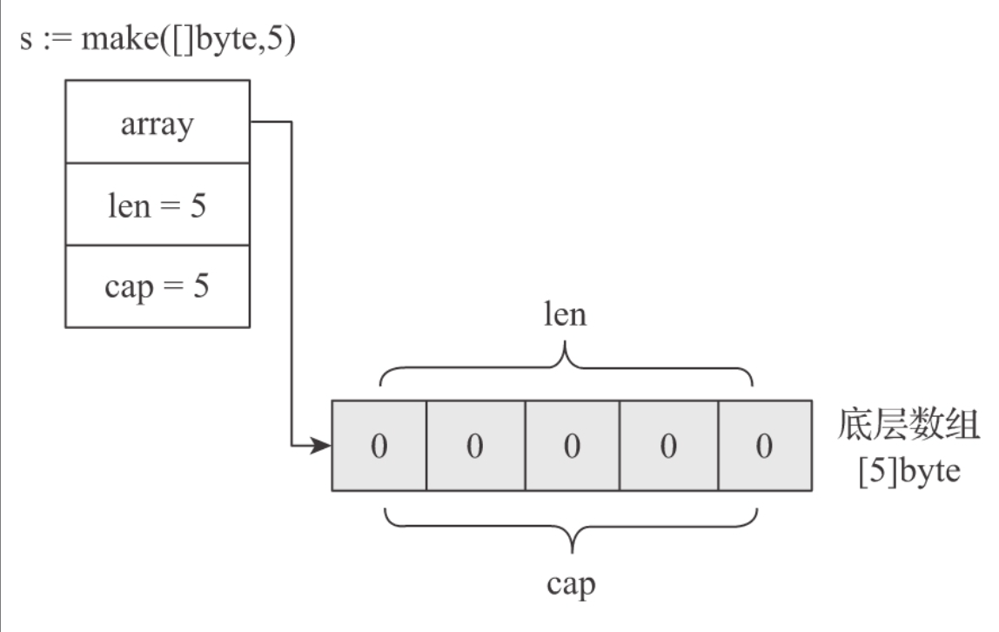

# 第十三条_了解切片实现原理并高效使用

slice,是Go语言在数组之上提供的一个重要的抽象数据类型。

## 切片到底是什么?

Go语言数组是一个固定长度的、容纳同构类型元素的连续序列，因此Go数组类型具有两个属性：元素类型和数组长度。这两个属性都相同的数组类型是等价的。

**Go数组是值语义的，这意味着一个数组变量表示的是整个数组，而不是数组的首地址。**

所以，在Go语言中，更地道地方式是使用切片，而不是数组。

切片之于数组就像是文件描述符之于文件。在Go语言中，数组更多是“退居幕后”​，承担的是底层存储空间的角色；而切片则走向“前台”​，为底层的存储（数组）打开了一个访问的“窗口”​

我们可以称切片是数组的描述符。切片之所以能在函数参数传递时避免较大性能损耗，是因为它是“描述符”的特性，切片这个描述符是固定大小的，无论底层的数组元素类型有多大，切片打开的窗口有多长。

切片在Go运行时(runtime)中，是一个结构体类型，其定义如下：

```go
type slice struct {
    array unsafe.Pointer // 指向下层数组某元素的指针, 切片起始元素
    len   int // 切片长度
    cap   int // 切片容量
}
```

运行时每个切片容量都是一个runtime.sclie结构体类型的实例

```go
s := make([]byte, 5)
```



**切片的reslicing**

新创建的切片与原切片同样是共享底层数组的，并且通过新切片对数组的修改也会反映到原切片中。

当切片作为函数参数传递给函数时，实际传递的是切片的内部表示，也就是上面的runtime.slice结构体实例，因此无论切片描述的底层数组有多大，切片作为参数传递带来的性能损耗都是很小且恒定的，甚至小到可以忽略不计，这就是函数在参数中多使用切片而不用数组指针的原因之一。而另一个原因就是切片可以提供比指针更为强大的功能，比如下标访问、边界溢出校验、动态扩容等。

## 动态扩容

```go
var s []int // s被赋予零值nil
s = append(s, 11)
fmt.Println(len(s), cap(s)) // 1 1
s = append(s, 22)
fmt.Println(len(s), cap(s)) // 2 2
s = append(s, 33)
fmt.Println(len(s), cap(s)) // 3 4
```

```go
func main() {
  u := []int {1, 2, 3, 4, 5}
  fmt.Println("array", u) // array [1 2 3 4 5]
  s := u[1:3]
  fmt.Println("slice", s) // slice [2 3]
  s = append(s, 66)
  fmt.Println("slice", s) // slice [2 3 66]
  fmt.Println("array", u) // array [1 2 3 66 5]
}
```

## 尽量使用cap参数创建切片

append操作是一件利器，它让切片类型部分满足了“零值可用”的理念。但从append的原理中我们也能看到重新分配底层数组并复制元素的操作代价还是挺大的，尤其是当元素较多的情况下。

一种有效的方法是根据切片的使用场景对切片的容量规模进行预估，并在创建新切片时将预估出的切片容量数据以cap参数的形式传递给内置函数make

```go
s := make([]T, len, cap)
```

如果可以预估出切片底层数组需要承载的元素数量，强烈建议在创建切片时带上cap参数
