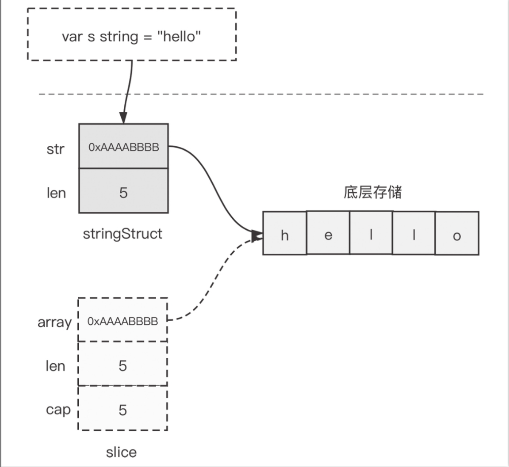

# 第十五条_了解string实现原理并高效使用

## Go语言的字符串类型

在Go语言中，无论是字符串常量、字符串变量还是代码中出现的字符串字面量，它们的类型都被统一设置为string

string类型的功能特点:

1. string类型的数据不可变
2. 零值可用: Go字符串无须像C语言中那样考虑结尾'\0'字符，因此其零值为""，长度为0。
3. 获取长度的实践复杂度为O(1)级别
4. 支持字符串拼接
5. 支持比较关系符
6. 对非ASCII字符串的原生支持
7. 支持多行字符串字面量

## 字符串的内部表示

Go string类型上述特性的实现与Go运行时对string类型的内部表示是分不开的。

Go string在运行时表示为下面的结构

```go
type stringStruct struct {
	str unsafe.Pointer
	len int
}
```

我们看到string类型也是一个描述符，它本身并不真正存储数据，而仅是由一个指向底层存储的指针和字符串的长度字段组成。

```go
// runtime包中实例化字符串对应的函数
func rawstring(size int) (s string, b[] byte) {
  p := mallocgc(uintptr(size), nil, false)
  stringStructOf(p).str = unsafe.Pointer(p)
  stringStructOf(p).len = size
  return unsafe.String(p, size), unsafe.Slice(p, size)
}
```

我们看到每个字符串类型变量/常量对应一个stringStruct实例，经过rawstring实例化后，stringStruct中的str指针指向真正存储字符串数据的底层内存区域，len字段存储的是字符串的长度（这里是5）​；rawstring同时还创建了一个临时slice，该slice的array指针也指向存储字符串数据的底层内存区域。注意，rawstring调用后，新申请的内存区域还未被写入数据，该slice就是供后续运行时层向其中写入数据（"hello"）用的。写完数据后，该slice就可以被回收掉了



根据string在运行时的表示可以得到这样一个结论：直接将string类型通过函数/方法参数传入也不会有太多的损耗，因为传入的仅仅是一个“描述符”​，而不是真正的字符串数据

## 字符串的高效构造

## 字符串相关的高效转换

