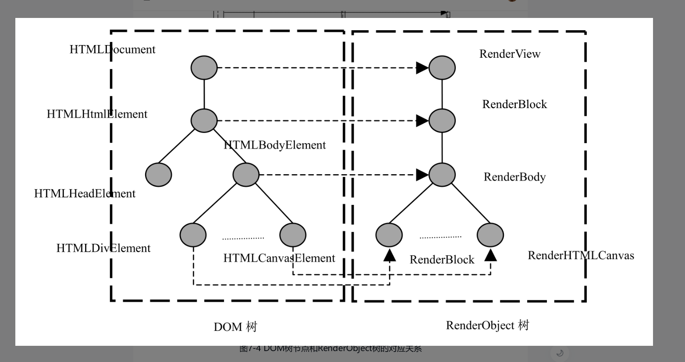

# 第七章 渲染基础

## 7.1 RenderObject树

### 7.1.1 RenderObject基础类

在DOM树构建完成之后，WebKit所要做的事情就是为DOM树节点构建RenderObject树。那么什么是RenderObject呢？它的作用是什么呢？

在DOM树中，某些节点是用户不可见的。(比如meta， head)

对于这些"可视节点"，WebKit需要将它们的内容绘制到最终的网页结果中，所以WebKit会为它们创建相应的RenderObject对象。

一个RenderObject对象保存了为绘制DOM节点所需要的各种信息，例如样式布局信息，经过WebKit的处理之后，RenderObject对象知道如何绘制自己。
这些RenderObject对象同DOM的节点对象类似，它们也构成一棵树，在这里我们称之为**RenderObject树**。
RenderObject树是基于DOM树建立起来的一棵新树，是为了布局计算和渲染等机制而构建的一种新的内部表示。RenderObject树节点和DOM树节点不是一一对应关系

哪些情况下为一个DOM节点建立新的RenderObject对象?

1. DOM树的document节点
2. DOM树中的可视节点
3. 某些情况下WebKit需要建立匿名的RenderObject节点, 该节点不对应于DOM树中的任何节点

### 7.1.2 RenderObject树

WebKit如何创建RenderObject对象并构建RenderObject树的?

首先WebKit检查DOM节点是否需要创建RenderObject对象。如果需要, WebKit建立/获取一个创建RenderObject对象的NodeRenderingContext对象, NodeRenderingContext会分析需要创建的RenderObject对象的父亲节点、兄弟节点等，设置这些信息后完成插入树的动作。

## 7.2 网页层次和RenderLayer树

### 7.2.1 层次和RenderLayer对象

网页可以分层的原因是

1. 为了网页开发者开发并设置层次
2. 为了WebKit处理的遍历(简化渲染的逻辑)

WebKit会为网页的层次创建相应的RenderLayer对象。
当某些类型的RenderObject节点或具有某些CSS样式的RenderObject节点出现的时候, WebKit就会为这些节点创建RenderLayer对象

RenderLayer树基于RenderObject树建立的一棵树。

RenderObject节点需要建立新的RenderLayer节点的基本规则

- DOM树的Document节点对应的RenderView节点
- DOM树中的Document的子节点->RenderBlock节点
- 显式指定CSS位置的RenderObject节点
- 有透明效果的RenderObject节点
- 节点有溢出(Overflow), alpha或反射等效果的RenderObject节点
- 使用Canvas2D和WebGL的RenderObject节点
- Video节点对应的RenderObject节点

在WebKit创建RenderObject树之后，WebKit也会创建RenderLayer树。当然某些RenderLayer节点也有可能在执行JavaScript代码时或者更新页面的样式被创建。同RenderObject类不同的是，RenderLayer类没有子类，它表示的是网页的一个层次，并没有“子层次”的说法。

### 7.2.2 构建RenderLayer树

RenderLayer树的构建非常简单，根据上面的基本规则来判断一个RenderObject节点是否需要建立一个新的RenderLayer对象, 并设置RenderLayer对象的父亲和兄弟关系即可。

## 7.3 渲染方式

### 7.3.1 绘图上下文(GraphicsContext)

RenderObject对象用什么绘制内容呢?

在WebKit中，绘图操作被定义了一个抽象层，就是绘图上下文，所有绘图的操作都是在该上下文中来进行的。

绘图上下文可以分成各种类型:

1. 用来绘制2D图形的上下文 -> 2D绘图上下文(GraphicsContext)
2. 用来绘制3D图形的上下文 -> 2D绘图上下文(GraphicsContext3D)

它们都是抽象基类(即只提供接口，供各种WebKit的移植)

2D绘图上下文的具体作用就是提供基本绘图单元的绘制接口以及设置绘图的样式。绘图接口包括画点、画线、画图片、画多边形、画文字等，绘图样式包括颜色、线宽、字号大小、渐变等。RenderObject对象知道自己需要画什么样的点，什么样的图片，所以RenderObject对象调用绘图上下文的这些基本操作就是绘制实际的显示结果

在现有的网页中，由于HTML5标准引入了很多新的技术，所以同一网页中可能会既需要使用2D绘图上下文，也需要使用3D绘图上下文。对于2D绘图上下文来说，其平台相关的实现既可以使用CPU来完成2D相关的操作，也可以使用3D图形接口（如OpenGL）来完成2D相关的操作。而对于3D绘图上下文来说，因为性能的问题，WebKit的移值通常都是使用3D图形接口（如OpenGL或者Direct3D等技术）来实现

### 7.3.2 渲染方式

在完成构建DOM树之后，WebKit要做的事情就是构建渲染的内部表示并使用图形库将模型渲染出来。

解析**网页的渲染模式**

1. 软件渲染
2. 硬件加速渲染
3. 混合模式

每个RenderLayer对象可以被想象成图像中的一个层，各个层一同构成了一个图像。

渲染的过程可以同样这么理解，每个层对应网页中的一个或一些可视元素，这些元素都绘制内容到该层中。

如果绘图操作由CPU执行，那么称之为软件绘图;如果绘图操作由GPU执行，那么称之为GPU硬件加速绘图。

理想情况下，每个层都有一个绘制的存储区域，这个存储区域用来保存绘图的结果。最后，需要将这些层的内容合并到一个图像中(Compositing), 使用了合成技术的渲染称之为合成化渲染。

所以在RenderObject树和RenderLayer树之后，WebKit将内部模型转化为可视的结果分为两个阶段: 每层的内容进行绘图工作以及之后将这些绘图的结果合成一个图像。

如何**区分三种渲染**

1. 软件渲染 -> WebKit需要CPU来绘制每层的内容。软件渲染没有合成阶段，因为在软件渲染中，渲染的结果就是一个位图(Bitmap)，绘制每一层的时候都是用该位图，区别在于位置不同，但是通过位图已经可以确定好顺序了
   软件渲染中网页使用的一个位图，实际上就是一块CPU使用的内存空间。
2. GPU硬件加速渲染 -> 合成化渲染 -> 软件渲染 + GPU硬件加速合成
   使用CPU来绘图的层，该层的结果首先应该保存在CPU内存中，之后被传输到GPU的内存中。
3. GPU负责绘制所有的合成层

前面的这些描述，是把RenderLayer对象和实际的存储空间对应, 这是理想情况，实际上每个RenderLayer都有一个存储空间。

了解**渲染**

1. 对于2D绘图，使用GPU绘图不一定比CPU有优势 -> 原因是: CPU的使用缓存机制有效减少了重复绘制的开销而不需要GPU的并行性，其次，GPU的内存资源相对于CPU的内存资源比较紧张，网页分层使用了较多的GPU资源
2. 软件渲染只能处理2D操作，比较适合没有复杂绘图或多媒体需求的场景。
   对于H5的新技术，软件渲染不够好。
   1. 对于CSS3D, WebGL来说，能力不足
   2. 性能不好, 比如在视频, Canvas2D
   另外, 软件渲染和硬件渲染很大的不同就是对于更新区域的处理。网页中有一个更新小型区域的请求时，软件渲染只需要计算一个极小的区域, 而硬件渲染可能需要重新绘制其中的一层/多层，然后再合成，硬件渲染的代价大的多。
3. 对于硬件加速的合成化渲染来说, 每个层的绘制和合成都由GPU来完成, 这适合于3D绘图的操作。这种情况下, RenderLayer树中, WebKit和Chromium还需要建立更多的内部表示，目的是支持硬件加速。
   1. 硬件可以支持所有的H5标准
   2. 如果需要更新某一层的区域，软件渲染没有为每一层提供后端存储, 需要将和这个区域有重叠部分的所有层次的相关区域依次从前往后重新绘制一遍, 而硬件加速渲染只需要重新绘制更新发生的层次。

## 7.4

### 7.4.1 软件渲染过程

很多时候, WebKit可以使用软件渲染技术来完成页面的绘制工作。

分析软件渲染

1. RenderLayer树
2. RenderLayer所包含的RenderObject树

每个RenderObject对象需要三个阶段绘制自己

1. 绘制该层中的所有块的背景和边框
2. 绘制浮动内容
3. 绘制前景(Foreground)内容部分、轮廓

在上面这一过程中，Webkit所使用的绘图上下文都是2D的，因为没有GPU加速，所以3D的绘图上下文没有办法工作。这意味着，每一层上的RenderObject子树中不能包含使用3D绘图的节点，例如Canvas 3D(WebGL)节点等。同时，每个RenderLayer层上使用的CSS 3D变形等操作也没有办法得到支持。

最开始的时候, WebKit绘制的区域等同于可视化区域大小。在这之后, WebKit只是首先计算需要更新的区域, 然后绘制同这些区域有交集的RenderObject节点。
这也就是说，如果更新区域跟某个RenderLayer节点有交集，WebKit会继续查找RenderLayer树中包含的RenderObject子树中的特定一个或一些节点，而不是绘制整个RenderLayer对应的RenderObject子树。

WebKit软件渲染结果的储存方式，在不同的平台上可能不一样，但是基本上都是CPU内存的一块区域，多数情况下是一个位图(Bitmap)。至于这个位图如何处理，如何跟之前绘制的结果合并，如何显示出来，都跟WebKit的不同移植相关。

### 7.4.2 Chromium的多进程软件渲染技术

Chromium需要将渲染结果从Renderer进程传递到Browser进程

一个多进程的软件渲染过程大致如下:

1. RenderWidget类接收到更新请求时, Chromium创建一个共享内存区域。
2. 然后Chromium创建Skia的SKCanvas对象，并且RenderWidget会把实际绘制的工作派发给RenderObject树。

WebKit负责遍历RenderObject树，每个RenderObject节点根据需要来绘制自己和子女的内容并存储到目标存储空间，也就是SkCanvas对象所对应的共享内存的位图中。最后，RenderWidgetHost类把位图复制到BackingStore对象的相应区域中，并调用“Paint”函数来把结果绘制到窗口中
