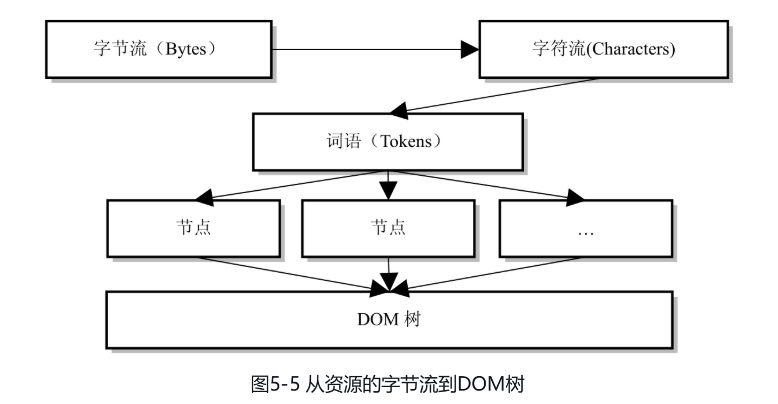
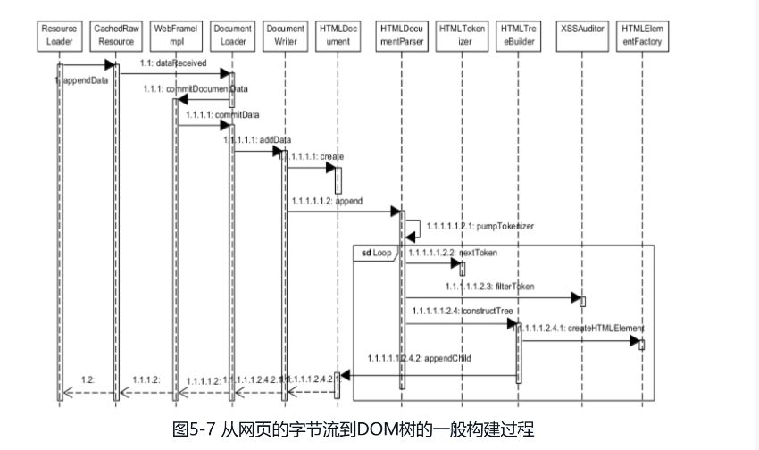
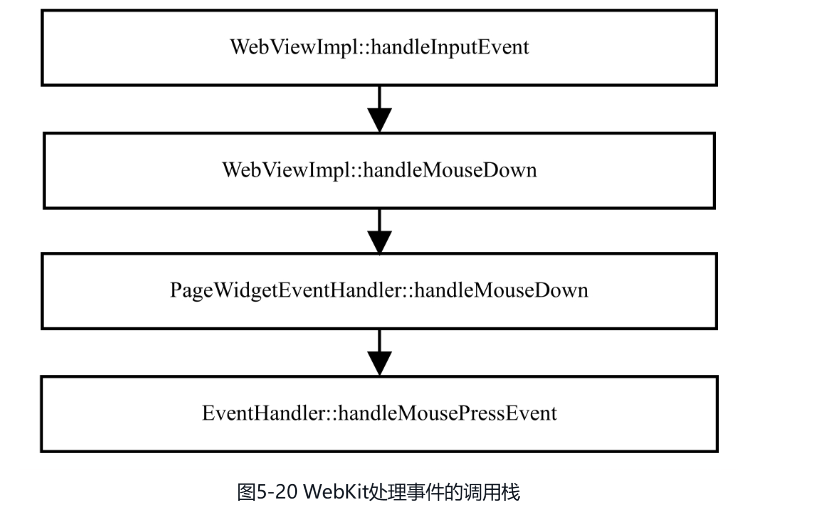

# 第五章 HTML解释器和DOM模型

在WebKit中，资源最初的表示就是字节流，这些字节流可以是网络传输来的，也可以是本地文件，那么字节流在接下来需要经过怎样的处理呢？处理后变成了什么？

## 5.1 DOM模型

DOM(Document Object Model)，文档对象模型，它可以以一种独立于平台和语言的方式访问和修改一个文档的内容和结构。

这里的文档可以是HTML文档、XML文档或者XHTML文档。DOM以面向对象的方式来描述文档，在HTML文档中，Web开发者可以使用JavaScript语言来访问、创建、删除或者修改DOM结构，其主要目的是动态改变HTML文档的结构。

DOM定义的是一组与平台，语言无关的接口，该接口允许编程语言动态访问和更改结构化文档。使用DOM表示的文档被描述成一个树形结构，使用DOM的接口可以对DOM树结构进行操作。

W3C定义了DOM接口，随着时间的发展，DOM接口也在不断发展，DOM Level 1, DOM Level 2, DOM Level 3

其中，在2009年，WebApps工作组（Web应用程序工作组）推进提出了一个对DOM3 Events规范的修改版，目前称之为DOM4，DOM4还处于草案阶段，还不是推荐标准

**DOM Level 1** 包含两部分

1. Core: 一组底层的接口，其接口可以表示任何结构化文档，同时也允许对接口进行拓展，例如对XML文档的支持
2. HTML: 在Core定义的接口之上，W3C定义了一组上层接口，主要是为了对HTML文档进行访问。它把HTML中的内容定义为文档(Document)、节点(Node)、属性(Attribute)、元素(Element)、文本(Text)等。

**DOM Level 2** 包含六部分

1. Core: 对DOM level 1中Core部分的扩展，其中著名的就是getElementById​，还有很多关于名空间(namespace)的接口。
2. Views: 描述跟踪一个文档的各种视图（使用CSS 样式设计文档前后）的接口。
3. Events: 非常重要，这个部分引入了对DOM事件的处理，笔者觉得这是个非常大的变化，主要有EventTarget、Mouse事件等接口。但是，规范仍然不支持键盘事件，这个在DOM Level 3才被加入进来。
4. Style(CSS): 一种新接口，可以修改HTML元素的样式属性
5. Traversal and Range: 描述了DOM树的遍历和范围的接口，例如，NodeIterator、TreeWalker、Range等。
6. HTML: 扩充DOM Level 1的HTML部分，允许动态访问和修改HTML文档。

**DOM Level 3** 包含五部分

1. Core: 在DOM Level 1和DOM Level 2的基础上，该部分加入了新接口adoptNode和textContent。
2. Load and Save: 允许程序动态加载XML文件并解释成DOM表示的文档结构
3. Validation: 允许程序验证文档的有效性
4. Events：主要加入了对键盘的支持。随着移动平台的兴起，触屏技术得到广泛应用，所以触控(Touch)事件的草案应该很快就会进入标准。
5. XPath: 允许程序使用XPath表达式来查询DOM树中的节点。

### 5.1.2 DOM树

#### 5.1.2.1 结构模型

DOM结构构成的基本要素是"节点", 而文档的DOM结构就是由层次化的节点组成。

在DOM模型中，节点的概念很宽泛，整个文档(Document)就是一个节点，称为文档节点。HTML中的标记(Tag)也是一种节点，称为元素(Element)节点。还有一些其他类型的节点，例如属性节点（标记的属性）​、Entity节点、ProcessingIntruction节点、CDataSection节点、注释(Comment)节点等。

由于DOM的定义是与语言无关的，所以标准中所有这些都是接口。同时，因为支持不同类型的语言，例如C++、Java或者JavaScript，所以它没有对内存的管理机制做任何方面的规定。同时这些不同语言的不同实现只需要符合标准定义的接口即可，而实现者通常可以把这些实现的细节隐藏起来。

#### 5.1.2.2 DOM树

待DOM的节点和各种子节点被逐次定义后，接下来的问题是如何将这些节点组织起来表示一个文档。

众多的节点按照层次组织构成一个DOM树形结构

## 5.2 HTML解释器

### 5.2.1 解释过程

HTML解释器的作用就是将网络/本地磁盘中获取的HTML网页和资源以字节流的形式转换为DOM树的结构。

字节流->解码->字符流->词法分析->构建节点->DOM树

### 5.2.2 词法分析

在进行词法分析之前，解释器首先要做的事情就是检查该网页内容使用的编码格式，以便后面使用合适的解码器。
如果解释器在HTML网页中找到了设置的编码格式，WebKit会使用相应的解码器来将字节流转换成特定格式的字符串。如果没有特殊的格式，词法分析器HTMLTokenizer类可以直接进行词法分析。

词法分析的工作都是由HTMLTokenizer类完成的，简单来说，它就是一个状态机--输入的是字符串，输出的是一个一个词语。

词法分析器的主要接口是“nextToken”函数，调用者只需要将字符串传入，然后就会得到一个词语，并对传入的字符串设置相应的信息，表示当前处理完的位置，如此循环。如果词法分析器遇到错误，则报告状态错误码

对于“nextToken”函数的调用者而言，它首先设置输入需要解释的字符串，然后循环调用NextToken函数，直到处理结束。​“nextToken”方法每次输出一个词语，同时会标记输入的字符串，表明哪些字符已经被处理过了。因此，每次词法分析器都会根据上次设置的内部状态和上次处理之后的字符串来生成一个新的词语。​“nextToken”函数内部使用了超过70种状态

而对于词语的类别，WebKit只定义了很少，HTMLToken类定义了6种词语类别，包括DOCTYPE、StartTag、EndTag、Comment、Character和EndOfFile。

nextTokeN()->检查当前状态->处理状态->输出单词和修改输入的字符串

### 5.2.3 XSSAuditor验证词语

当词语生成之后，WebKit需要使用XSSAuditor来验证词语流(Token Stream)。XSS指的是Cross Site Security，主要是针对安全方面的考虑。

### 5.2.4 词语到节点

经过词法分析器解释之后的词语随之被XSSAuditor过滤并且在没有被阻止之后，将被WebKit用来构建DOM节点。

这一步骤是由HTMLDocumentParser类调用HTMLTreeBuilder类的“constructTree”函数来实现的。

### 5.2.5 构建DOM树

从节点到构建DOM树，包括为树中的元素节点创建属性节点等工作由HTMLConstructionSite类来完成。正如前面介绍的，该类包含一个DOM树的根节点——HTMLDocument对象，其他的元素节点都是它的后代。

因为HTML文档的Tag标签是有开始和结束标记的，所以构建这一过程可以使用栈结构来帮忙。HTMLConstructionSite类中包含一个“HTMLElementStack”变量，它是一个保存元素节点的栈，其中的元素节点是当前有开始标记但是还没有结束标记的元素节点。想象一下HTML文档的特点，例如一个片段“＜body＞＜div＞＜img＞＜/img＞＜/div＞＜/body＞”​，当解释到img元素的开始标记时，栈中的元素就是body、div和img，当遇到img的结束标记时，img退栈，img是div元素的子女；当遇到div的结束标记时，div退栈，表明div和它的子女都已处理完，以此类推

同DOM标准一样，一切的基础都是Node类。在WebKit中，DOM中的接口Interface对应于C++的类，Node类是其他类的基类，图5-10显示了DOM的主要相关节点类。图中的Node类实际上继承自EventTarget类，它表明Node类能够接受事件，这个会在DOM事件处理中介绍。Node类还继承自另外一个基类——ScriptWrappable，这个跟JavaScript引擎相关。Node的子类就是DOM中定义的同名接口，元素类、文档类和属性类均继承自一个抽象出来的ContainerNode类，表明它们能够包含其他的节点对象。回到HTML文档来说，元素和文档对应的类就是HTMLElement类和HTMLDocument类。实际上HTML规范还包含众多的HTMLElement子类，用于表示HTML语法中众多的标签。

### 5.2.6 网页基础设施

上面介绍了Frame、Document等WebKit中的基础类，这些都是网页内部的概念，实际上，WebKit提供了更高层次的设施，用于表示整个网页的一些类，WebKit中的接口部分就是基于它们来提供的。表示网页的类既提供了构建DOM树等这些操作，同时也提供了接口用于之后章节介绍的布局、渲染等操作。

### 5.2.7 线程化的解释器

在Renderer进程中有一个线程，该线程用来处理HTML文档的解释任务。正如前面所说，在HTML解释器的步骤中，WebKit的Chromium移植跟其他的WebKit移植也存在不同之处。

线程化的解释器就是利用单独的线程来解释HTML文档。因为在WebKit中，网络资源的字节流自IO线程传递给渲染线程之后，后面的解释、布局、渲染等操作都是在该线程(渲染线程)中文昌。

因为DOM树只能在渲染线程上创建和访问，所以构建DOM树的过程只能在渲染线程上进行。

当字符串传送到HTMLDocumentParser类的时候，该类不是自己处理，而是创建一个新的对象BackgroundHTMLParser来负责处理，然后将这些数据交给该对象。WebKit会检查是否需要创建用于解释字符串的线程HTMLParserThread。

**线程化解释器的初始化工作**

1. HTMLDocumentParser::append()
2. HTMLDocumentParser::startBackgroundParser()
3. 创建BackgroundHTMLParser
4. 创建BackgroundHTMLParser::Configuration
5. 如果需要，创建HTMLParserThread
6. HTMLParserThread::postTask()

在HTMLParserThread线程中，WebKit所做的事情包括将字符串解释成一个个词语，然后使用之前提到的XSSAuditor进行安全检查，这些任务跟之前介绍的没有什么大的区别，只是在一个新的线程中执行而已。主要的区别在于解释成词语之后，WebKit会分批次地将结果词语传递给渲染线程

### 5.2.8 JavaScript的执行

在HTML解释器的工作过程中，可能会有JavaScript代码（全局作用域的代码）需要执行，它发生在将字符串解释成词语之后、创建各种节点的时候。这也是为什么全局执行的JavaScript代码不能访问DOM树的原因——因为DOM树还没有被创建完呢。

WebKit将DOM树创建过程中需要执行的JavaScript代码交由HTMLScriptRunner类来负责。工作方式很简单，就是利用JavaScript引擎来执行Node节点中包含的代码

因为JavaScript代码可能会调用例如“document.write（​）​”来修改文档结构，所以JavaScript代码的执行会阻碍后面节点的创建，同时当然也会阻碍后面的资源下载，这时候WebKit对需要什么资源一无所知，这导致了资源不能够并发地下载这一严重影响性能的问题。

如何避免?

1. "script"标签的async属性，异步执行JavaScript代码
2. 将 "script" 标签放在body标签的最后，这样不会阻碍其他资源的并发下载

WebKit使用预扫描和预加载机制来实现资源的并发下载而不被JavaScript的执行所阻碍。

具体做法是: 当遇到需要执行的JavaScript代码时，WebKit会先暂停JavaScript代码执行，使用预先扫描器HTMLPreloadScanner类来扫描后面的词语。如果WebKit发现它们需要使用其他资源，那么使用预资源加载器HTMLResourcePreloader类来发送请求，在这之后，才执行JavaScript的代码。预先扫描器本身并不创建节点对象，也不会构建DOM树，所以速度比较快。

当DOM树构建完之后，WebKit触发“DOMContentLoaded”事件，注册在该事件上的JavaScript函数会被调用。当所有资源都被加载完之后，WebKit触发“onload”事件。

## 5.3 DOM的事件机制

### 5.3.1 事件的工作流程

事件在工作过程中使用两个主体，一个是Event，一个是EventTarget。
每个事件都有属性来标记该事件的事件目标。当事件到达事件目标（如一个元素节点）的时候，在这个目标上注册的监听者(Event Listeners)都会被触发调用，当然这些监听者的调用顺序是不固定的，所以不能依赖监听者注册的顺序来决定你的代码逻辑。

**事件处理最重要的部分就是EventCapture和EventBubbling两种机制。**

当渲染引擎接收到一个事件的时候，它会通过HitTest（WebKit中的一种检查触发事件在哪个区域的算法）检查哪个元素是直接的事件目标。事件会经过自顶向下和自底向上两个过程。

**事件的捕获是自顶向下**，也就是说，事件先是到达document节点，然后一路到达目标节点。
"# document" -> "HTML" -> "body" -> "img"
事件可以在这一传递过程中被捕获，只需要在注册监听者的时候设置相应的参数即可。

默认情况下，其他节点不捕获这样的事件。如果网页注册了这样的监听者，那么监听者的回调函数会被调用，函数可以通过事件的“stopPropagation”函数来阻止事件向下传递。

**事件的冒泡过程是从下向上**
它的默认行为是不冒泡，但是事件包含一个是否冒泡的属性。

当这一属性为真的时候，渲染引擎会将该事件首先传递给事件目标节点的父亲，然后是父亲的父亲，以此类推。同捕获动作一样，这些监听函数也可以使用“stopPropagation”函数来阻止事件向上传递。

### 5.3.2 WebKit的事件处理机制

DOM的事件分为很多种，与用户相关的只是其中的一种，称为UIEvent，其他的包括CustomEvent、MutationEvent等。UIEvent又可以分为很多种，包括但是不限于FocusEvent、MouseEvent、KeyboardEvent、CompositionEvent等。

WebKit的浏览器事件处理过程

1. 做HitTest，查找事件发生处的元素，检测该元素有没有监听者。如果网页的相关节点注册了事件的监听者，那么浏览器会把事件派发给WebKit内核来处理。同时，浏览器也可能需要理解和处理这样的事件。这主要是因为，有些事件浏览器必须响应从而对网页作默认处理。浏览器经过HitTest之后，发现有监听者，它需要将这些事件传给WebKit，WebKit实际上最后调用JavaScript引擎来触发监听者函数。但是，浏览器可能也会根据这些事件仍然处理它的默认行为，这会导致竞争冲突，所以Web开发者在监听者的代码中应该调用事件的“preventDefault”函数来阻止浏览器触发它的默认处理行为
2. 当事件的派发机制遇到网页的框结构特别是多框结构的时候，情况变得稍显复杂，这是因为事件需要在多个框和多个DOM树之间传递。当触控事件(Touch Events)被引入后，情况变得更为复杂。
3. 最后来了解一下事件从浏览器到达WebKit内核之后，WebKit内部的调用过程

WebKit的EventHandler类

EventHandler类是处理事件的核心类，它除了需要将各种事件传给JavaScript引擎以调用响应的监听者之外，它还会识别鼠标事件，来触发调用右键菜单、拖放效果等与事件密切相关的工作，而且EventHandler类还支持网页的多框结构。

## 5.4 Shadow DOM

影子DOM是一个新东西，它主要解决了一个文档中可能需要大量交互的多个DOM树建立和维护各自的功能边界的问题。

### 5.4.1 影子DOM的定义

影子DOM是HTML5中定义的一种新的DOM结构，它允许开发者将DOM树的结构和样式封装在独立的DOM树中，从而实现更好的模块化和可重用性。

影子DOM的子树在整个网页的DOM树中不可见，那么事件是如何处理的呢？事件中需要包含事件目标，这个目标当然不能是不可见的DOM节点，所以事件目标其实就是包含影子DOM子树的节点对象。事件捕获的逻辑没有发生变化，在影子DOM子树内也会继续传递。当影子DOM子树中的事件向上冒泡的时候，WebKit会同时向整个文档的DOM上传递该事件，以避免一些很奇怪的行为。

### 5.4.2 WebKit的支持

