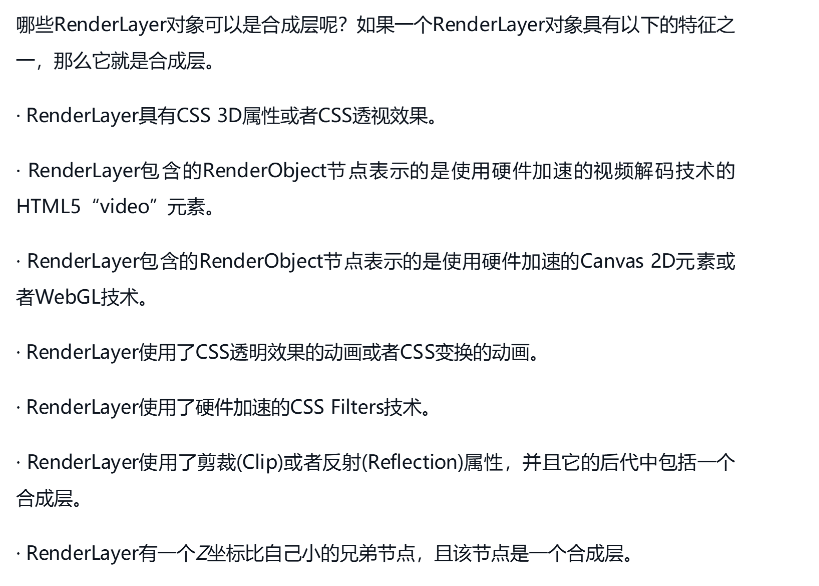

# 第八章 硬件加速机制

## 8.1 硬件加速基础

### 8.1.1 概念

这里的硬件加速指的是使用GPU的硬件能力来帮助渲染网页, GPU主要用于绘制3D图像且性能好

对于GPU绘图而言，通常不像软件渲染那样只是计算其中更新的区域，一旦有更新请求，如果没有分层，引擎可能需要重新绘制所有的区域，因为计算更新部分对GPU来说可能耗费更多的时间。当网页分层之后，部分区域的更新可能只在网页的一层或者几层，而不需要将整个网页都重新绘制。通过重新绘制网页的一个或者几个层，并将它们和其他之前绘制完的层合成起来，既能使用GPU的能力，又能够减少重绘的开销。

硬件加速机制在RenderLayer树建立之后需要做三件事情:

1. WebKit决定将哪些RenderLayer对象组合起来, 形成有后端存储的新层, 这一层不久之后会用于之后的合成，这里称之为Compositing Layer(合成层)。每一新层都有一个或多个后端存储(可能是GPU的内存)。对于一个RenderLayer对象，如果它没有后端存储的新层，那么就使用它的父亲所使用的合成层。
2. 将每个合成层包含的RenderLayer内容绘制在合成层的后端存储中(软件/硬件)
3. 由Compositor将多个合成层合成起来, 形成网页的最终可视化结果, 实际上是一张图片。合成器是一种能够将多个合成层按照这些层的前后顺序、合成层的3D变形等设置而合成一个图像结果的设施

在WebKit中，只有把编译的C代码宏(macro)“ACCELERATED_COMPOSITING”打开之后，硬件加速机制才会被开启，有关硬件加速的基础设施才会被编译进去。

### 8.1.2 WebKit硬件加速设施

一个RenderLayer对象如果需要后端存储，它会创建一个RenderLayerBacking对象，该对象负责Renderlayer对象所需要的各种存储。正如前面所述，理想情况下，每个RenderLayer都可以创建自己的后端存储，但事实上不是所有RenderLayer都有自己的RenderLayerBacking对象。如果一个RenderLayer对象被WebKit依照一定的规则创建了后端存储，那么该RenderLayer被称为合成层。

每个合成层都有一个RenderLayerBacking，RenderLayerBacking负责管理RenderLayer所需要的所有后端存储，因为后端存储可能需要多个存储空间。在WebKit中，存储空间使用GraphicsLayer类来表示。

RenderLayer对象具有以下特征，那么就是合成层:

### 8.1.3 硬件渲染过程

