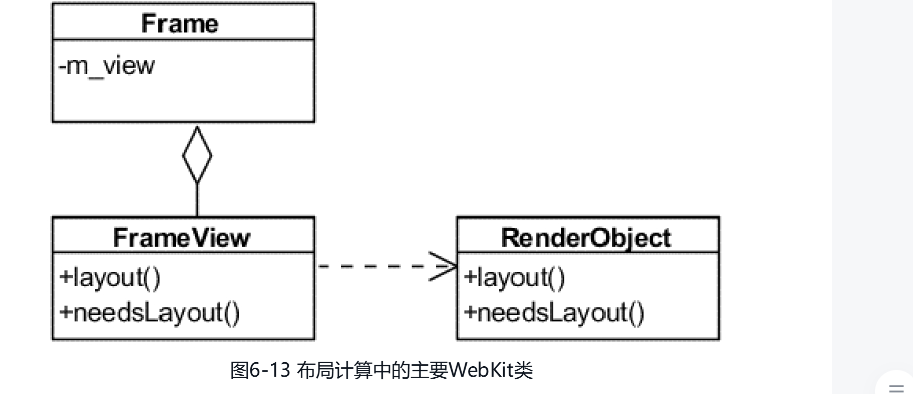

# 第六章 CSS解释器和样式布局

从整个网页的加载和渲染过程来看，CSS解释器和规则匹配处于DOM树建立之后，RenderObject树建立之前, CSS解释器解释后的结果会保存起来, 然后RenderObject树基于这个结果来进行规范匹配和布局计算。

## 6.1 CSS基本功能

CSS的全称是Cascading Style Sheet，中文名是级联样式表，主要是用来控制网页的显示风格。

## 6.2 CSS解释器和规则匹配

### 6.2.1 样式的WebKit表示类

一切的起源都是从DOM中的Document类开始。先看Document类之外的左上部分：包括一个DocumentStyleSheetCollection类，该类包含了所有CSS样式表；还包括WebKit的内部表示类CSSStyleSheet，它包含CSS的href、类型、内容等信息。CSS的内容就是样式信息StyleSheetContents，包含了一个样式规则(StyleRuleBase)列表。样式规则被用在CSS的解释器的工作过程中。

### 6.2.2 解释过程

CSS解释过程指的是从CSS字符串经过CSS解释器处理后变成渲染引擎的内部规则表示的过程。

### 6.2.3 样式规则匹配

样式规则建立完成之后，WebKit保存规则结果在DocumentRuleSets对象类中。当DOM的节点建立之后，WebKit会为其中的一些节点（只限于可视节点，在第7章中介绍）选择合适的样式信息。
这些工作由StyleResolver类完成。然而实际的匹配工作还是在DocumentRuleSets类中完成的。

StyleResolver来为DOM的元素节点匹配样式。StyleResolver类根据元素的信息，例如标签名、类别等，从样式规则中查找最匹配的规则，然后将样式规则保存到新建的RenderStyle对象中。最后，这些RenderStyle对象被RenderObject类所管理和使用。

规则的匹配是由ElementRuleCollector类来计算并获得的，它根据元素的属性等信息，并从DocoumentRuleSets类中获取规则集合，依次按照ID,类别，标签等选择器信息逐次匹配获得元素的样式。

1. 当WebKit需要为HTML元素创建RenderObject类的时候，首先StyleResolver类负责采取样式信息，并返回RenderStyle对象，RenderStyle对象包含了匹配完的结果样式信息
2. 其次根据需求，每个元素可能需要匹配不同来源的规则，依次是用户代理规则集合、用户规则集合和HTML网页中包含的自定义规则集合。
3. 然后对于自定义规则集合，它先查找ID规则，检查有无匹配的规则，之后依次检查类型规则、标签规则等。如果某个规则匹配上该元素，WebKit会把这些规则保存到匹配结果中。
4. 最后WebKit对这些规则按照优先级排序，将样式属性值返回。

## 6.3 WebKit布局

### 6.3.1 基础

当WebKit创建RenderObject对象之后，每个对象是不知道自己的位置、大小等信息的，WebKit根据框模型来计算它们的位置、大小等信息的过程称为布局计算

布局计算根据其计算的范围大致可以分为两类:
1. 对整个RenderObject树进行计算
2. 对RenderObject树中的某个节点进行计算

### 6.3.2 布局计算

布局计算是一个递归的过程，这是因为一个节点的大小通常需要先计算它的子女节点的位置、大小等信息。

主要通过RenderObject的layout()方法来完成。

1. 该函数会判断RenderObject节点是否需要重新计算，这通常需要检查位数组中的相应标记位，子女是否需要计算布局等来确定
2. 其次，该函数会确定网页的宽度和垂直方向上的外边距
3. 然后，该函数会遍历其每一个子女节点，依次计算布局。每个元素实现自己的layout函数。
4. 节点根据子女大小计算得到自己的高度，结束。

**哪些情况需要重新计算呢?**

1. 网页首次打开,viewport中会调用计算方法(即可视区域发生变化)
2. 网页动画
3. JavaScript代码触发CSSDOM
4. 用户交互

WebKit的处理方式是——对于一个块元素对应的RenderObject对象，它的子女要么都是块元素的RenderObject对象，要么都是非内联元素对应的RenderObject对象，这可以通过建立匿名块(Anonymous Block)对象来实现

