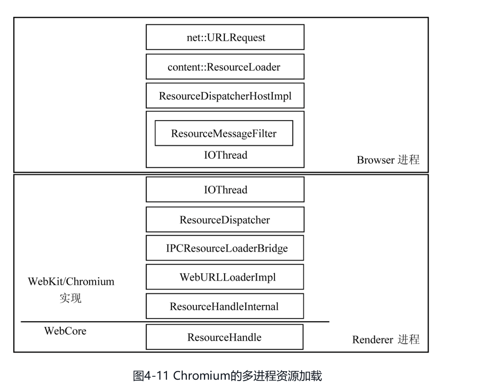

# 第四章 资源加载和网络栈

## 4.1 WebKit资源加载机制

### 4.1.1 资源

网络和资源加载是网页的加载和渲染过程中的第一步，也是必不可少的一步。网页本身就是一种资源，而且网页一般还需要依赖很多其他类型的资源，例如图片、视频等。因为资源的加载涉及网络和资源的缓存等机制，而且它们在整个渲染过程中占的比例并不少。

HTML支持的资源主要包括以下类型:

- HTML
- JavaScript
- CSS
- 图片
- SVG: 用于绘制SVG的2D矢量图形表示
- CSS Shader
- 视频，音频，字幕
- 字体文件
- XSL样式表

上面这些资源在WebKit中均有不同的类来表示它们，它们的公共基类是CachedResource。

### 4.1.2 资源缓存

资源的缓存机制是提高资源使用效率的有效方法。

**基本思想**: 建立一个缓存池，当WebKit需要请求资源的时候，先从资源池中查找是否存在相应的资源。如果存在，WebKit则取出以便调用; 如果没有，WebKit创建一个新的CachedResource子类对象，并发送真正的请求给服务器, WebKit收到资源之后，将资源保存到缓存池中，以便下次使用。(这里的缓存指的是内存缓存， 不同于磁盘缓存)

WebKit从资源池中查找资源的关键字是URL， 因为标记资源唯一性的特征就是资源的URL。

### 4.1.3 资源加载

按照加载器的类型划分，WebKit的资源加载器可以分为以下几种:

- 针对每种资源类型的特定加载器，其特点是仅加载某一种资源。例如对于“image”这个HTML元素，该元素需要图片资源，对应的特定资源加载器是ImageLoader类。对于CSS自定义字体，它的特定资源加载器是FontLoader类。这些资源加载器没有公共基类，其作用就是当需要请求资源的时候，由资源加载器负责加载并隐藏背后复杂的逻辑。
- 资源缓存机制的资源加载器特点是: 所有特定加载器都共享它来查找并插入缓存资源--CachedResourceLoader类。特定加载器先通过缓存机制的资源加载器来查找是否有缓存资源，它属于HTML的文档对象。
  举个例子:
    1. 获取CachedResourceLoader对象 -> ImageLoader -> HTMLDocument
    2. CachedResourceLoader对象的find方法， 通过URL查找资源
- 通用加载器-ResourceLoader类， 是在WebKit需要从网络或者文件系统获取资源的时候使用该类只负责获得资源的数据，因此被所有特定加载器共享。它属于CachedResource类。同CachedResourceLoader类没有继承关系。

### 4.1.4 过程

鉴于从网络获取资源是一个非常耗时的过程，通常一些资源的加载是异步执行的，也就是说资源的获取和加载不会阻碍当前WebKit的渲染过程，例如图片、CSS文件。当然，网页也存在某些特别的资源会阻碍主线程的渲染过程，例如JavaScript代码文件。这会严重影响WebKit下载资源的效率，因为后面可能还有许多需要下载的资源，WebKit怎么做呢？

主线程被阻塞了，后面的解析工作无法进行，所以对于HTML后面使用的资源也没有办法直到并发送下载请求。

**WebKit是这么做的: 当主线程被阻塞时, WebKit会启动另外一个线程去遍历后面的HTML页面，收集所需要的资源URL，然后发送请求，这样就可以避免主线程被阻塞。与此同时，WebKit会并发去下载这些资源，甚至并发下载JavaScript文件。**

### 4.1.5 资源的生命周期

同CachedResourceLoader对象一样，资源池也属于HTML文档对象。

**资源池中的资源生命周期是什么?**

资源池不能无限放大，必须用相应的机制来替换其中的资源，从而加入新的资源。资源池所用的机制很简单，就是采用LRU(Least Recently Used)算法。
另一方面，当一个资源被加载后，它会被放入资源池，以便之后使用。

问题是，WebKit如何判断下次使用的时候是否需要更新该资源从而对服务器重新请求呢？因为服务器可能在某段时间之后更新了该资源。

考虑这样的场景，当用户打开网页后，他想刷新当前的页面。这种情况下，资源池会出现怎样的情况呢？是清除所有的资源，重新获得呢？还是直接利用当前的资源？都不是。对于某些资源，WebKit需要直接重新发送请求，要求服务器端将内容重新发送过来。但对于很多资源，WebKit则可以利用HTTP协议减少网络负载。在HTTP协议的规范中对此有规定，浏览器可以发送消息确认是否需要更新，如果有，浏览器则重新获取该资源；否则就需要利用该资源

WebKit的做法: 首先判断资源是否在资源池中，如果是，则发送一个HTTP请求，说明该资源在本地的信息，例如该资源什么时候修改的，服务器根据它做判断，如果没有任何变化，则返回304状态码，表示资源没有变化，浏览器则直接使用本地资源。如果资源发生变化，则返回200状态码，浏览器则重新获取该资源。

**WebKit在"关闭缓存"之后发生了什么？**

首先，开发者工具中直接清除掉MemoryCache对象中的所有资源，MemoryCache对象全局唯一。在清除掉该对象中的资源之后，WebKit立刻重新打开缓存机制。

## 4.2 Chromium多进程资源加载

### 4.2.1 多进程

资源的实际加载在各个WebKit的移植有所不同。Chromium采用多进程加载

- Render进程
  - WebCore
    - ResourceHandle
  - WebKit/Chromium
    - IOThread
    - ResourceDispatcher
    - IPCResourceLoaderBridge
    - WebURLLoaderImpl
    - ResourceHandleInternal
- Browser进程
  - IOThread && ResouceMessageFilter
  - ResourceDispatcherHostImpl
  - content::ResouceLoader
  - net::URLRequest

Renderer进程在网页的加载过程中需要获取资源，但是由于安全性(沙箱模型打开后，Renderer进程无权去获取资源)和效率上的考虑，Renderer进程的资源获取实际上是通过进程间通信将任务交给Browser进程来完成，Browser进程有权限从网络/本地获取资源。

在Chromium架构的Renderer进程中，ResourceHandleInternal类通过IPCResource-LoaderBridge类同Browser进程通信。IPCResourceLoaderBridge类继承自ResourceLoaderBridge类，其作用是负责发起请求的对象和回复结果的解释工作，实际消息的接收和派发交给ResourceDispatcher类来处理。

在Browser进程中，首先由ResourceMessageFilter类来过滤Renderer进程的消息，如果与资源请求相关，则该过滤类转发请求给ResourceDispatcherHostImpl类，随即ResourceDispatcherHostImpl类创建Browser进程中的ResourceLoader对象来处理。ResourceLoader类是Chromium浏览器实际的资源加载类，它负责管理向网络发起的请求、从网络接收过来的认证请求、请求的回复管理等工作。因为这其中每项都有专门的类来负责，但都是由ResourceLoader类统一管理。从网络或者本地文件读取信息的是URLRequest类，实际上它承担了建立网络连接、发送请求数据和接受回复数据的任务

### 4.2.2 工作方式和资源共享

资源请求有同步和异步两种方式。

资源统一交由Browser进程来处理，这使得资源在不同网页间的共享变得很容易。接下来面临一个问题，因为每个Renderer进程某段时间内可能有多个请求，同时还有多个Renderer进程，Browser进程需要处理大量的资源请求，这就需要一个处理这些请求的调度器，这就是Chromium中的ResourceScheduler。

ResourceScheduler类管理的对象就是顶层类net::URLRequest，它负责管理URLRequest的创建、销毁、调度等。
根据URLRequest的标记和优先级来调度URLRequest对象，每个URLRequest对象都有一个ChildId和RouteId来标记属于哪个Renderer进程。
ResourceScheduler类中有一个哈希表，该表按照进程来组织URLRequest对象。
对于这些类型的网络请求，立即被Chromium发出

1. 高优先级的请求
2. 同步请求
3. 具有SPDY协议的请求

## 4.3 网络栈

### 4.3.1 WebKit的网络设施

WebKit的资源加载其实是交由各个移植来实现的，所以WebCore其实并没有什么特别的基础设施，每个移植的网络实现是非常不一样的。

### 4.3.2 Chromium的网络栈

#### 4.3.2.1 网络栈的基本组成

#### 4.3.2.2 网络栈结构

**网络栈调用过程解析**

1. URLRequest类被上层调用并启动请求时，会根据URL的"scheme"来决定需要创建什么类型的请求("schema"就是URL的协议类型，例如http、https、ftp等)。URLRequest对象创建的时一个URLRequestJob子类的一个对象。例如图中的URLRequestHttpJob类。为了支持自定义的scheme处理方式，Chromium使用工厂模式。URLRequestJob类和它的工厂类URLRequestJobFactory的管理工作都由URLRequestJobManager类负责。基本的思路是，用户可以在该类中注册多个工厂，当有URLRequest请求时，先由工厂检查它是否需要处理该“scheme”​，如果没有，工厂管理类继续交给下一个工厂类来处理。最后，如果没有任何工厂能够处理，Chromium则交给内置的工厂来检查和处理是否为“http://”​、​“ftp：//”或者“file：//”等
2. 当URLRequestHttpJob对象被创建之后，该对象首先从Cookie管理器中获取与URL相关联的信息。之后，它同样借助于HttpTransactionFactory类来创建HttpTransaction对象来开启一个HTTP连接的事务。通常，HttpTransactionFactory对象对应的是它的一个子类HttpCache对象。HttpCache使用本地磁盘缓存机制，如果该请求对应的回复已经在磁盘缓存中了，那么Chromium无需再建立HttpTransaction来发起连接，而是直接从磁盘中获取。如果磁盘中没有该URL的缓存，同时如果目前该URL请求对应的HttpTransaction已经建立，那么只要等待它的回复即可。当这些条件都不满足的时候，Chromium实际上才会真正创建HttpTransaction对象。
3. HttpNetworkTransaction类使用HttpNetworkSession类来管理连接会话。HttpNetworkSession类通过它的成员HttpStreamFactory对象来建立TCP Socket连接，之后Chromium创建HttpStream对象。HttpStreamFactory对象将和网络之间的数据读写交给自己新创建的一个HttpStream子类的对象来处理。
4. 套接字的建立。Chromium中与服务器建立连接的套接字是StreamSocket类，是一个抽象类，同时为了支持SSL，Chromium又创建了SSLSocket类。

#### 4.3.2.3 代理

当用户设置代理时，上面的网络栈结构是如何组织的呢？用户代理依赖以下类来处理。

- ProxyService: 对于一个URL，HttpStreamFactory类使用ProxyService类来获取代理信息。ProxyService类首先会检查当前的代理设置是不是最新的，如果不是，它依赖ProxyConfigService来重新获取代理信息。该类不处理实际任务，而是使用ProxyResolver类来做实际的代理工作。
- ProxyConfigService: 该类负责从注册表中获取代理信息，并使用ProxyResolver类来解析代理信息。
- ProxyScriptFetcher: Chromium支持代理的JavaScript脚本，该类负责从代理的URL中获取该脚本。
- ProxyResolver: 实际负责代理的解释与执行，通常采用新的线程来处理，因为当前可能会被域名的解析所阻碍
- ProxyResolverV8: 该类是ProxyResolver的子类，它使用V8引擎来解析代和执行脚本

**代理的过程**

1. ProxyConfigService类从注册表中获取代理信息，并使用ProxyResolver类来解析代理信息。
2. 系统代理设置
3. ProxyResolver类解析代理信息，并使用ProxyScriptFetcher类获取代理的JavaScript脚本。 -> ProxyService
4. ProxyScriptFetcher类从代理的URL中获取代理的JavaScript脚本。
5. ProxyResolverV8类解析代理的JavaScript脚本，并执行。
6. ProxyInfo -> ProxyService

#### 4.3.2.4 域名解析(DNS)

