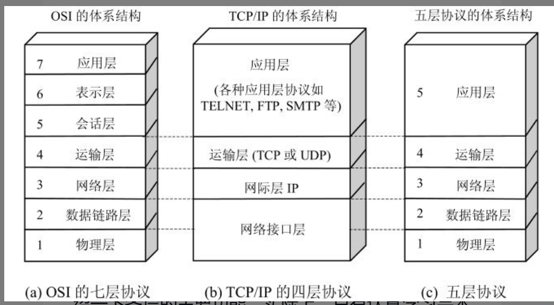

# 第一章 概述

## 1.1 计算机网络在信息时代中的作用

计算机网络向用户提供的两个最重要的功能有:

1. 连通性;
2. 共享;

## 1.2 Internet概述

### 1.2.1 网络的网络

网络(network)是由若干节点(node)和链接这些节点的链路(link)组成。

网络中的节点可以是计算机、集线器、交换机或路由器等。

网络和网络还可以通过路由器互连起来，这样就构成了一个覆盖范围更大的网络，即互联网。

所以互联网是 "**网络的网络**"(network of networks);

### 1.2.2 因特网发展的三个阶段

#### 第一个阶段 从单个网络ARPANET向互联网发展的过程

1969年美国国防部创建的第一个分组交换网ARPANET最初只是一个单个的分组交换网（并不是一个互连的网络）​。所有要连接在ARPANET上的主机都直接与就近的结点交换机相连。但到了上世纪70年代中期，人们已认识到不可能仅使用一个单独的网络来满足所有的通信问题。于是ARPA开始研究多种网络（如分组无线电网络）互连的技术，这就导致后来互连网的出现。

这样的互联网就成为现在**因特网(Internet)**的雏形。

1983年，TCP/IP协议成为ARPANET上的标准协议，使得所有使用TCP/IP协议的计算机都可以利用互联网相互通信。

**区分internet和Internet**

internect是一个通用名词，泛指由多个计算机网络互连而成的网络(它们之间的通信规则是任意的)

Internet(因特网)是一个专有名词，指的是当前全球最大的、开放的、由众多网络互相连接而成的特定计算机网络，它采用TCP/IP协议族作为通信的规则，前身是美国的ARPANET。

#### 第二阶段 三级结构的因特网

1985年起，美国国家科学基金会NSF (National Science Foundation)就围绕六个大型计算机中心建设计算机网络，即国家科学基金网NSFNET。它是一个三级计算机网络，分为主干网、地区网和校园网（或企业网）。这种三级计算机网络覆盖了全美国主要的大学和研究所，并且成为因特网中的主要组成部分。

#### 第三阶段 多层次ISP结构的因特网

从1993年开始，由美国政府资助的NSFNET逐渐被若干个商用的因特网主干网替代，而政府机构不再负责因特网的运营。这样就出现了一个新的名词：因特网服务提供者ISP (Internet Service Provider)。在许多情况下，因特网服务提供者ISP就是一个进行商业活动的公司，因此ISP又常译为因特网服务提供商。

ISP可以从因特网管理机构申请到很多的IP地址, 同时拥有通信线路以及路由器等设备，因此"上网"指的是通过某个ISP获得的IP地址接入到因特网。

IP地址的管理机构不会把一个单个的IP地址分配给单个用户（不“零售”IP地址）​，而是把一批IP地址有偿租赁给经审查合格的ISP（只“批发”IP地址）​。由此可见，现在的因特网已不是某个单个组织所拥有而是全世界无数大大小小的ISP所共同拥有的，这就是因特网也称为“网络的网络”的原因。

根据提供服务的覆盖面积大小以及所拥有的IP地址数量，ISP分为三个层次: 主干ISP, 地区ISP和本地ISP。

1. 主干ISP: 由几个专门的公司创建和维持
2. 地区ISP: 通过一个或多个主干ISP连接
3. 本地ISP: 给端用户提供直接的服务。

从原理上讲，只要每一个本地ISP都安装了路由器连接到某个地区ISP，而每一个地区ISP也有路由器连接到主干ISP，那么在这些相互连接的ISP的共同合作下，就可以完成因特网中的所有的分组转发任务。但随着因特网上数据流量的急剧增长，人们开始研究如何更快地转发分组，以及如何更加有效地利用网络资源。于是，因特网交换点 IXP (Internet eXchange Point)就应运而生了。

因特网交换点IXP的作用是: 允许两个网络直接相连并交换分组，不需要再通过第三个网络来转发分组。

IXP常采用工作在数据链路层的网络交换机，这些网络交换机都用局域网互连起来。

### 1.2.3 因特网的标准化工作

## 1.3 因特网的组成

主要分为两大块:

1. 边缘部分由所有连接在因特网上的主机组成。这部分用户直接使用，用来进行通信(传送数据、音频或视频)和资源共享
2. 核心部分由大量网络和连接这些网络的路由器组成。(为边缘部分提供服务，提供连通性和交换性)

### 1.3.1 因特网的边缘部分

处在因特网边缘的部分就是连接在因特网上的所有的主机。这些主机又称为端系统(end system)，​“端”就是“末端”的意思（即因特网的末端）​。

边缘部分利用核心部分所提供的服务，使得众多的主机之间能够互相通信并交换或共享信息。

"计算机之间相互通信"指的是: "主机A的某个进程和主机B上的另一个进程进行通信"

在网络编译的端系统之间的通信方式可以划分为两大类:

1. 客户-服务器方式(C/S方式)
2. 对等方式(P2P方式)

### 1.3.2 因特网的核心部分

网络核心部分是因特网中最复杂的部分，因为网络中的核心部分要向网络边缘中的大量主机提供连通性，使边缘部分中的任何一台主机都能够向其他主机通信。

在网络核心部分起特殊作用的是路由器(router), 它是一种专门的计算机(不是主机)。
路由器是实现分组交换(packet switching)的关键构件，其任务是转发收到的分组。

#### 电路交换的主要特点

一百多年来，电话交换机虽然经过多次更新换代，但交换的方式一直都是电路交换(circuit switching)。

从通信资源的分配角度来看，交换就是按照某种方式动态地分配传输线路的资源。

必须经过"建立连接(占用通信资源) -> 通话(一直占用通信资源) -> 释放连接(归还通信资源)"三个步骤的交换方式称为**电路交换**

电路交换的一个重要特点就是**在通话的全部时间内，通话的两个用户始终占用端到端的通信资源**。

当使用电路交换来传送计算机数据时，其线路的传输效率往往很低。

#### 分组交换的主要特点

分组交换主要采取**存储转发**技术。

位于网络边缘的主机和位于网络核心部分的路由器都是计算机，但它们的作用却很不一样。主机是为用户进行信息处理的，并且可以和其他主机通过网络交换信息。路由器则是用来转发分组的，即进行分组交换的。路由器收到一个分组，先暂时存储一下，检查其首部，查找转发表，按照首部中的目的地址，找到合适的接口转发出去，把分组交给下一个路由器。这样一步一步地（有时会经过几十个不同的路由器）以存储转发的方式，把分组交付最终的目的主机。各路由器之间必须经常交换彼此掌握的路由信息，以便创建和维持在路由器中的转发表，使得转发表能够在整个网络拓扑发生变化时及时更新。

三种交换方式在数据传送阶段的主要特点:

1. 电路交换-整个报文的比特流连续地从源点直达终点，好像在一个管道中传送
2. 报文交换-整个报文先传送到相邻结点，全部存储下来之后查找转发表，转发到下一个结点
3. 分组交换-单个分组(报文的一部分)，存储下来后查找转发表，转发给下一个结点

## 1.5 计算机网络的类别

### 1.5.1 计算机网络的定义

关于计算机网络的最简单的定义是：一些互相连接的、自治的计算机的集合。这里“自治”的概念即独立的计算机，它有自己的硬件和软件，可以单独运行使用，而“互相连接”是指计算机之间能够进行数据通信或交换信息。

最简单的计算机网络就只有两台计算机和连接它们的一条链路，即两个结点和一条链路。因为没有第三台计算机，因此不存在交换的问题。

### 1.5.2 几种不同类别的网络

#### 按照网络的作用范围分类

1. 广域网WAN(Wide Area Network): 它的作用范围通常为几十到几千公里，有时也称之为(远程网)。广域网是因特网的核心，其任务是通过长距离运送主机所发送的数据。连接广域网各结点交换机的链路一般都是高速链路。
2. 城域网MAN(Metropolitan Area Network): 城域网的作用范围一般是一个城市，可跨越几个街区甚至整个的城市，其作用距离约为5～50km。城域网可以为一个或几个单位所拥有，但也可以是一种公用设施，用来将多个局域网进行互连。目前，很多城域网采用的是以太网技术，因此城域网有时也常纳入局域网的范围进行讨论。
3. 局域网LAN(Local Area Network): 局域网一般用微型计算机或工作站通过高速通信线路相连（速率通常在10Mb/s以上）​，但地理上则局限在较小的范围（如1km左右）​。在局域网发展的初期，一个学校或工厂往往只拥有一个局域网，但现在局域网已非常广泛地使用，一个学校或企业大都拥有许多个互连的局域网（这样的网络常称为校园网或企业网）​。
4. 个人区域网PAN(Personal Area Network): 个人区域网就是在个人工作的地方把属于个人使用的电子设备（如便携式电脑等）用无线技术连接起来的网络，因此也常称为无线个人区域网WPAN (Wireless PAN)，其范围大约在10 m左右。

#### 按网络的使用者分类

1. 公用网(public network):这是指电信公司（国有或私有）出资建造的大型网络
2. 专用网(private network): 这是某个部门、某个行业为各自的特殊业务工作需要而建造的网络。这种网络不对外人提供服务。例如，政府、军队、银行、铁路、电力、公安等系统均有本系统的专用网。
3. 接入网AN(Access Network): 接入网是从某个端系统到另一个端系统的路径中，由这个端系统到第一个路由器之间的物理链路组成。从覆盖的范围看，很多接入网还是属于局域网。从作用上看，接入网只是起到让用户能够与因特网连接的“桥梁”作用。

## 1.6 计算机网络的性能

### 1.6.1 计算机网络的性能指标

#### 速率

我们知道，计算机发送出的信号都是数字形式的。比特（bit）是计算机中数据量的单位，也是信息论中使用的信息量的单位。英文单词bit来源于binary digit，意思是一个“二进制数字”​，因此一个比特就是二进制数字中的一个1或0。网络技术中的速率指的是连接在计算机网络上的主机在数字信道上传送数据的速率，它也称为数据率(data rate)或比特率(bit rate)。速率是计算机网络中最重要的一个性能指标。速率的单位是b/s（比特每秒）(或bit/s，有时也写为bps，即bit per second)。

#### 带宽(bandwidth)

1. 带宽本来指的是信号具有的频带宽度。信号带宽指的是该信号所包含的不同频率成份所占据的频率范围。表示通信线路允许通过的信号频带范围就称为线路的带宽（或通频带）​。
2. 在计网中，带宽用来表示网络的通信线路传送数据的能力。因此网络带宽表示在单位时间内从网络中的某一点到另一点所能通过的“最高数据率”。在本书中在提到“带宽”时，主要是指这个意思。这种意义的带宽的单位是“比特每秒”​，记为b/s。在这种单位的前面也常常加上千（k）​、兆（M）​、吉（G）或太（T）这样的倍数。

在“带宽”的两种表述中，前者为频域称谓，而后者为时域称谓，其本质是相同的。也就是说，一条通信链路的“带宽”越宽，其所能传输的“最高数据率”也越高。

#### 吞吐量(throughput)

表示在单位时间内通过某个网络(信道/接口)的数据量。

吞吐量更经常地用于对现实世界中的网络的一种测量，以便知道实际上到底有多少数据量能够通过网络。显然，吞吐量受网络的带宽或网络的额定速率的限制。例如，对于一个100Mb/s的以太网，其额定速率是100Mb/s，那么这个数值也是该以太网吞吐量的绝对上限值。

#### 时延(delay/latency)

指的是数据从网络的一端到另一端的时间。

1. 发送时延是主机/路由器发送数据帧所需要的时间
2. 传播时延: 电磁波在信道中传播一定距离需要花费的时间
3. 处理时延: 主机/路由器在收到分组时处理要花费的时间
4. 排队时延: 分组在经过网络传输时，要经过许多的路由器。但分组在进入路由器后要先在输入队列中排队等待处理。在路由器确定了转发接口后，还要在输出队列中排队等待转发。这就产生了排队时延。排队时延的长短往往取决于网络当时的通信量。当网络的通信量很大时会发生队列溢出，使分组丢失，这相当于排队时延为无穷大。
5. 时延带宽积
6. 往返时间
7. 信道利用率

### 1.6.2 非性能特征

1. 费用
2. 质量
3. 标准化
4. 可靠性
5. 可扩展性和可升级性
6. 易于管理和维护

## 1.7 计算机网络体系结构

### 1.7.1 计算机网络体系结构的形成

1974年，美国IBM公司宣布了**系统网络体系结构SNA(System Network Architecture)**。

这个著名的网络标准就是按照分层的方法制定的。现在用IBM大型机构建的专用网络仍在使用SNA。

全球经济的发展使得不同网络体系结构的用户迫切要求能够互相交换信息。为了使不同体系结构的计算机网络都能互连，国际标准化组织ISO于1977年成立了专门机构研究该问题。不久，他们就提出一个试图使各种计算机在世界范围内互连成网的标准框架，即著名的开放系统互连基本参考模型 OSI/RM (Open Systems Interconnection Reference Model)，简称为OSI。​“开放”是指非独家垄断的。因此只要遵循OSI标准，一个系统就可以和位于世界上任何地方的、也遵循这同一标准的其他任何系统进行通信。这一点很像世界范围的电话和邮政系统，这两个系统都是开放系统。​“系统”是指在现实的系统中与互连有关的各部分

所以开放系统互连参考模型OSI/RM是个抽象的概念。在1983年形成了开放系统互连基本参考模型的正式文件，即著名的ISO 7498国际标准，也就是所谓的七层协议的体系结构。

OSI试图达到一种理想境界，即全世界的计算机网络都遵循这个统一的标准，因而全世界的计算机将能够很方便地进行互连和交换数据。在20世纪80年代，许多大公司甚至一些国家的政府机构纷纷表示支持OSI。当时看来似乎在不久的将来全世界一定会按照OSI制定的标准来构造自己的计算机网络。然而到了20世纪90年代初期，虽然整套的OSI国际标准都已经制定出来了，但由于因特网已抢先在全世界覆盖了相当大的范围，而与此同时却几乎找不到有什么厂家生产出符合OSI标准的商用产品。因此人们得出这样的结论：OSI只获得了一些理论研究的成果，但在市场化方面OSI则事与愿违地失败了。

得到最广泛应用的不是法律上的国际标准OSI，而是非国际标准TCP/IP。

这样，TCP/IP就常被称为是事实上的国际标准。从这种意义上说，能够占领市场的就是标准。在过去制定标准的组织中往往以专家、学者为主。但现在许多公司都纷纷挤进各种各样的标准化组织，使得技术标准具有浓厚的商业气息。一个新标准的出现，有时不一定反映其技术水平是最先进的，而是往往有着一定的市场背景。

### 1.7.2 协议与划分层次

这些为进行网络中的数据交换而建立的规则、标准或约定称为网络协议(network protocol)。

协议由三要素组成:

1. 语法: 数据与控制信息的结构或格式;
2. 语义: 即需要发出何种控制信息，完成何种动作以及做出何种响应;
3. 同步: 事件实现顺序的详细说明;

协议通常有两种不同的形式，一种是使用便于人来阅读和理解的文字描述，另一种是使用让计算机能够理解的程序代码。这两种不同形式的协议，都必须能够对网络上信息交换过程做出精确的解释。

我们把计算机网络的各层及其协议的集合，称为网络的体系结构(architecture)。换种说法，计算机网络的体系结构就是这个计算机网络及其构件所应完成的功能的精确定义

这些功能究竟是用何种硬件或软件完成的，则是一个遵循这种体系结构的实现(implementation)的问题。

**体系结构是抽象的，而实现则是具体的，是真正在运行的计算机硬件和软件**

### 1.7.3 具有五层协议的体系结构

TCP/IP是一个四层的体系结构, 包含应用层、运输层、网际层和网络接口层

实质上讲，TCP/IP只有上面三层，网络接口层和一般的通信链路在功能上没有多大差别。

因此，综合OSI和TCP/IP的优点，采用一种只有五层协议的体系结构。

1. 应用层(application layer): 应用层是体系结构中的最高层。应用层的任务是通过应用进程间的交互来完成特定网络应用。应用层协议定义的是应用进程间通信和交互的规则。这里的进程就是主机中运行的程序。我们讲应用层交互的数据单位称之为报文(message)
2. 运输层(transport layer): 运输层的任务就是负责向两个主机中进程之间的通信提供通用的数据传输服务。应用进程利用该服务传送应用层报文。所谓通用，是指并不针对某个特定网络应用，而是多种应用可以使用同一个运输层服务。由于一台主机可同时运行多个进程，因此运输层有复用和分用的功能。复用就是多个应用层进程可同时使用下面运输层的服务，分用与复用相反，是运输层把收到的信息分别交付上面应用层中的相应进程。
运输层主要使用以下两种协议:
     1. 传输控制协议TCP(Transmission Control Protocol)-提供面向连接的、可靠的数据传输服务，其数据传输的单位是报文段(segment)
     2. 用户数据报协议UDP(User Datagram Protocol)-提供无连接的、best-effort的数据传输服务，其数据传输的单位是用户数据报
3. 网络层(network layer): 网络层负责为分组交换网上的不同主机提供通信服务。在发送数据时，网络层把运输层产生的报文段或用户数据报封装成分组或包(packet)进行传送。在TCP/IP体系中，由于网络层使用IP协议，因此分组也叫作 IP数据报，或简称为数据报(datagram)。本书把“分组”和“数据报”作为同义词使用。
4. 数据链路层(data link layer): 数据链路层常简称为链路层。我们知道，两台主机之间的数据传输，总是在一段一段的链路上传送的，这就需要使用专门的链路层的协议。在两个相邻结点之间传送数据时，数据链路层将网络层交下来的IP数据报组装成帧（framing）​，在两个相邻结点间的链路上传送帧（frame）​。每一帧包括数据和必要的控制信息（如同步信息、地址信息、差错控制等）​。在接收数据时，控制信息使接收端能够知道一个帧从哪个比特开始和到哪个比特结束。这样，数据链路层在收到一个帧后，就可从中提取出数据部分，上交给网络层。(链路层不仅要检错，还要纠错。
5. 物理层(physical layer): 在物理层上所传数据的单位是比特。

### 1.7.4 实体、协议、服务和服务访问点

当研究开放系统中的信息交换时，往往使用**实体(entity)**这一较为抽象的名词表示**任何可发送或接收信息的硬件或软件进程**

**协议是控制两个对等实体（或多个实体）进行通信的规则的集合。**

**在协议的控制下，两个对等实体间的通信使得本层能够向上一层提供服务。要实现本层协议，还需要使用下面一层所提供的服务。**

### 1.7.5 TCP/IP是一个四层的体系结构
