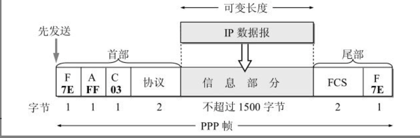
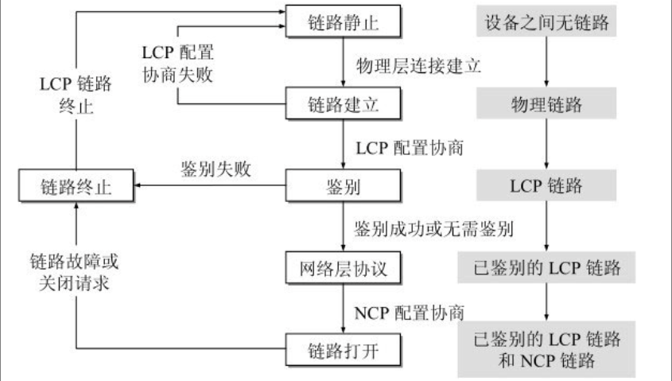
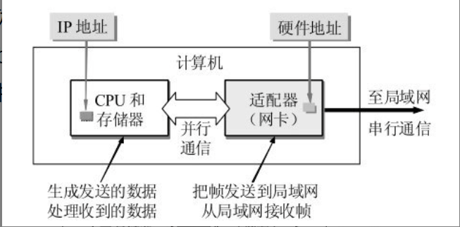
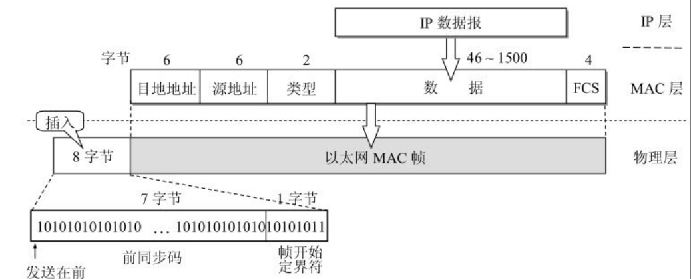
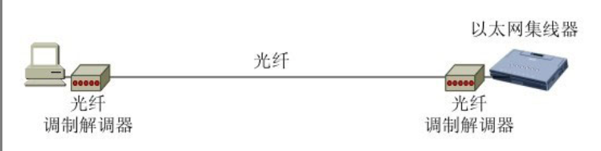
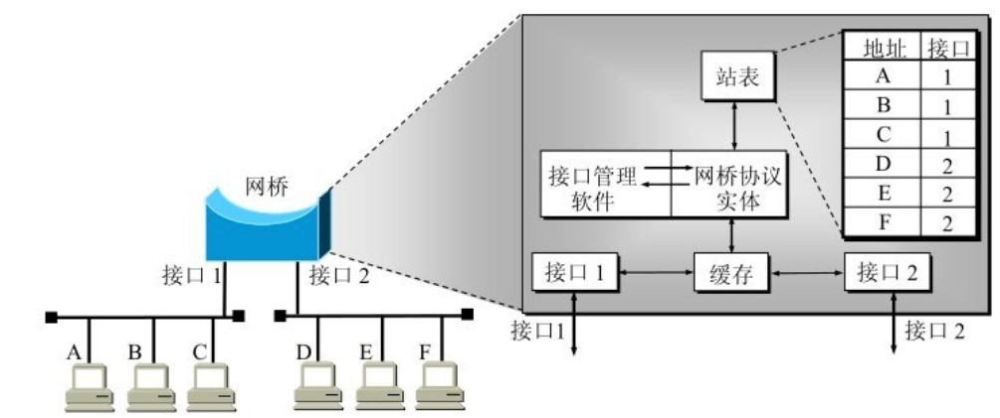

# 第三章 数据链路层

数据链路层使用的信道主要有:

1. 点对点信道
2. 广播信道

## 3.1 使用点对点信道的数据链路层

### 3.1.1 数据链路和帧

链路(link)就是一个结点到相邻结点的一段物理线路，而中间没有任何其他的交换结点。

数据链路(data link)则是另一个概念。这是因为当需要在一条线路上传送数据时，除了必须有一条物理线路外，还必须有一些必要的通信协议来控制这些数据的传输。如果把实现这些协议的硬件和软件加到链路上，就构成了数据链路。现在最常用的方法就是**网络适配器**来实现这些协议。

也有人采用另外的术语。这就是把链路分为物理链路和逻辑链路。物理链路就是上面所说的链路，而逻辑链路就是上面的数据链路，是物理链路加上必要的通信协议。

早期的数据通信协议曾叫作通信规程(procedure)。因此在数据链路层，规程和协议是同义语。

点对点信道的数据链路层的协议数据单元**帧**。

数据链路层把网络层交下来的数据构成**帧**发送到链路上，以及把接收到的帧中的数据取出来并上交给网络层。
在Internet中，网络层协议数据单元就是IP数据报(数据报、分组或包)。

点对点信道的数据链路层在进行通信时的主要步骤如下:

1. 结点A的数据链路层把网络层交下来的IP数据报添加首部和尾部封装成帧
2. 结点A把封装好的帧发送给结点B的数据链路层
3. 若结点B的数据链路层收到的帧无差错，则从收到的帧中提取出IP数据报交给上面的网络层;否则丢弃这个帧

数据链路层不必考虑物理层如何实现比特传输的细节。我们甚至还可以更简单地设想好像是沿着两个数据链路层之间的水平方向把帧直接发送到对方

### 3.1.2 三个基本问题

数据链路层协议有许多种，有三个问题是公共的。
三个基本问题是: 封装成帧，透明传输和差错检测。

#### 封装成帧

封装成帧(framing)就是在一段数据的前后分别添加首部和尾部，这样构成一个帧。接收端在收到物理层上交的比特流后，就可以根据首部和尾部的标记，从收到的比特流中识别帧的开始和结束。

复习一个分组交换的概念: 所有在因特网上传送的数据都是以分组(即IP数据报)为传送单位的。网络层的IP数据报传送到数据链路层就成为帧的数据部分。在帧的数据部分的前面和后面分别加上首部和尾部就构成一个完整的帧。这样的帧就是数据链路层的数据传输单元。

#### 透明传输

由于帧的开始和结束的标记是使用专门指明的控制字符，因此，所传输的数据中的任何8比特的组合一定不允许和用作帧定界的控制字符的比特编码一样，否则就会出现帧定界的错误。

当传送的帧是用文本文件组成的帧时（文本文件中的字符都是从键盘上输入的）​，其数据部分显然不会出现像SOH或EOT这样的帧定界控制字符。可见不管从键盘上输入什么字符都可以放在这样的帧中传输过去，因此这样的传输就是透明传输。

### 差错检测

## 3.2 点对点协议PPP

对于点对点的链路，简单得多的点对点协议PPP (Point-to-Point Protocol)则是目前使用得最广泛的数据链路层协议。

### 3.2.1 PPP协议的特点

我们知道，用户通常要连接到某个ISP才能接入到因特网。PPP协议就是用户计算机和ISP进行通信时用到的数据链路层协议。

#### PPP协议应该满足的需求

1. 简单: 接收方每收到一个帧，就进行CRC检验。如CRC检验正确，就收下这个帧；反之，就丢弃这个帧，其他什么也不做
2. 封装成帧: PPP协议必须规定特殊的字符作为帧定界符，以便使接收端从收到的比特流中准确找出帧的开始和结束
3. 透明性: PPP必须保证数据传输的透明性。
4. 多种网络层协议支持
5. 多种类型链路
6. 差错检测: PPP协议必须能够对接收端收到的帧进行检测，立即丢弃有差错的帧。
7. 检测连接状态: PPP协议必须具有一种机制可以及时自动检测出链路是否处于正常工作状态。
8. 最大传送单元: PPP协议必须对每一种类型的点对点链路设置最大传送单元MTU的标准默认值。注意, MTU是数据链路层的帧可以载荷的数据部分的最大长度，而不是帧的总长度
9. 网络层地址协商: PPP协议必须提供一种机制使得通信的两个网络层试题能够通过协商知道或能够配置彼此的网络层地址.
10. 数据压缩协商: PPP协议必须提供一种方法来协商使用数据压缩算法。但PPP协议并不要求将数据压缩算法进行标准化。

#### PPP协议的组成

1. 一个将IP数据报封装到串行链路的方法。PPP既支持异步链路，也支持面向比特的同步链路。
2. 一个用来建立、配置和测试数据链路连接的链路控制协议LCP。
3. 一套网络控制协议NCP

### 3.2.2 PPP协议的帧格式

#### 各个字段的意义

PPP帧的首部和尾部分为四个字段和两个字段。

### 3.2.3 PPP协议的工作状态

PPP帧如何被初始化?
当用户拨号接入ISP后，就建立了一条从PC到ISP的物理连接。这时候用户PC向ISP发送一系列的链路控制协议LCP分组(封装成多个PPP帧)，以便建立LCP连接。这些分组及其响应选择了将要使用的PPP参数，接着还要进行网络层配置，网络控制协议NCP给新接入的用户PC分配一个临时的IP地址。这样用户PC就成为因特网上的一个有IP地址的主机了。用户通信完毕后，NCP释放网络层链接，收回原来分配出去的IP地址。接着，LCP释放数据链路层连接，最后释放的是物理层的连接。

PPP链路的终止和起始状态永远是链路终止(Link Dead)。这时用户PC和ISP的路由器之间没并不存在物理层的连接。

双方建立了物理层连接后，PPP就进入了"**链路连接(Linke Establish)**"状态，目的是建立链路层的LCP连接。

这个时候LCP开始协商一些配置选项，即发送LCP的配置请求帧(Configure-Request)。这是一个PPP帧，起协议字段设置为LCP对应的代码，而信息字段包含特定的配置请求。

链路的另一端可以发送以下几种响应的一种:

1. 配置确认帧(Configure-Ack): 所有选项都接受
2. 配置否认帧(Configure-Nak): 所有选项都理解但是不能接受
3. 配置拒绝帧(Configure-Reject): 选项有的无法识别或不能接受，需要协商。

LCP配置选项包括链路上的最大帧长、所使用的鉴别协议(authentication protocol)的规约（如果有的话）​，以及不使用PPP帧中的地址和控制字段（因为这两个字段的值是固定的，没有任何信息量

协商结束之后双方都建立了LCP链路，进入 **鉴别(Authenticate)状态**。
鉴别失败，转到Link Dead，否则进入网络层协议(Network-Layer-Protocol)

如果在PPP链路上运行的是IP协议，则对PPP链路的每一端配置IP协议模块（如分配IP地址）时就要使用NCP中支持IP的协议——IP控制协议IPCP (IP Control Protocol)。IPCP分组也封装成PPP帧（其中的协议字段为0x8021）在PPP链路上传送。

网络层配置完毕后，链路就进入可进行数据通信的Link Open(链路打开)状态。
两个PPP端点还可发送回送请求LCP分组(Echo-Request)和回送回答LCP分组(Echo-Reply)，以检查链路的状态。

数据传输结束后，可以由链路的一端发出终止请求LCP分组(Terminate-Ack)后，转到Link Dead状态。如果链路故障，当调制解调器的载波停止后，回到链路静止状态

**PPP协议已不是纯粹的数据链路层的协议，它还包含了物理层和网络层的内容。**

## 3.3 使用广播信道的数据链路层

广播信道可以进行一对多的通信

### 3.3.1 局域网的数据链路层

局域网最主要的特点是:**网络以一个单位所拥有，且地理范围和站点数目有限**

在局域网刚刚出现时，局域网比广域网具有较高的数据率、较低的时延和较小的误码率。但随着光纤技术在广域网中普遍使用，现在广域网也具有很高的数据率和很低的误码率

局域网的优点:

1. 具有广播的功能, 从一个站点可以很方便地访问全网。局域网上地主机可以共享连接在局域网上地各种硬件和软件资源
2. 便于系统的扩展和逐渐地演变，各设备的位置可以灵活调整和改变
3. 提高了系统的可靠性、可用性和生存性

局域网可以按照网络拓扑分类
分为:
1. 星形网
2. 环形网
3. 总线网

**局域网工作的层次跨越了数据链路层和物理层**

共享信道要着重考虑的一个问题就是如何使众多用户能够合理而方便地共享通信媒体资源。这在技术上有两种方法

1. 静态划分信道(不适合局域网)
2. 动态媒体接入控制(多点接入)，特点是信道并非在用户通信时固定分配给用户:
   分为两类:
   1. 随机接入: 所有用户随机地发送信息。共享信道要着重考虑的一个问题就是如何使众多用户能够合理而方便地共享通信媒体资源。这在技术上有两种方法
   2. 受控接入: 用户不能随机地发送信息而必须服从一定的控制。这类的典型代表有分散控制的令牌环局域网和集中控制的多点线路探询(polling)，或称为轮询。

#### 介绍传统以太网

##### 以太网的两个标准

以太网是美国施乐(Xerox)公司的Palo Alto研究中心（简称为PARC）于1975年研制成功的。那时，以太网是一种基带总线局域网，当时的数据率为2.94Mb/s。以太网用无源电缆作为总线来传送数据帧，并以曾经在历史上表示传播电磁波的以太(Ether)来命名。

1980年9月，DEC公司、英特尔(Intel)公司和施乐公司联合提出了10Mb/s以太网规约的第一个版本DIX V1 (DIX是这三个公司名称的缩写)。1982年又修改为第二版规约（实际上也就是最后的版本）​，即**DIX Ethernet V2**，成为世界上第一个局域网产品的规约。

IEEE 802委员会的802.3工作组于1983年制定了第一个IEEE的以太网标准IEEE 802.3[W-IEEE802.3]​，数据率为10Mb/s。802.3局域网对以太网标准中的帧格式作了很小的一点更动，但允许基于这两种标准的硬件实现可以在同一个局域网上互操作。以太网的两个标准DIX Ethernet V2与IEEE的802.3标准只有很小的差别，因此很多人也常把802.3局域网简称为“以太网

为了使数据链路层能更好地适应多种局域网标准，IEEE 802委员会就把局域网的数据链路层拆成两个子层，即逻辑链路控制 LLC (Logical Link Control)子层和媒体接入控制MAC (Medium Access Control)子层。与接入到传输媒体有关的内容都放在MAC子层，而LLC子层则与传输媒体无关，不管采用何种传输媒体和MAC子层的局域网对LLC子层来说都是透明的（

然而到了20世纪90年代后，激烈竞争的局域网市场逐渐明朗。以太网在局域网市场中已取得了垄断地位，并且几乎成为了局域网的代名词。由于因特网发展很快而TCP/IP体系经常使用的局域网只剩下DIX Ethernet V2而不是IEEE 802.3标准中的局域网，因此现在IEEE 802委员会制定的逻辑链路控制子层LLC（即IEEE 802.2标准）的作用已经消失了，很多厂商生产的适配器上就仅装有MAC协议而没有LLC协议。

##### 适配器的作用

**计算机怎样连接到局域网上?**

计算机与外部局域网的连接是通过**通信适配器(adapter)**。
适配器本来是主机箱内插入的一块网络接口板。这种接口板又称之为网络接口卡NIC(Network Interface Card)简称为网卡.

现在计算机主板上已经都嵌入了这种适配器，不再使用单独的网卡了

在适配器上面装有处理器和存储器。适配器和局域网之间的通信通过电缆/双绞线进行串行传输方式进行的，而适配器和计算机之间的通信则是通过计算机主板上的I/O总线以并行的传输方式进行的。因此，适配器的一个重要功能就是要进行数据串行传输和并行传输的转换。适配器还要能够实现以太网协议。

适配器所实现的功能却包含了数据链路层及物理层这两层次的功能。

适配器接收和发送各种帧时不使用计算机的CPU。这时CPU可以处理其他任务。当适配器收到有差错的帧时，就把这个帧丢弃而不必通知计算机。当适配器收到正确的帧时，它就使用中断来通知该计算机并交付协议栈中的网络层。当计算机要发送IP数据报时，就由协议栈把IP数据报向下交给适配器，组装成帧后发送到局域网。

计算机的硬件地址就在适配器的ROM中，软件地址IP地址就在计算机的存储器中。

### 3.3.2 CSMA/CD协议

最早的以太网是将许多计算机都连接到一根总线上。当初认为这种连接方法既简单又可靠，因为在那个时代普遍认为：​“有源器件不可靠，而无源的电缆线才是最可靠的”​。

总线的特点是：当一台计算机发送数据时，总线上的所有计算机都能检测到这个数据。这种就是广播通信方式。但我们并不总是要在局域网上进行一对多的广播通信。为了在总线上实现一对一的通信，可以使每一台计算机的适配器拥有一个与其他适配器都不同的地址。在发送数据帧时，在帧的首部写明接收站的地址。现在的电子技术可以很容易做到：仅当数据帧中的目的地址与适配器ROM中存放的硬件地址一致时，该适配器才能接收这个数据帧。适配器对不是发送给自己的数据帧就丢弃。这样，具有广播特性的总线上就实现了一对一的通信。

为了通信的简便, 以太网采取了以下步骤:

1. 采用较为灵活的无连接的工作方式，即不必先建立连接就可以直接发送数据。适配器对发送的数据帧不进行编号，也不要求对方发回确认。以太网提供的服务是尽最大努力的交付(不可靠的交付)。当目的站收到有错误的数据帧时，就把帧丢弃，其他啥也不做。对有差错的帧是否需要重传由高层决定例如，如果高层使用TCP协议，那么TCP就会发现丢失了一些数据。于是经过一定的时间后，TCP就把这些数据重新传递给以太网进行重传。(但是以太网并不知道这是重传帧，而是当作新的数据帧来发送)
我们知道，总线上只要有一台计算机在发送数据，总线的传输资源就被占用。因此，在同一时间只能允许一台计算机发送数据，否则各计算机之间就会互相干扰，使得所发送数据被破坏。因此，如何协调总线上各计算机的工作就是以太网要解决的一个重要问题。
以太网采取最简单的**随机接入**, 但有很好的协议用来减少冲突发生的概率。
这个协议就是CSMA/CD，**载波监听多点接入/碰撞检测(Carrier Sense Multiple Access with Collision Detection)**
2. 以太网发送的数据都是用曼彻斯特编码的信号。
我们知道，二进制基带数字信号通常就是高、低电压交替出现的信号。使用这种信号的最大问题就是当出现一长串的连1或连0时，接收端就无法从收到的比特流中提取位同步（即比特同步）信号。
曼彻斯特编码的方法是把每一个码元再分成两个相等的间隔。码元1是在前一个间隔为低电压而后一个间隔为高电压。码元0则正好相反，从高电压变到低电压（也可采用相反的约定，即1是“前高后低”而0是“前低后高”​）​。这样就保证了在每一个码元的正中间出现一次电压的转换，而接收端就利用这种电压的转换很方便地把位同步信号提取出来。(但是它所占的频道宽度比原始的基带信号增加了一倍)

#### CSMA/CD协议的要点

1. 多点接入: 总线型网络，许多计算机以多点接入的方式连接在一根总线上。协议的实质是"载波监听"和"碰撞检测"
2. 载波监听: 实际上是就是检测信道。不管发送前后，每个站(主机)都必须不停地检测信道。在发送前检测信道，是为了获得发送权。如果检测出已经有其他站在发送，则自己就暂时不许发送数据，必须要等到信道变为空闲时才能发送。在发送中检测信道，是为了及时发现有没有其他站的发送和本站发送的碰撞。这就称为碰撞检测。
3. 碰撞检测: 适配器便发送数据边检测信道上的信道电压的变化情况。当几个站同时在总线上发送数据时，总线上的信号电压变化幅度将会增大（互相叠加）​。当适配器检测到的信号电压变化幅度超过一定的门限值时，就认为总线上至少有两个站同时在发送数据，表明产生了碰撞。

显然，使用CSMA/CD协议时，一个站不可能同时进行发送和接收(必须边发送边监听信道)。因此使用CSMA/CD协议的以太网不太可能进行全双工通信，只能进行半双工通信(双向交替通信)

## 3.4 使用广播信道的以太网

### 3.4.1 使用集线器的星形拓扑

传统以太网最初是使用粗同轴电缆，后来演进到使用比较便宜的细同轴电缆，最后发展为使用更便宜和更灵活的双绞线。这种以太网采用星形拓扑，在星形的中心则增加了一种可靠性非常高的设备，叫做**集线器(hub)**

性价比很高的10BASE-T双绞线以太网的出现，是局域网发展史上的一个非常重要的里程碑，它为以太网在局域网中的统治地位奠定了牢固的基础。

集线器的特点:

1. 从表面上看，使用集线器的局域网在物理上是一个星型网，但由于集线器是使用电子器件来模拟实际电缆线的工作，因此整个系统仍像一个传统以太网那样运行。也就是说，使用集线器的以太网在逻辑上仍是一个总线网，各站共享逻辑上的总线，使用的还是CSMA/CD协议
2. 一个集线器有许多的接口。因此，一个集线器很像一个多接口的转发器。
3. 集线器工作在物理层，它的每个接口仅仅简单地转发比特。收到1就转发1，收到0就转发0，不进行碰撞检测
4. 集线器采用了专门的芯片，进行自适应串音回波抵消。这样就可使接口转发出去的较强信号不致对该接口接收到的较弱信号产生干扰

### 3.4.2 以太网的信道利用率

### 3.4.3 以太网的MAC层

#### MAC层的硬件地址

局域网中，硬件地址又称之为物理地址或MAC地址(因为这种地址用在MAC帧中)

大家知道，在所有计算机系统的设计中，标识系统(identification system)[插图]都是一个核心问题

**名字指出我们所要寻找的那个资源，地址指出那个资源在何处，路由告诉我们如何到达该处**

IEEE 802标准为局域网规定了一种48位的全球地址。指的是局域网上的每一台计算机中固化在适配器的ROM中的地址。

所以:

1. 假定连接在局域网上的一台计算机的适配器坏了而我们更换了一个新的适配器，那么这台计算机的局域网的“地址”也就改变了，虽然这台计算机的地理位置一点也没有变化，所接入的局域网也没有任何改变。
2. (2) 假定我们把位于南京的某局域网上的一台笔记本电脑携带到北京，并连接在北京的某局域网上。虽然这台电脑的地理位置改变了，但只要电脑中的适配器不变，那么该电脑在北京的局域网中的“地址”仍然和它在南京的局域网中的“地址”一样。

局域网上的某个主机的“地址”根本不能告诉我们这台主机位于什么地方。因此，严格地讲，局域网的“地址”应当是每一个站的“名字”或标识符[PERL00]​。

现在IEEE的注册管理机构RA (Registration Authority)是局域网全球地址的法定管理机构[W-IEEERA]​，它负责分配地址字段的6个字节中的前三个字节(即高位24位)。世界上凡要生产局域网适配器的厂家都必须向IEEE购买由这三个字节构成的这个号（即地址块）​，这个号的正式名称是组织唯一标识符OUI (Organizationally Unique Identifier)，通常也叫做公司标识符(company_id)。

因此, MAC地址也称之为硬件地址(hardware address)或物理地址。所以MAC地址实际上就是适配器地址/适配器标识符EUI-48

IEEE规定地址字段的第一字节的最低位为I/G位。I/G表示Individual/Group。当I/G位为0时，地址字段表示一个单个站地址。当I/G位为1时表示组地址，用来进行多播（以前曾译为组播）​。因此，IEEE只分配地址字段前三个字节中的23位。当I/G位分别为0和1时，一个地址块可分别生成224个单个站地址和224个组地址。需要指出，有的书把上述最低位写为“第一位”​，但“第一”的定义是含糊不清的。这是因为在地址记法中有两种标准：第一种记法是把每一字节的最低位写在最左边（最左边的最低位是第一位）​。IEEE 802.3标准就采用这种记法。第二种记法是把每一字节的最高位写在最左边（最左边的最高位是第一位）​。在发送数据时，两种记法都是按照字节的顺序发送，但每一个字节中先发送哪一位则不同：第一种记法先发送最低位，第二种记法先发送最高位。

我们知道适配器有过滤功能。但适配器从网络上每收到一个MAC帧就先用硬件检查MAC帧中的目的地址。如果是发往本站的帧则收下，然后再进行其他的处理。否则就将此帧丢弃，不再进行其他的处理。

发往本站的帧包括以下三种帧:

1. 单播(unicast)帧(一对一): 即收到的帧的MAC地址与本站的硬件地址相同
2. 广播(broadcast)帧(一对全体): 即发送给本局域网上所有站点的帧（全1地址）​
3. 多播(multicast)帧(一对多): 即发送给本局域网上一部分站点的帧

以太网适配器还可设置为一种特殊的工作方式，即混杂方式(promiscuous mode)。工作在混杂方式的适配器只要“听到”有帧在以太网上传输就都悄悄地接收下来，而不管这些帧是发往哪个站。请注意，这样做实际上是“窃听”其他站点的通信而并不中断其他站点的通信。网络上的黑客(hacker或cracker)常利用这种方法非法获取网上用户的口令。因此，以太网上的用户不愿意网络上有工作在混杂方式的适配器。

#### MAC帧的格式

常用的以太网MAC帧格式有两种标准，一种是DIX Ethernet V2标准（即以太网V2标准）​，另一种是IEEE的802.3标准。

以太网V2的MAC帧比较简单，由五个字段组成。
前两个分别为6字节长的目的地址和源地址字段。
第三个字段是2字节的类型字段，用于标记上一层使用的什么协议，以便把收到的MAC帧的数据上交给上一层的这个协议。例如，当类型字段的值是0x0800时，就表示上层使用的是IP数据报。若类型字段的值为0x8137，则表示该帧是由Novell IPX发过来的。
第四个是数据字段，其长度在46到1500字节之间（46字节是这样得出的：最小长度64字节减去18字节的首部和尾部就得出数据字段的最小长度）​。
最后一个字段是4字节的帧检验序列FCS(用CRC检验)

## 3.5 扩展的以太网

### 3.5.1 在物理层扩展以太网

以太网上的主机之间的距离不能太远（例如，10BASE-T以太网的两个主机之间的距离不超过200米）​，否则主机发送的信号经过铜线的传输就会衰减到使CSMA/CD协议无法正常工作。

目前, 扩展主机和集线器之间的距离的一种简单办法就是使用光纤和光纤调制解调器

光纤调制解调器的作用就是进行电信号和光信号的转换。由于光纤带来的时延很小，并且带宽很高，因此使用这种方法可以很容易地使主机和几公里以外的集线器相连接。

如果使用多个集线器，就可以连接成覆盖更大范围的多级星型结构的以太网。例如，一个学院的三个系各有一个10BASE-T以太网（图3-24(a)）​，可通过一个主干集线器把各系的以太网连接起来，成为一个更大的以太网

### 3.5.2 在数据链路层拓展以太网

在数据链路层拓展以太网要使用网桥(bridge)。网桥的工作在数据链路层，它根据MAC帧的目的地址对收到的帧进行转发和过滤。

当网桥收到一个帧时，并不是向所有的接口转发此帧，而是先检查此帧的目的MAC地址，然后再确定将该帧转发到哪一个接口，或者是把它丢弃（即过滤）​。

#### 网桥的内部结构

最简单的网桥有两个接口

复杂些的网桥可以有更多的接口。两个以太网通过网桥连接起来后，就成为一个覆盖范围更大的以太网，而原来的每个以太网就可以称为一个网段(segment)。

网桥依靠转发表来转发帧。转发表也叫做转发数据库或路由目录。

##### 使用网桥的好处:

1. 过滤通信量，增大吞吐量。网桥工作在链路层的MAC子层，可以使以太网各网段成为隔离开的碰撞域。如果把网桥换成工作在物理层的转发器，那就没有这种过滤通信量的功能。因此，若每一个网段的数据率都是10Mb/s，那么三个网段合起来的最大吞吐量就变成30Mb/s。如果把两个网桥换成为集线器或转发器，那么整个网络仍然是一个碰撞域，当A和B通信时，所有其他站点都不能够通信。整个碰撞域的最大吞吐量仍然是10Mb/s。
2. 扩大了物理范围
3. 提高了系统的可靠性
4. 可互连不同的物理层、不同MAC子层和不同速率的以太网

##### 缺点

1. 由于网桥对接收的帧要先存储和查找转发表，然后才转发，而转发之前，还必须执行CSMA/CD算法（发生碰撞时要退避）​，这就增加了时延。
2. MAC子层没有流量控制功能。当网络上的负荷很重时，网桥中的缓存的存储空间可能不够而发生溢出，以致产生帧丢失的现象。
3. 网桥只适合用户不多的以太网，否则有时还会因传播过多的广播信息而产生网络拥塞。这就是所谓的广播风暴。

#### 透明网桥(transparent bridge)

透明”是指以太网上的站点并不知道所发送的帧将经过哪几个网桥，以太网上的站点都看不见以太网上的网桥。透明网桥还是一种即插即用设备(plug-and-play device)，意思是只要把网桥接入局域网，不用人工配置转发表网桥就能工作。

#### 源路由网桥

透明网桥的最大优点就是容易安装，一接上就能工作。但是，网络资源的利用还不充分。因此，另一种由发送帧的源站负责路由选择的网桥就问世了，这就是**源路由(source route)网桥**

源路由网桥是在发送帧时，把详细的路由信息放在帧的首部中。

为了发现合适的路由，源站以广播方式向欲通信的目的站发送一个**发现帧(discovery frame)**作为探测之用。发现帧将在整个扩展的以太网中沿着所有可能的路由传送。在传送过程中，每个发现帧都记录所经过的路由。当这些发现帧到达目的站时，就沿着各自的路由返回源站。源站在得知这些路由后，从所有可能的路由中选择出一个**最佳路由**。以后，凡从这个源站向该目的站发送的帧的首部，都必须携带源站所确定的这一路由信息。

发现帧还有另一个作用，就是帮助源站确定整个网络可以通过的帧的最大长度

#### 多接口网桥-以太网交换机

1990年问世的交换式集线器(switching hub)，可明显地提高以太网的性能。交换式集线器常称为以太网交换机(switch)或第二层交换机，表明这种交换机工作在数据链路层。

以太网交换机实质上就是一个多接口的网桥

太网交换机的每个接口都直接与一个单个主机或另一个集线器相连（注意：普通网桥的接口往往是连接到以太网的一个网段）​，并且一般都工作在全双工方式。当主机需要通信时，交换机能同时连通许多对的接口，使每一对相互通信的主机都能像独占传输媒体那样，无碰撞地传输数据。以太网交换机和透明网桥一样，也是一种即插即用设备，其内部的帧转发表也是通过**自学习算法**自动地逐渐建立起来的。当两个站通信完成后就断开连接。以太网交换机由于使用了专用的交换结构芯片，其交换速率就较高。

## 3.6 高速以太网

