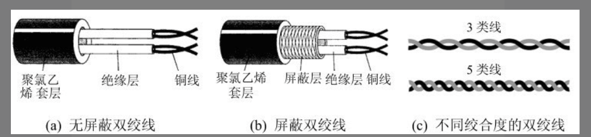
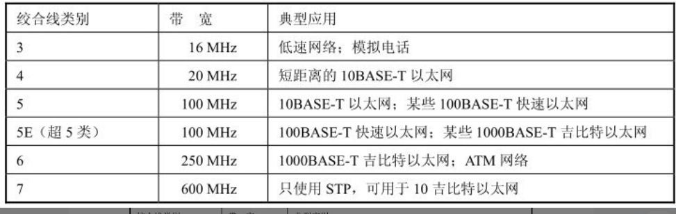

# 第二章 物理层

## 2.1 物理层的基本概念

首先，物理层考虑的是怎么才能在连接各种计算机的传输媒体上传输数据比特流，而不是具体的传输媒体。
物理层就是要尽可能地屏蔽通信手段和传输媒体地差异，使得物理层上面地数据链路层感觉不到差异，使得数据链路层只考虑如何完成本层的协议和服务。

用于物理层的协议通常称之为物理层规程(procedure)。

物理层规程主要描述为确定与传输媒体的接口有关的特性:

1. 机械特性: 指明接口所用接线器的形状和尺寸，引脚数目和排列，固定和锁定装置，等等
2. 电气特性: 指明在接口电缆的各条线上出现的电压的范围
3. 功能特性: 指明某条线上出现的某一电频的电压表示何种意义
4. 过程特性: 指明对于不同功能的各种可能事件的出现顺序

数据在计算机中多采用并行传输方式。但数据在通信线路（传输媒体）上的传输方式一般都是串行传输（这是出于经济上的考虑）​，即逐个比特按照时间顺序传输。因此物理层还要完成传输方式的转换。

## 2.2 数据通信的基础知识

### 2.2.1 数据通信系统的模型

一个数据通信系统可划分为三大部分，即源系统（或发送端、发送方）​、传输系统（或传输网络）和目的系统（或接收端、接收方）​。

源系统一般分为:

1. 源点(source): 源点设备产生要传输的数据
2. 发送器: 通常，源点生成的数字比特流要通过发送器编码后才能够在传输系统中进行传输。典型的发送器就是调制器。

目的系统一般分为:

1. 接收器: 接收传输系统传送过来的信号，并把它转换为能够被目的设备处理的信息。典型的接收器就是解调器，它把来自传输线路上的模拟信号进行解调，提取出在发送端置入的消息，还原出发送端产生的数字比特流。
2. 终点: 终点设备从接收器获取传送来的数字比特流，然后把信息输出（例如，把汉字在PC屏幕上显示出来）​。终点又称为目的站，或信宿。

### 2.2.2 有关信道的几个基本概念

信道指的是向某个方向传送信息的媒体。

从通信的双方信息交互的方式来看，有三种基本方式:

1. 单向通信又称之为单工通信: 即只能有一个方向的通信而没有反方向的交互。(无线电/有线电/电视广播)
2. 双向交替通信又称为半双工通信: 通信双方都可以发送信息，但是不可以同时发送(一方发送，乙方接收)
3. 双向同时通信又称为全双工通信: 通信双方可以同时接收和发送信息

单向通信只需要一条信道，而双向交替通信或双向同时通信则都需要两条信道（每个方向各一条）​。显然，双向同时通信的传输效率最高。

来自信源的信号常称为基带信号(即基本频带信号)。

基带信号往往包含有较多的低频成分，甚至有直流成分，而许多信道并不能传输这种低频分量或直流分量。为了解决这一问题，就必须对基带信号进行调制(modulation)。

调制可以分为两大类。

一类仅仅对基带信号的波形进行变换，使得他可以与信道特性相适应。变换后的信号仍然是基带信号。这类称之为基带调制。
由于这种基带调制是把数字信号转换为另一种形式的数字信号，因此大家更愿意把这种过程称为编码(coding)。另一类调制则需要使用载波(carrier)进行调制，把基带信号的频率范围搬移到较高的频段，并转换为模拟信号，这样就能够更好地在模拟信道中传输。经过载波调制后的信号称为带通信号（即仅在一段频率范围内能够通过信道）​，而使用载波的调制称为带通调制。

### 2.2.3 信道的极限容量

## 2.3 物理层下面的传输媒体

传输媒体也成为传输介质或传输媒介，它就是数据传输系统中在发送器和接收器之间的物理通路。传输媒体可以分为两大类，即导引型传输媒体和非导引型传输媒体。

在导引型传输媒体中，电磁波被导引沿着固体媒体（铜线或光纤）传播；而非导引型传输媒体就是指自由空间，在非导引型传输媒体中电磁波的传输常称为无线传输。

### 2.3.1 导引型传输媒体

#### 1.双绞线

把两根互相绝缘的铜导线并排放在一起，然后用规则的方法绞合(twist)起来就构成了双绞线。绞合可减少对相邻导线的电磁干扰。使用双绞线最多的地方就是到处都有的电话系统。几乎所有的电话都用双绞线连接到电话交换机。这段从用户电话机到交换机的双绞线称为用户线或用户环路(subscriber loop)。通常将一定数量的这种双绞线捆成电缆，在其外面包上护套。

为了提高双绞线的抗电磁干扰的能力，可以在双绞线的外面再加上一层用金属丝编织成的屏蔽层。这就是屏蔽双绞线，简称为STP (Shielded Twisted Pair)。它的价格当然比无屏蔽双绞线UTP (Unshielded Twisted Pair) 要贵一些。

**常用的双绞线的类别、带宽和典型应用**

#### 2.同轴电缆

同轴电缆由内导体铜质芯线（单股实心线或多股绞合线）​、绝缘层、网状编织的外导体屏蔽层（也可以是单股的）以及保护塑料外层所组成

#### 3.光缆

### 2.3.2 非导引型传输媒体

### 2.4信道复用技术

#### 2.4.1 频分复用、时分复用和统计时分复用

**复用(multiplexing)**是通信技术的基本概念

最基本的复用就是频分复用 FDM (Frequency Division Multiplexing)和时分复用 TDM (Time Division Multiplexing)。

- 频分复用: 用户在分配到一定的频带后，**在通信过程中自始至终都占用这个频带**。
- 可见频分复用的**所有用户在同样的时间占用不同的带宽资源**（请注意，这里的“带宽”是频率带宽而不是数据的发送速率）​。而时分复用则是将时间划分为一段段等长的时分复用帧（TDM帧）​。每一个时分复用的用户在每一个TDM帧中占用固定序号的时隙。

在进行通信时，复用器(multiplexer)总是和分用器(demultiplexer)成对地使用。在复用器和分用器之间是用户共享的高速信道。分用器的作用正好和复用器的作用相反，它把高速信道传送过来的数据进行分用，分别送交到相应的用户。

#### 2.4.2 波分复用

波分复用WDM(WaveLength Division Multiplexing)就是光的频分复用。

人们只能在一根光纤上复用两路光载波信号。这种复用方式称为波分复用 WDM。

#### 2.4.3 码分复用

码分复用CDM (Code Division Multiplexing)是另一种共享信道的方法。实际上，人们更常用的名词是码分多址CDMA (Code Division Multiple Access)。每一个用户可以在同样的时间使用同样的频带进行通信。由于各用户使用经过特殊挑选的不同码型，因此各用户之间不会造成干扰。码分复用最初是用于军事通信的，因为这种系统发送的信号有很强的抗干扰能力，其频谱类似于白噪声，不易被敌人发现。

### 2.5 数字传输系统

### 2.6 宽带接入技术

从宽带接入的媒体来看，可以划分为两大类。一类是有线宽带接入，而另一类是无线宽带接入

#### 2.6.1 ADSL接入技术

非对称数字用户线ADSL(Asymmetric Digital Subscriber Line)技术是用数字技术对现有的模拟电话用户线进行改造，使它能够承载宽带数字业务

#### 2.6.2 光纤同轴混合网(HFC网)

光纤同轴混合网（HFC网, HFC是Hybrid Fiber Coax的缩写）是在目前覆盖面很广的有线电视网的基础上开发的一种居民宽带接入网