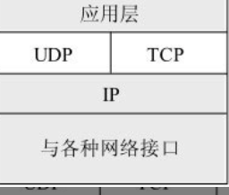
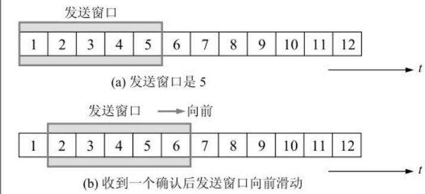

# 第五章 运输层

## 5.1 运输层协议概述

### 5.1.1 进程之间的通信

从通信和信息处理的角度来看，**运输层向它上面的应用层提供通信服务**, 它属于面向通信部分的最高层，同时也是用户功能的最底层。当网络的边缘部分中的两个主机使用网络的核心部分的功能进行端到端的通信时，只有主机的协议栈才有运输层，而网络核心部分中的路由器在转发分组时都只用到下三层的功能。

IP协议能够把源主机A发送出的分组按照首部中的目的地址送交到目的主机B，那么，为什么还需要运输层呢？

从IP层来说，通信的两端是两个主机。IP数据报的首部明确地标志了这两个主机的IP地址。
但“两个主机之间的通信”这种说法还不够清楚。这是因为，**真正进行通信的实体是在主机中的进程，是这个主机中的一个进程和另一个主机中的一个进程在交换数据**（即通信）​。

因此严格地讲，**两个主机进行通信就是两个主机中的应用进程互相通信。IP协议虽然能把分组送到目的主机，但是这个分组还停留在主机的网络层而没有交付主机中的应用进程**。

从运输层的角度来看，**通信的真正端点并不是主机而是主机的进程**。也就是说，**端到端的通信**是应用进程
之间的通信。

运输层有一个很重要的功能--复用(multiplexing)和奋勇(demultiplexing)。

这里的复用指的是发送方在不同的应用程序进程都可以使用同一个运输层协议发送数据，而分用指的是接收方的运输层在剥去报文的首部后能够把这些数据正确交付目的应用进程。

**运输层提供应用进程间的逻辑通信**

逻辑通信的意思是: 从应用层来看，只要把应用层报文交给下面的运输层，运输层就可以把这报文传送到对方的运输层，**好像这种通信就是沿水平方向直接传送数据。但事实上这两个运输层之间并没有一条水平方向的物理连接。数据的传送是沿着图中的虚线方向（经过多个层次）传送的**

逻辑通信的意思是好像是这样通信，但事实上并非真的这样通信

**网络层为主机之间提供逻辑通信，而运输层为应用进程之间提供端到端的逻辑通信**

运输层还要对收到的报文进行差错检测。(在网络层，IP数据报首部中的检验和字段，只检验首部是否出现差错而不检查数据部分。)

根据应用程序的不同需求, 运输层需要有两种不同的运输协议，即**面向连接的TCP**和**无连接的UDP**

**运输层向高层用户屏蔽了下面网络核心的细节, 它使得应用进程看见的好像就是两个运输层实体之间一条端到端的逻辑通信信道**

但是UDP和TCP有所区别, 当运输层采用面向连接的TCP协议时，尽管下面的网络是不可靠的(只提供尽最大努力服务，不确保正确)，但这种逻辑通信信道就相当于一条全双工的可靠信道。但当运输层采用无连接的UDP协议时，这种逻辑通信信道仍然是一条不可靠信道。

### 5.1.2 运输层的两个主要协议

TCP/IP运输层的两个主要协议都是因特网的正式标准，即:

1. 用户数据报协议UDP(User Datagram Protocol)
2. 传输控制协议TCP(Transimission Control protocol)

按照OSI的术语，两个对等的运输实体在通信时传送的数据单位叫做**运输协议数据单元TPDU(Trasport Protocol Data Unit)**

但是TCP/IP体系中，根据所使用的协议是TCP/UDP，分别称之为**TCP报文段或UDP用户数据报**

**UDP在传送数据之前不需要先建立连接。远地主机的运输层在收到UDP报文后，不需要给出任何确认。**

**TCP则提供面向连接的服务，在传送数据之前必须先建立连接，数据传送结束后要释放连接**

TCP不提供广播或多播服务。由于TCP要提供可靠的、面向连接的运输服务，因此不可避免地增加了许多的开销，如确认、流量控制、计时器以及连接管理等。这不仅使协议数据单元的首部增大很多，还要占用许多的处理机资源。

### 5.1.3 运输层的端口

应用层所有的应用进程都可以通过运输层再传送到IP层（网络层）​，**这就是复用**。

运输层从IP层收到数据后必须交付指明的应用进程，**这就是分用。**

在单个计算机中的进程是用进程标识符（一个不大的整数）来标志的。但是在因特网环境下，计算机操作系统所指派的这种进程标识符用来标志运行在应用层的各种应用进程则是不行的。这是因为在因特网上使用的计算机的操作系统种类很多，而不同的操作系统又使用不同格式的进程标识符。为了使运行不同操作系统的计算机的应用进程能够互相通信，就必须用统一的方法（而这种方法必须与特定操作系统无关）对TCP/IP体系的应用进程进行标志。

但是，把一个特定机器上运行的特定进程，指明为因特网上通信的最后的终点还是不可行的。这是因为进程的创建和撤销都是动态的，通信的一方几乎无法识别对方机器上的进程。另外，我们往往需要利用目的主机提供的功能来识别终点，而不需要知道具体实现这个功能的进程是哪一个

解决这个问题的方法就是在运输层使用**协议端口号(protocol port number)**也称之为**端口**

虽然通信的终点是应用进程，**但我们只要把要传送的报文交到目的主机的某一个合适的目的端口，剩下的工作（即最后交付目的进程）就由TCP来完成。**

注意: **这种在协议栈层的抽象的协议端口是软件端口，与路由器/交换机的硬件端口完全不同**

**硬件端口是不同硬件设备进行交互的接口，而软件端口是应用层的各种协议进程与运输实体进行层间交互的一种地址。**

不同的系统具体实现端口的方法不同

TCP/IP的运输层用一个16位端口号来标志一个端口。但请注意，端口号只具有本地意义，它只是为了标志本计算机应用层中的各个进程在和运输层交互时的层间接口。在因特网不同计算机中，相同的端口号是没有关联的。16位的端口号可允许有65 535个不同的端口号，这个数目对一个计算机来说是足够用的。

因特网上的计算机通信是采用客户-服务器方式。客户在发起通信请求时，必须先知道对方服务器的IP地址和端口号。因此运输层的端口号共分为下面的两大类:

1. 服务器端使用的端口号分为两类: 
   1. 熟知端口号(well-known port number)/系统端口号
   2. 登记端口号: 数值为1024～49151。这类端口号是为没有熟知端口号的应用程序使用的。
2. 客户端使用的端口号: 由于这类端口号仅在客户进程运行时才动态选择，因此又叫做短暂端口号[插图]。这类端口号是留给客户进程选择暂时使用。当服务器进程收到客户进程的报文时，就知道了客户进程所使用的端口号，因而可以把数据发送给客户进程。通信结束后，刚才已使用过的客户端口号就不复存在，这个端口号就可以供其他客户进程使用。

## 5.2 用户数据报协议UDP

### 5.2.1 UDP概述

用户数据报协议UDP只在IP的数据报服务之上增加了很少一点的功能，这就是复**用和分用的功能以及差错检测的功能**。

UDP的主要特点是:

1. UDP是无连接的: 发送数据之前不需要建立连接(发送数据结束也没有连接可释放), 减少了开销和发送数据之前的时延
2. UDP使用尽最大努力交付，即不保证可靠交付，主机不需要维持复杂的连接状态
3. UDP是面向报文的。发送方的UDP对应用程序交下来的报文，在添加首部后就向下交付IP层,UDP对应用层交下来的报文，既不合并，也不拆分，而是保留这些报文的边界。这就是说，应用层交给UDP多长的报文，UDP就照样发送，即一次发送一个报文。在接收方的UDP，对IP层交上来的UDP用户数据报，在去除首部后就原封不动地交付上层的应用进程。也就是说，UDP一次交付一个完整的报文。因此，应用程序必须选择合适大小的报文。若报文太长，UDP把它交给IP层后，IP层在传送时可能要进行分片，这会降低IP层的效率。反之，若报文太短，UDP把它交给IP层后，会使IP数据报的首部的相对长度太大，这也降低了IP层的效率。
4. UDP没有拥塞控制: 因此网络出现的拥塞不会使源主机的发送速率降低。这对某些实时应用是很重要的。很多的实时应用（如IP电话、实时视频会议等）要求源主机以恒定的速率发送数据，并且允许在网络发生拥塞时丢失一些数据，但却不允许数据有太大的时延。UDP正好适合这种要求。
5. UDP支持一对一、一对多、多对一和多对对的交互通信
6. UDP的首部开销小，只有8个字节，比TCP的20个字节首部要短

### 5.2.2 UDP的首部格式

用户数据报UDP只有两个字段:

1. 数据字段
2. 首字段

## 5.3 传输控制协议TCP概述

### 5.3.1 TCP最主要的特点

1. TCP是面向连接的运输层协议。也就是说，应用程序在使用TCP协议之前，必须先建立TCP连接。传输数据完毕之后，必须释放已建立的TCP连接。
2. 每条TCP连接只能由两个端点(endpoint),每条TCP连接只能是点对点的
3. TCP连接提供可靠交付的服务。通过TCP连接传送的数据、无差错、不丢失、不重复、并且按序到达
4. TCP提供全双工通信。TCP允许通信双方的应用进程在任何时候都能发送数据。TCP连接的两端都设有发送缓存和接收缓存，用来临时存放双向通信的数据。在发送时，应用程序在把数据传送给TCP的缓存后，就可以做自己的事，而TCP在合适的时候把数据发送出去。在接收时，TCP把收到的数据放入缓存，上层的应用进程在合适的时候读取缓存中的数据。
5. 面向字节流。TCP中的流指的是流入到进程或从进程中流出的字节序列。面向字节流”的含义是：虽然应用程序和TCP的交互是一次一个数据块（大小不等）​，但TCP把应用程序交下来的数据看成仅仅是一连串的无结构的字节流。TCP并不知道所传送的字节流的含义。TCP不保证接收方应用程序所收到的数据块和发送方应用程序所发出的数据块具有对应大小的关系（例如，发送方应用程序交给发送方的TCP共10个数据块，但接收方的TCP可能只用了4个数据块就把收到的字节流交付上层的应用程序）​。但接收方应用程序收到的字节流必须和发送方应用程序发出的字节流完全一样。当然，接收方的应用程序必须有能力识别收到的字节流，把它还原成有意义的应用层数据。

另外很重要的一点，TCP连接是一条虚连接(逻辑连接)

TCP报文段先要传送到IP层，加上IP首部后，再传送到数据链路层。再加上数据链路层的首部和尾部后，才离开主机发送到物理链路。

TCP和UDP在发送报文时所采用的样式完全不同。TCP并不关心应用进程一次把多长的报文发送到TCP的缓存中，而是根据对方给出的窗口值和当前网络拥塞的程度来决定一个报文段应该包含多少个字节(UDP发送的报文长度是应用进程给出的)

如果应用进程传送到TCP缓存的数据块太长，TCP就可以把它划分短一些再传送。如果应用进程一次只发来一个字节，TCP也可以等待积累有足够多的字节后再构成报文段发送出去。

### 5.3.2 TCP的连接

**TCP把连接作为最基本的抽象。**

每一条TCP连接有两个端点。那么TCP连接的端点是什么？不是主机，不是IP地址，不是应用进程，也不是协议端口
而是**套接字(socket)或接口**

**端口号拼接到(contatenated with) IP地址即构成了套接字。**

因此，**套接字的表示方法是在点分十进制的IP地址后面写上端口号，中间用冒号或逗号隔开**。

例如，若IP地址是192.3.4.5而端口号是80，那么得到的套接字就是(192.3.4.5:80)。

套接字socket = (IP地址: 端口号)

**每一条TCP连接唯一地被通信两端的两个端点(即两个套接字)所确定**

## 5.4 可靠传输的工作原理

TCP发送的报文段是交给IP层传送的。但IP层只能提供尽最大努力服务，也就是说，TCP下面的网络所提供的是不可靠的传输。因此，TCP必须采用适当的措施才能使得两个运输层之间的通信变得可靠。

理想的传输条件

1. 传输信道不差错
2. 不管发送方以多快的速度发送数据，接收方总是来得及处理收到的数据

### 5.4.1 停止等待协议

停止等待就是发送完一个分组(数据单元)后就停止发送，等待对方的确认。在收到确认之后再发送给下一个分组

1. 无差错情况
2. 出现差错: A只要超过了一段时间仍然没有收到确认，就认为刚才发送的分组丢失了，因而重传前面发送过的分组。这就叫做超时重传。要实现超时重传，就要在每发送完一个分组设置一个超时计时器。

注意:

  1. A发送完一个分组后，必须暂时保留已发送的分组的副本(超时重传时使用)。只有收到相应的确认后才能清除暂时保留的分组副本。
  2. 分组和确认分组都必须进行编号。这样才能明确是哪一个发送出去的分组收到了确认。而哪一个分组还没收到确认
  3. 超时计时器设置的重传时间应当比数据在分组传输的平均往返时间更长一些。

3. 确认丢失和确认迟到
4. 信道利用率: 缺点就是利用率太低，为了提高传输效率，发送方可以不使用低效率的停止等待协议，而是采用流水线传输。流水线传输就是发送方可连续发送多个分组，不必每发完一个分组就停顿下来等待对方的确认。这样可使信道上一直有数据不间断地在传送。显然，这种传输方式可以获得很高的信道利用率。

### 5.4.2 连续ARQ协议

发送方维持的发送窗口，它的意义是：位于发送窗口内的5个分组都可连续发送出去，而不需要等待对方的确认。这样，信道利用率就提高了。

连续ARQ协议规定，发送方每收到一个确认，就把发送窗口向前滑动一个分组的位置。

接收方采用累积确认的方式。这就是说，接收方不必对收到的分组逐个发送确认，而是在收到几个分组后，对按序到达的最后一个分组发送确认，这就表示：到这个分组为止的所有分组都已正确收到了。

累积确认有优点也有缺点。优点是：容易实现，即使确认丢失也不必重传。但缺点是不能向发送方反映出接收方已经正确收到的所有分组的信息。

## 5.5 TCP报文段的首部格式

TCP虽然是面向字节流的，但TCP传送的数据单元却是报文段。一个TCP报文段分为首部和数据两部分，而TCP的全部功能都体现在它首部中各字段的作用。因此，只有弄清TCP首部各字段的作用才能掌握TCP的工作原理。

TCP报文段首部的前20个字节是固定的，后面有4n字节是根据需要增加的选项(n为整数)。因此TCP首部的最小长度是20字节。

首部固定部分各字段的意义如下:

1. 源端口和目的端口: 各占两个字节，分别写入源端口号和目的端口号
2. 序号: 4个字节。序号范围是[0, 232 - 1]​，共232（即4 294 967 296）个序号。序号增加到232 - 1后，下一个序号就又回到0。也就是说，序号使用mod 232运算。TCP是面向字节流的。在一个TCP连接中传送的字节流中的每一个字节都按顺序编号。整个要传送的字节流的起始序号必须在连接建立时设置。首部中的序号字段值则指的是本报文段所发送的数据的第一个字节的序号。也称之为报文段序号
3. 确认号: 4个字节, 是期望收到对方下一个报文段的第一个数据字节的序号。
4. 数据偏移: 4个字节。它指出TCP报文段的数据起始处距离TCP报文段的起始处有多远。这个字段实际上是指出TCP报文段的首部长度。由于首部中还有长度不确定的选项字段，因此数据偏移字段是必要的。
5. 保留: 占6位，保留为今后使用，但目前应置为0。
6. 紧急URG(URGent): 当URG = 1时，表明紧急指针字段有效。它告诉系统此报文段中有紧急数据，应尽快传送(相当于高优先级的数据)，而不要按原来的排队顺序来传送。当URG置1时，发送应用进程就告诉发送方的TCP有紧急数据要传送。于是发送方TCP就把紧急数据插入到本报文段数据的最前面，而在紧急数据后面的数据仍是普通数据。这时要与首部中紧急指针(Urgent Pointer)字段配合使用。
7. 确认ACK(ACKnowlegment): 仅当ACK = 1时确认号字段才有效。当ACK = 0时，确认号无效。TCP规定，在连接建立后所有传送的报文段都必须把ACK置1。
8. 推送PSH(Push): 当两个应用进程进行交互式的通信时，有时在一端的应用进程希望在键入一个命令后立即就能够收到对方的响应。在这种情况下，TCP就可以使用推送(push)操作。这时，发送方TCP把PSH置1，并立即创建一个报文段发送出去。接收方TCP收到PSH = 1的报文段，就尽快地（即“推送”向前）交付接收应用进程，而不再等到整个缓存都填满了后再向上交付。
9. 复位RST(resst): 当RST = 1时，表明TCP连接中出现严重差错（如由于主机崩溃或其他原因）​，必须释放连接，然后再重新建立运输连接。RST置1还用来拒绝一个非法的报文段或拒绝打开一个连接。RST也可称为重建位或重置位。
10. 同步SYN(SYNchronization):  在连接建立时用来同步序号。当SYN = 1而ACK = 0时，表明这是一个连接请求报文段。对方若同意建立连接，则应在响应的报文段中使SYN = 1和ACK = 1。因此，SYN置为1就表示这是一个连接请求或连接接受报文
11. 终止FIN:  用来释放一个连接。当FIN = 1时，表明此报文段的发送方的数据已发送完毕，并要求释放运输连接。
12. 窗口: 占2字节。窗口值是[0, 216 - 1]之间的整数。窗口指的是发送本报文段的一方的接收窗口（而不是自己的发送窗口）​。窗口值告诉对方：从本报文段首部中的确认号算起，接收方目前允许对方发送的数据量。之所以要有这个限制，是因为接收方的数据缓存空间是有限的。总之，**窗口值作为接收方让发送方设置其发送窗口的依据**。(窗口字段明确指出了现在允许对方发送的数据量，窗口值经常在动态变化着)
13. 检验和: 占2字节。检验和字段检验的范围包括首部和数据这两部分。
14. 紧急指针: 占2字节。紧急指针仅在URG = 1时才有意义，它指出本报文段中的紧急数据的字节数（紧急数据结束后就是普通数据）​。因此，紧急指针指出了紧急数据的末尾在报文段中的位置。当所有紧急数据都处理完时，TCP就告诉应用程序恢复到正常操作。值得注意的是，即使窗口为零时也可发送紧急数据。
15. 选项: 长度可变，最长可达40字节。当没有使用“选项”时，TCP的首部长度是20字节。TCP最初只规定了一种选项，即最大报文段长度MSS (Maximum Segment Size) [RFC 879]​。请注意MSS这个名词的含义。MSS是每一个TCP报文段中的数据字段的最大长度。数据字段加上TCP首部才等于整个的TCP报文段。所以MSS并不是整个TCP报文段的最大长度，而是“TCP报文段长度减去TCP首部长度”​。

## 5.6 TCP可靠传输的实现

### 5.6.1 以字节为单位的滑动窗口

TCP的滑动窗口是以字节为单位的

