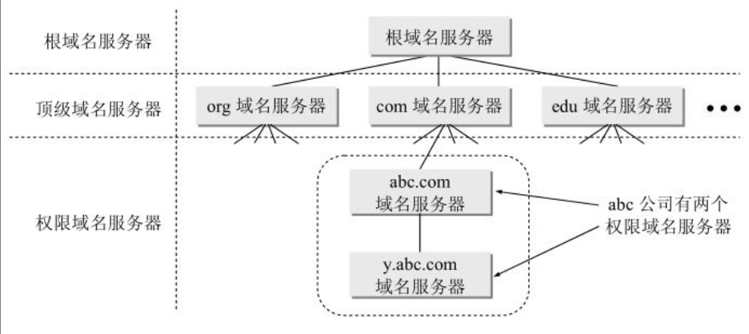

# 第六章 应用层

每个应用层协议都是为了解决某一类应用问题，而问题的解决又必须通过位于不同主机中的多个应用进程之间的通信和协同工作来完成的。应用进程之间的这种通信必须遵循严格的规则。**应用层的具体内容就是精确定义这些通信规则**

应用层协议应当定义:

- 应用进程交换的报文类型，如请求报文和响应报文
- 各种报文的语法
- 字段的语义
- 进程何时、如何发送报文，以及对报文进行响应的规则

应用层的许多协议都是基于客户-服务器方式。即使是对等通信方式，实质上也是一种特殊的客户-服务器方式。这里再明确一下，客户(client)和服务器(server)都是指通信中所涉及的两个应用进程。客户-服务器方式所描述的是进程之间服务和被服务的关系。这里最主要的特征就是：客户是服务请求方，服务器是服务提供方。

## 6.1 域名系统DNS

### 6.1.1 概述

域名系统DNS(Domain Name System)是因特网使用的命名系统，用来把便于人们使用的机器名字转换为IP地址。

许多应用层软件经常直接使用域名系统DNS。虽然计算机的用户只是间接而不是直接使用域名系统，但DNS却为因特网的各种网络应用提供了核心服务

用户与因特网上某个主机通信时，必须要知道对方的IP地址。然而用户很难记住长达32位二进制主机地址。即使是点分十进制IP地址也并不太容易记忆。但在应用层为了便于用户记忆各种网络应用，更多的是使用主机名字。

早在ARPANET时代，整个网络上只有数百台计算机，那时使用一个叫做hosts的文件，列出所有主机名字和相应的IP地址。只要用户输入一个主机名字，计算机就可很快地把这个主机名字转换成机器能够识别的二进制IP地址。

**为什么机器在处理IP数据报时要使用IP地址而不是用域名呢?**

因为IP地址的长度是固定的32位(如果IPV6，那就是128位，定长)，而域名长度不固定，机器处理困难

从理论上讲，整个因特网可以只使用一个域名服务器，使它装入因特网上所有的主机名，并回答所有对IP地址的查询。然而这种做法并不可取。因为因特网规模很大，这样的域名服务器肯定会因过负荷而无法正常工作，而且一旦域名服务器出现故障，整个因特网就会瘫痪

因此，1983年，因特网开始采用层次树状结构的命名方法，并使用**分布式的域名系统DNS**

因特网的域名系统DNS被设计为一个联机分布式数据库系统，并采用C/S方式

DNS使得大多数名字都在本地进行解析(resolve), 仅仅少量解析都需要在因特网上通信, 因此DNS系统的效率很高。由于DNS是分布式系统，即使单个计算机出了故障，也不会妨碍整个DNS系统的正常运行。

域名和IP地址的解析是由分布在因特网上的**许多域名服务器程序**共同完成的。

域名服务器程序在专设的结点上运行，而人们也常常把运行域名服务器程序的机器称之为域名服务器。

域名到IP地址的解析过程: 当某一个应用进程需要把主机名解析为IP地址时，应用进程调用解析程序(resolver), 并成为DNS的一个客户，把带解析的域名放到DNS请求报文中，以**UDP数据报**的方式发给本地域名服务器。本地域名服务器在查找域名后，把对应的IP地址放在回答报文中返回。

若本地域名服务器不能回答该请求，则此域名服务器就暂时成为DNS中的另一个客户，并向其他域名服务器发出查询请求。这种过程直至找到能够回答该请求的域名服务器为止

### 6.1.2 因特网的域名结构

因特网采用树状结构的命名方式，任何一个连接在因特网上的主机或服务器，都有一个唯一的层次结构的名字，即域名(domain)。

域(domain)是名字空间中一个可被管理的划分。域还可以划分为子域，而子域还可继续划分为子域的子域，这样就形成了顶级域、二级域、三级域，等等。

mail.cctv.com

mail: 一级域名
cctv: 二级域名
com: 顶级域名

DNS规定，域名中的标号都由英文字母和数字组成，每一个标号不超过63个字符（但为了记忆方便，最好不要超过12个字符）​，也不区分大小写字母（例如，CCTV或cctv在域名中是等效的）​。标号中除连字符(-)外不能使用其他的标点符号。级别最低的域名写在最左边，而级别最高的顶级域名则写在最右边。由多个标号组成的完整域名总共不超过255个字符。DNS既不规定一个域名需要包含多少个下级域名，也不规定每一级的域名代表什么意思。各级域名由其上一级的域名管理机构管理，而最高的顶级域名则由ICANN进行管理。用这种方法可使每一个域名在整个因特网范围内是唯一的，并且也容易设计出一种查找域名的机制。

需要注意的是，域名只是个逻辑概念，并不代表计算机所在的物理地点。变长的域名和使用有助记忆的字符串，是为了便于人来使用。

这里还要强调指出，因特网的名字空间是按照机构的组织来划分的，与物理的网络无关，与IP地址中的“子网”也没有关系。

### 6.1.3 域名服务器

DNS就采用划分区的办法来解决这个问题

一个服务器所负责管辖的范围(或有权限的)范围叫做区(zone)。

各单位根据具体情况来划分自己管辖范围的区。但在一个区中的所有节点必须是能够连通的。每一个区设置相应的权限域名服务器(authoritative name server)，用来保存该区中的所有主机的域名到IP地址的映射。总之，DNS服务器的管辖范围不是以“域”为单位，而是以“区”为单位。区是DNS服务器实际管辖的范围。区可能等于或小于域，但一定不可能大于域。

**区是"域"的子集**

根据域名服务器所起的作用，可以把域名服务器划分为四种不同的类型:

1. 根域名服务区(root name server): 根域名服务器是最高层次的域名服务器，也是最重要的域名服务器。所有的根域名服务器都知道所有的顶级域名服务器的域名和IP地址。根域名服务器是最重要的域名服务器，因为不管是哪一个本地域名服务器，若要对因特网上任何一个域名进行解析（即转换为IP地址）​，只要自己无法解析，就首先要求助于根域名服务器。假定所有的根域名服务器都瘫痪了，那么整个的DNS系统就无法工作。在因特网上共有13个不同IP地址的根域名服务器，它们的名字是用一个英文字母命名，从a一直到m （前13个字母）​。根域名服务器采用了任播(anycast)技术
2. 顶级域名服务器(TLD服务器):这些域名服务器负责管理在该顶级域名服务器注册的所有二级域名。当收到DNS查询请求时，就给出相应的回答（可能是最后的结果，也可能是下一步应当找的域名服务器的IP地址）​。
3. 权限域名服务器: 这就是前面已经讲过的负责一个区的域名服务器。当一个权限域名服务器还不能给出最后的查询回答时，就会告诉发出查询请求的DNS客户，下一步应当找哪一个权限域名服务器。
4. 本地域名服务器(local name server): 当一个主机发出DNS查询请求时，这个查询请求报文就发送给本地域名服务器。由此可看出本地域名服务器的重要性。每一个因特网服务提供者ISP，或一个大学，甚至一个大学里的系，都可以拥有一个本地域名服务器，这种域名服务器有时也称为默认域名服务器

#### 域名的解析过程

1. 主机向本地域名服务器的查询一般是采用递归查询(recursive query)。如果主机所询问的本地域名服务器不知道被查询域名的IP地址，那么本地域名服务器就以DNS客户的身份，向其他根域名服务器继续发出查询请求报文（即替该主机继续查询）​，而不是让该主机自己进行下一步的查询。因此，递归查询返回的查询结果或者是所要查询的IP地址，或者是报错，表示无法查询到所需的IP地址。
2. 本地域名服务器向根域名服务器的查询通常是采用迭代查询(iterative query)。当根域名服务器收到本地域名服务器发出的迭代查询请求报文时，要么给出所要查询的IP地址，要么告诉本地域名服务器：​“你下一步应当向哪一个域名服务器进行查询”​。然后让本地域名服务器进行后续的查询（而不是替本地域名服务器进行后续的查询）​。根域名服务器通常是把自己知道的顶级域名服务器的IP地址告诉本地域名服务器，让本地域名服务器再向顶级域名服务器查询。顶级域名服务器在收到本地域名服务器的查询请求后，要么给出所要查询的IP地址，要么告诉本地域名服务器下一步应当向哪一个权限域名服务器进行查询，本地域名服务器就这样进行迭代查询。最后，知道了所要解析的域名的IP地址，然后把这个结果返回给发起查询的主机。当然，本地域名服务器也可以采用递归查询，这取决于最初的查询请求报文的设置是要求使用哪一种查询方式

为了提高DNS查询效率，并减轻根域名服务器的负荷和减少因特网上的DNS查询报文数量，在域名服务器中广泛使用了**高速缓存**。高速缓存用来存放最近查询过的域名以及从何处获得域名映射信息的记录

## 6.2 文件传送协议

### 6.2.1 FTP概述

文件传送协议(File Transfer Protocol)是因特网上使用得最广泛的文件传送协议。FTP提供交互式的访问，允许客户指明文件的类型与格式（如指明是否使用ASCII码）​，并允许文件具有存取权限（如访问文件的用户必须经过授权，并输入有效的口令）​。FTP屏蔽了各计算机系统的细节，因而适合于在异构网络中任意计算机之间传送文件。RFC 959很早就成为了因特网的正式标准。

**文件共享协议**: 若要存取一个文件，就必须先获得一个本地的文件副本。如果要修改文件，只能对文件的副本进行修改，然后再将修改后的文件副本传回到原节点。

文件共享协议中的另一大类是**联机访问(on-line access)**: 联机访问意味着允许多个程序同时对一个文件进行存取。和数据库系统不同之处是用户不需要调用一个特殊的客户进程，而是由操作系统提供对远地共享文件进行访问的服务，就如同对本地文件的访问一样。这就使用户可以用远地文件作为输入和输出来运行任何应用程序，而**操作系统中的文件系统则提供对共享文件的透明存取。**

透明存取的优点是: 将原来用于处理本地文件的应用程序用来处理远地文件时，不需要对该应用程序作明显的改动。属于文件共享协议的有网络文件系统NFS (Network File System) [COME06]​。网络文件系统NFS最初是在UNIX操作系统环境下实现文件和目录的共享。NFS可使本地计算机共享远地的资源，就像这些资源在本地一样。

### 6.2.2 FTP的基本工作原理

文件传送协议FTP只提供文件传送的一些基本的服务，它使用TCP可靠的运输服务。FTP的主要功能是减少或消除在不同操作系统下处理文件的不兼容性。

FTP采用C/S方式。一个FTP服务器进程可同时为多个客户进程提供服务。FTP的服务器进程由两大部分组成: 一个主进程，负责接受新的请求; 另外有若干个从事进程，负责处理单个请求

主进程的工作步骤:

1. 打开熟知端口，使得客户进程可以连接上
2. 等待客户进程发出连接请求
3. 启动从属进程来处理客户进程发来的请求。从属进程对客户进程的请求处理完毕后即终止，但从属进程在运行期间根据需要还可能创建其他一些子进程。
4. 回到等待状态, 继续接受其他客户进程发来的请求。主进程与从属进程的处理是并发地进行

在进行文件传输时，FTP的客户和服务器之间要建立两个并行的TCP连接:

1. 控制连接
2. 数据连接

控制连接在整个会话期间一直保持打开，FTP客户所发出的传送请求，通过控制连接发送给服务器端的控制进程，但控制连接并不用来传送文件。实际用于传输文件的是“数据连接”。服务器端的控制进程在收到FTP客户发送来的文件传输请求后就创建了"数据传送进程"和"数据连接"，用来连接客户端和服务器端的数据传送进程。数据传送进程实际完成文件的传送，在传送完毕后关闭“数据传送连接”并结束运行。由于FTP使用了一个分离的控制连接，因此FTP的控制信息是带外(out of band)传送的。

当客户进程向服务器进程发出建立连接请求时，要寻找连接服务器进程的熟知端口(21)，同时还要告诉服务器进程自己的另一个端口号码，用于建立数据传送连接。接着，服务器进程用自己传送数据的熟知端口(20)与客户进程所提供的端口号码建立数据传送连接。由于FTP使用了两个不同的端口号，所以数据连接与控制连接不会发生混乱。

FTP并非对所有的数据传输都是最佳的。例如，计算机A上运行的应用程序要在远地计算机B的一个很大的文件末尾添加一行信息。若使用FTP，则应先将此文件从计算机B传送到计算机A，添加上这一行信息后，再用FTP将此文件传送到计算机B，来回传送这样大的文件很花时间。实际上这种传送是不必要的，因为计算机A并没有使用该文件的内容。

网络文件系统NFS则采用另一种思路。**NFS允许应用进程打开一个远地文件，并能在该文件的某一个特定的位置上开始读写数据。**

### 6.2.3 简单文件传送协议TFTP

TCP/IP协议族中还有一个简单文件传送协议TFTP (Trivial File Transfer Protocol)，它是一个很小且易于实现的文件传送协议。TFTP的版本2是因特网的正式标准[RFC 1350]​。虽然TFTP也使用客户-服务器方式，但它使用UDP数据报，因此TFTP需要有自己的差错改正措施。TFTP只支持文件传输而不支持交互。TFTP没有一个庞大的命令集，没有列目录的功能，也不能对用户进行身份鉴别。

TFTP的优点:

1. TFTP用于UDP环境
2. TFTP代码占用内存小

TFTP的特点:

1. 每次传送的数据报文中有512字节的数据，但最后一次可不足512字节
2. 数据报文按序编号，从1开始
3. 支持ASCII码或二进制传送
4. 可对文件进程读写
5. 使用很简单的头部

TFTP的工作很像停止等待协议​。发送完一个文件块后就等待对方的确认，确认时应指明所确认的块编号。发完数据后在规定时间内收不到确认就要重发数据PDU。发送确认PDU的一方，若在规定时间内收不到下一个文件块，也要重发确认PDU。这样就可保证文件的传送不致因某一个数据报的丢失而告失败。

在一开始工作时。TFTP客户进程发送一个读请求报文或写请求报文给TFTP服务器进程，其熟知端口号码为69。TFTP服务器进程要选择一个新的端口和TFTP客户进程进行通信。若文件长度恰好为512字节的整数倍，则在文件传送完毕后，还必须在最后发送一个只含首部而无数据的数据报文。若文件长度不是512字节的整数倍，则最后传送数据报文中的数据字段一定不满512字节，这正好可作为文件结束的标志。

## 6.3 远程终端协议TELNET

TELNET是一个简单的远程终端协议[RFC 854]​，它也是因特网的正式标准。用户用TELNET就可在其所在地通过TCP连接注册（即登录）到远地的另一个主机上（使用主机名或IP地址）​。TELNET能将用户的击键传到远地主机，同时也能将远地主机的输出通过TCP连接返回到用户屏幕。这种服务是透明的，因为用户感觉到好像键盘和显示器是直接连在远地主机上。因此，TELNET又称为终端仿真协议。

TELNET也使用客户-服务器方式。在本地系统运行TELNET客户进程，而在远地主机则运行TELNET服务器进程。和FTP的情况相似，服务器中的主进程等待新的请求，并产生从属进程来处理每一个连接。

为了适用不同操作系统的按键差异，TELNET定义了数据和命令应该怎么通过因特网。

这些定义就是所谓的网络虚拟终端NVT (Network Virtual Terminal)

客户软件把用户的击键和命令转换成NVT格式，并送交服务器。服务器软件把收到的数据和命令，从NVT格式转换成远地系统所需的格式。向用户返回数据时，服务器把远地系统的格式转换为NVT格式，本地客户再从NVT格式转换到本地系统所需的格式。

## 6.4 万维网WWW

### 6.4.1 概述

万维网WWW (World Wide Web)并非某种特殊的计算机网络。万维网是一个大规模的、联机式的信息储藏所，英文简称为Web。万维网用链接的方法能非常方便地从因特网上的一个站点访问另一个站点（也就是所谓的“链接到另一个站点”​）​，从而主动地按需获取丰富的信息

万维网是一个分布式的超媒体(hypermedia)系统，它是超文本(hypertext)系统的扩充。所谓超文本是包含指向其他文档的链接的文本。也就是说，一个超文本由多个信息源链接成，而这些信息源的数目实际上是不受限制的。利用一个链接可使用户找到另一个文档，而这又可链接到其他的文档（依次类推）​。这些文档可以位于世界上任何一个接在因特网上的超文本系统中。超文本是万维网的基础。

分布式的和非分布式的超媒体系统有很大区别。在非分布式系统中，各种信息都驻留在单个计算机的磁盘中。由于各种文档都可从本地获得，因此这些文档之间的链接可进行一致性检查。所以，一个非分布式超媒体系统能够保证所有的链接都是有效的和一致的。

万维网以C/S方式工作。

万维网文档所驻留的主机则允许服务器程序，这个主机称之为万维网服务器。

**客户程序向服务器程序发出请求，服务器程序向客户端送回给客户的万维网文档**

在一个客户程序主窗口上显示出的万维网文档称为页面(page)。

万维网必须解决以下几个问题:

1. 怎么标志分布在整个因特网上的万维网文档?
2. 用怎么样的协议来实现万维网上各种链接?
3. 怎样使不同作者创作的不同风格的万维网文档，都能在因特网上的各种主机上显示出来，同时使用户清楚地知道在什么地方存在着链接？
4. 怎样使得用户方便找到需要的信息

为了解决第一个问题, 万维网使用统一资源定位符URL (Uniform Resource Locator)来标志万维网上的各种文档，并使每一个文档在整个因特网的范围内具有唯一的标识符URL。

为了解决上述的第二个问题，就要使万维网客户程序与万维网服务器程序之间的交互遵守严格的协议，这就是超文本传送协议HTTP (HyperText Transfer Protocol)。HTTP是一个应用层协议，它使用TCP连接进行可靠的传送。

为了解决上述的第三个问题，万维网使用超文本标记语言HTML (HyperText Markup Language)，使得万维网页面的设计者可以很方便地用链接从本页面的某处链接到因特网上的任何一个万维网页面，并且能够在自己的主机屏幕上将这些页面显示出来

最后，用户可使用搜索工具在万维网上方便地查找所需的信息。

### 6.4.2 统一资源定位符URL

#### URL的格式

统一资源定位符URL是用来表示从因特网上得到的资源位置和访问这些资源的方法。URL给资源的位置提供一种抽象的识别方法，并用这种方法给资源定位。只要能够对资源定位，系统就可以对资源进行各种操作，如存取、更新、替换和查找其属性。

URL的一般形式由以下四个部分组成：<协议>://<主机>:<端口>/<路径>

### 6.4.3 超文本传送协议HTTP

#### HTTP的操作过程

HTTP协议定义了浏览器（即万维网客户进程）怎样向万维网服务器请求万维网文档，以及服务器怎样把文档传送给浏览器。

从层次角度来看, HTTP是**面向事务的(transaction-oriented)**应用层协议

每个万维网网点都有一个服务器进程，它不断地监听TCP的端口80，以便发现是否有浏览器（即万维网客户。请注意，浏览器和万维网客户是同义词）向它发出连接建立请求。一旦监听到连接建立请求并建立了TCP连接之后，浏览器就向万维网服务器发出浏览某个页面的请求，服务器接着就返回所请求的页面作为响应。最后，TCP连接就被释放了。在浏览器和服务器之间的请求和响应的交互，必须按照规定的格式和遵循一定的规则。这些格式和规则就是超文本传送协议HTTP。

HTTP规定在HTTP客户与HTTP服务器之间的每次交互，都由一个ASCII码串构成的请求和一个类似的通用因特网邮件扩充，即"类MIME"的响应组成

用户用鼠标点击了屏幕上的一个可选部分。他使用的链接指向了“清华大学院系设置”的页面，其URL是http://www.tsinghua.edu.cn/chn/yxsz/index.htm。下面我们用HTTP/1.0更具体地说明在用户点击鼠标后所发生的几个事件

1. 浏览器分析链接指向页面的URL
2. 浏览器向DNS请求解析url的域名地址
3. 域名系统DNS解析处清华大学服务器的IP地址为...
4. 浏览器与服务器建立TCP连接
5. 浏览器发出取文件命令：GET /chn/yxsz/index.htm。
6. 服务器给出响应，把文件发送给浏览器
7. 释放TCP连接
8. 浏览器显示“清华大学院系设置”文件index.htm中的所有文本。

HTTP使用了面向连接的TCP作为运输层协议，保证了数据的可靠传输。HTTP不必考虑数据在传输过程中被丢弃后又怎样被重传。但是，HTTP协议本身是无连接的。这就是说，虽然HTTP使用了TCP连接，但通信的双方在交换HTTP报文之前不需要先建立HTTP连接。

HTTP协议是无状态的。也就是说，同一个客户第二次访问同一个服务器上的页面时，服务器的响应与第一次被访问时的相同（假定现在服务器还没有把该页面更新）​，因为服务器并不记得曾经访问过的这个客户，也不记得为该客户曾经服务过多少次。HTTP的无状态特性简化了服务器的设计，使服务器更容易支持大量并发的HTTP请求。

HTTP/1.0的主要缺点，就是每请求一个文档就要有两倍RTT的开销。若一个主页上有很多链接的对象（如图片等）需要依次进行链接，那么每一次链接下载都导致2×RTT的开销。另一种开销就是万维网客户和服务器为每一次建立新的TCP连接都要分配缓存和变量。特别是万维网服务器往往要同时服务于大量客户的请求，所以这种非持续连接会使万维网服务器的负担很重。好在浏览器都提供了能够打开5～10个并行的TCP连接，而每一个TCP连接处理客户的一个请求。因此，使用并行TCP连接可以缩短响应时间。

HTTP/1.1协议较好地解决了这个问题，它采用了持续连接

所谓持续连接就是万维网服务器在发送响应后仍然在一段时间内保持这条连接，使同一个客户（浏览器）和该服务器可以继续在这条连接上传送后续的HTTP请求报文和响应报文。这并不局限于传送同一个页面上链接的文档，而是只要这些文档都在同一个服务器上就行。

HTTP/1.1协议的持续连接有两种工作方式，即非流水线方式(without pipelining)和流水线方式(with pipelining)。

非流水线方式的特点，是客户在收到前一个响应后才能发出下一个请求。因此，在TCP连接已建立后，客户每访问一次对象都要用去一个往返时间RTT。这比非持续连接要用去两倍RTT的开销，节省了建立TCP连接所需的一个RTT时间。但非流水线方式还是有缺点的，因为服务器在发送完一个对象后，其TCP连接就处于空闲状态，浪费了服务器资源。

流水线方式的特点，是客户在收到HTTP的响应报文之前就能够接着发送新的请求报文。于是一个接一个的请求报文到达服务器后，服务器就可连续发回响应报文。因此，使用流水线方式时，客户访问所有的对象只需花费一个RTT时间。流水线工作方式使TCP连接中的空闲时间减少，提高了下载文档效率。

#### 代理服务器

代理服务器(proxy server)是一种网络实体，它又称为万维网高速缓存(Web cache)。代理服务器把最近的一些请求和响应暂存在本地磁盘中。当新请求到达时，若代理服务器发现这个请求与暂时存放的请求相同，就返回暂存的响应，而不需要按URL的地址再次去因特网访问该资源。代理服务器可在客户端或服务器端工作，也可在中间系统上工作。

校园网适用代理服务器的过程

1. 校园网PC中的浏览器向因特网的服务器请求服务时，就先和校园网的代理服务器建立TCP连接，并向代理服务器发出HTTP请求报文​。
2. 若代理服务器已经存放了所请求的对象，代理服务器就把这个对象放入HTTP响应报文中返回给PC的浏览器。
3. 否则，代理服务器就代表发出请求的用户浏览器，与因特网上的源点服务器(origin server)建立TCP连接​，并发送HTTP请求报文。
4. 源点服务器把所请求的对象放在HTTP响应报文中返回给校园网的代理服务器
5. 代理服务器收到这个对象后，先复制在自己的本地存储器中（留待以后用）​，然后再把这个对象放在HTTP响应报文中，通过已建立的TCP连接, 返回给请求该对象的浏览器。

#### HTTP的报文结构

HTTP有两类报文:

1. 请求报文
2. 响应报文

由于HTTP是面向文本的(text-oriented)，因此在报文中的每一个字段都是一些ASCII码串，因而各个字段的长度都是不确定的。

HTTP请求报文和响应报文都是由三个部分组成。可以看出，这两种报文格式的区别就是开始行不同。

1. 开始行: 用于区分是请求报文还是响应报文。在请求报文中的开始行叫做请求行(Request-Line)，而在响应报文中的开始行叫做状态行(Status-Line)。
2. 首部行: 用来说明浏览器、服务器或报文主体的一些信息。
3. 实体主体(entity body): 在请求报文中一般都不用这个字段，而在响应报文中也可能没有这个字段。

##### HTTP请求报文最主要的一些特点

请求报文的第一行“请求行”只有三个内容，即方法，请求资源的URL，以及HTTP的版本。

1. OPTION: 请求选项的信息
2. GET: 请求读取由URL所标志的信息
3. HEAD: 请求读取由URL所标志的信心的头部
4. POST: 给服务器添加信息
5. PUT: 在指明的URL下存储下一个文档
6. DELETE: 删除资源
7. TRACE: 用来进程回环测试的请求报文
8. CONNECT: 用于代理服务器

### 6.4.4 万维网的文档

#### 超文本标记语言HTML

要使任何一台计算机都能显示出任何一个万维网服务器上的页面，就必须解决页面制作的标准化问题。超文本标记语言HTML (HyperText Markup Language)就是一种制作万维网页面的标准语言，它消除了不同计算机之间信息交流的障碍。但请注意，HTML并不是应用层的协议，它只是万维网浏览器使用的一种语言。

#### XML(Extensible Markup Language)可扩展标记语言

它和HTML很相似。但**XML的设计宗旨是传输数据，而不是显示数据**

XML相对于HTML的优点是**它将用户界面与结构化数据分割开。这种数据与显示的分离使得集成来及不同源的数据成为可能。**

**XML不是要替换HTML，而是对HTML的补充**。XML标记由文档的作者定义，并且是无限制的。**HTML标记则是预定义的**；HTML作者只能使用当前HTML标准所支持的标记。

另一个XHTML(Extensible HTML)是可拓展超文本标记语言。

#### 动态万维网文档

上面所讨论的万维网文档只是万维网文档中最基本的一种，即所谓的静态文档(static document)。静态文档是指在文档创作完毕后就存放在万维网服务器中，在被用户浏览的过程中，内容不会改变。由于这种文档的内容不会改变，因此用户对静态文档的每次读取所得到的返回结果都是相同的。

动态文档(dynamic document)是指文档的内容是在浏览器访问万维网服务器时才由应用程序动态创建。当浏览器请求到达时，万维网服务器要运行另一个应用程序，并把控制转移到此应用程序。接着，该应用程序对浏览器发来的数据进行处理，并输出HTTP格式的文档，万维网服务器把应用程序的输出作为对浏览器的响应。由于对浏览器每次请求的响应都是临时生成的，因此用户通过动态文档所看到的内容是不断变化的。动态文档的主要优点是具有报告当前最新信息的能力。

要实现动态文档就必须在以下两个方面对万维网服务器的功能进行扩充：

1. 增加一个应用程序，用来处理浏览器发来的数据，并创建动态文档
2. 应增加一个机制，使得万维网服务器将浏览器发来的数据传送给这个应用程序，然后万维网服务器能够解释这个应用程序的输出，并向浏览器返回HTML文档。

CGI(Common Gateway Interface)通用网关接口

CGI是一种标准，它定义了动态文档应如何创建，输入数据应如何提供给应用程序，以及输出结果应如何使用。

CGI程序的正式名字是CGI脚本(script)。按照计算机科学的一般概念，​“脚本”[插图]指的是一个程序，它被另一个程序（解释程序）而不是计算机的处理机来解释或执行。

#### 活动万维网文档

动态文档一旦建立，它所包含的信息内容也就固定下来而无法及时刷新屏幕。另外，像动画之类的显示效果，动态文档也无法提供。

有两种技术可用于浏览器屏幕显示的连续更新。一种技术称为服务器推送(server push)，这种技术是将所有的工作都交给服务器。服务器不断地运行与动态文档相关联的应用程序，定期更新信息，并发送更新过的文档。

另一种提供屏幕连续更新的技术是活动文档(active document)。这种技术是把所有的工作都转移给浏览器端。每当浏览器请求一个活动文档时，服务器就返回一段活动文档程序副本，使该程序副本在浏览器端运行。这时，活动文档程序可与用户直接交互，并可连续地改变屏幕的显示。只要用户运行活动文档程序，活动文档的内容就可以连续地改变。由于活动文档技术不需要服务器的连续更新传送，对网络带宽的要求也不会太高。

从传送的角度看，浏览器和服务器都把活动文档看成是静态文档。在服务器上的活动文档的内容是不变的，这点和动态文档是不同的。浏览器可在本地缓存一份活动文档的副本。活动文档还可处理成压缩形式，便于存储和传送。另一点要注意的是，活动文档本身并不包括其运行所需的全部软件，大部分的支持软件是事先存放在浏览器中。

### 6.4.5 万维网的信息检索系统

#### 全文检索搜索和分类目录搜索

在万维网中用来进行搜索的工具叫做搜索引擎(search engine)。搜索引擎的种类很多，但大体上可划分为两大类，即全文检索搜索引擎和分类目录搜索引擎。

全文检索搜索引擎是一种纯技术型的检索工具。它的工作原理是通过搜索软件（例如一种叫做“蜘蛛”或“网络机器人”的Spider程序）到因特网上的各网站收集信息，找到一个网站后可以从这个网站再链接到另一个网站，像蜘蛛爬行一样。然后按照一定的规则建立一个很大的在线数据库供用户查询。用户在查询时只要输入关键词，就从已经建立的索引数据库上进行查询（并不是实时地在因特网上检索到的信息）​。因此很可能有些查到的信息已经是过时的。建立这种索引数据库的网站必须定期对已建立的数据库进行更新维护。现在最出名的全文检索搜索引擎就是Google（谷歌）网站(www.google.com)

分类目录搜索引擎并不采集网站的任何信息，而是利用各网站向搜索引擎提交的网站信息时填写的关键词和网站描述等信息，经过人工审核编辑后，如果认为符合网站登录的条件，则输入到分类目录的数据库中，供网上用户查询。因此，分类目录搜索也叫做分类网站搜索。分类目录的好处就是用户可根据网站设计好的目录有针对性地逐级查询所需要的信息，查询时不需要使用关键词，只需要按照分类（先找大类，再找下面的小类）​，因而查询的准确性较好。但分类目录查询的结果并不是具体的页面，而是被收录网站主页的URL地址，因而所得到的内容就比较有限。

全文检索搜索引擎往往可直接检索到相关内容的网页，但分类目录搜索引擎一般只能检索到相关信息的网址。

**垂直搜索引擎**它针对某一特点领域、特定人群或某一特点需求提供搜索服务。垂直搜索也是提供关键字来进行搜索的，但被放到了一个行业知识的上下文中，返回的结果更倾向于信息、消息、条目等。例如，对买房的人讲，他希望查找的是房子的具体供求信息（如面积、地点、价格等）​，而不是有关房子供求的一般性的论文或新闻、政策等。

**元搜索引擎**它把用户提交的检索请求发送到多个独立的搜索引擎上去搜索，并把检索结果集中统一处理，以统一的格式提供给用户，因此是搜索引擎之上的搜索引擎。它的主要精力放在提高搜索速度、智能化处理搜索结果、个性化搜索功能的设置和用户检索界面的友好性上。

## 6.5 电子邮件

### 6.5.1 概述

电子邮件(e-mail)是因特网上使用最多的和最受用户欢迎的一种应用。电子邮件把邮件发送到收件人使用的邮件服务器，并放在其中的收件人邮箱(mail box)中，收件人可在自己方便时上网到自己使用的邮件服务器进行读取。这相当于因特网为用户设立了存放邮件的信箱，因此e-mail有时也称为“电子信箱”​。

## 6.7 简单网络管理协议SNMP

### 6.7.1 网络管理的基本概念

网络管理包括对硬件、软件和人力的使用、综合与协调，以便对网络资源进行监视、测试、配置、分析、评价和控制，这样就能以合理的价格满足网络的一些需求，如实时运行性能、服务质量等。网络管理常简称为网管。

