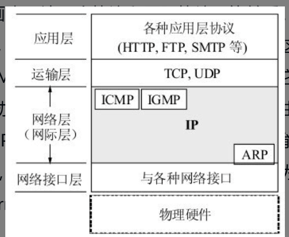
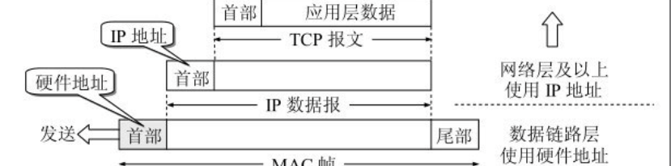
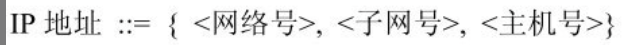
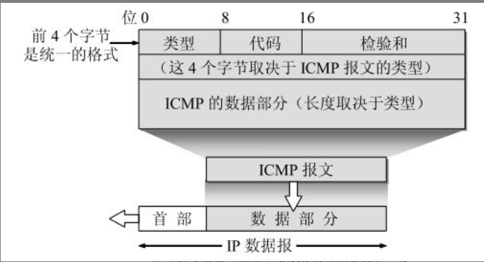

# 第四章 网络层

## 4.1 网络层提供的两种服务

在计算机网络领域，网络层应该向运输层提供怎样的服务（​“面向连接”还是“无连接”​）曾引起了长期的争论。争论焦点的实质就是：在计算机通信中，可靠交付应当由谁来负责？是网络还是端系统？

### 电信网设计思路

传统电信网的主要业务是提供电话服务。电信网使用昂贵的程控交换机（其软件也非常复杂）​，用面向连接的通信方式，使电信网络能够向用户（实际上就是电话机）提供可靠传输的服务。

因此他们认为，计算机网络也应模仿打电话所使用的面向连接的通信方式。当两个计算机进行通信时，也应当先建立连接（但在分组交换中是建立一条**虚电路 VC (Virtual Circuit)）**​，以保证双方通信所需的一切网络资源。然后双方就沿着已建立的虚电路发送分组。这样的分组的首部不需要填写完整的目的主机地址，而只需要填写这条虚电路的编号（一个不大的整数）​，因而减少了分组的开销。

这种通信方式如果再使用这种通信方式如果再使用可靠传输的网络协议，就可使所发送的分组无差错按序到达终点，当然也不丢失、不重复。在通信结束后要释放建立的虚电路.

### 因特网的先驱的设计思路

电信网提供的端到端可靠传输的服务对电话业务无疑是很合适的，但是电信网的终端（电话机）非常简单，没有智能，也没有差错处理能力。因此电信网必须负责把用户电话机产生的话音信号可靠地传送到对方的电话机，使还原后的话音质量符合技术规范的要求。但计算机网络的**端系统是有智能的计算机**。**计算机有很强的差错处理的能力**（这点和传统的电话机有本质上的差别）​。

设计思路: **网络层向上只提供简单灵活的、无连接的、尽最大努力交付的数据报服务**。
网络在发送分组时不需要先建立连接。每一个分组（也就是IP数据报）独立发送，与其前后的分组无关（不进行编号）​。
**网络层不提供服务质量的承诺**。也就是说，所传送的分组可能出错、丢失、重复和失序（即不按序到达终点）​，当然也不保证分组交付的时限。
这样意味着网络中的路由器可以做得比较简单

采用这种设计思路的好处是：网络的造价大大降低，运行方式灵活，能够适应多种应用。因特网能够发展到今日的规模，充分证明了当初采用这种设计思路的正确性。

## 4.2 网际协议IP

**网际协议IP**是TCP/IP体系中两个最主要的协议之一[STEV94]​[COME06]​[FORO10]​，也是最重要的因特网标准协议之一。

与IP协议配套的还有三个协议:

- 地址解析协议ARP(Address Resolution Protocol)
- 网际控制报文协议ICMP(Internet Control Message Protocol)
- 网际组管理协议IGMP(Internet Group Management Protocol)

由于网际协议IP是用来使互连起来的许多计算机网络能够进行通信，因此TCP/IP体系中的网络层常常称为网际层(internet layer)，或IP层。

讨论IP协议之前，要先知道什么是虚拟互连网络

### 4.2.1 虚拟互连网络

如果要在全世界范围内把数以百万计的网络都互连起来，并且能够互相通信，那么这样的任务一定非常复杂。其中会遇到许多问题需要解决
比如:

能不能让大家都使用相同的网络，这样可使网络互连变得比较简单。答案是不行的。因为用户的需求是多种多样的，**没有一种单一的网络能够适应所有用户的需求**。

从一般的概念来讲，将网络互相连接起来要使用一些**中间设备**。根据中间设备所在的层次，可以有以下四种不同的中间设备:

1. 物理层使用的中间设备: **转发器(repeater)**
2. 数据链路层使用的中间设备: **网桥/桥接器**
3. 网络层使用的中间设备: **路由器(router)**
4. 网络层以上使用的中间设备: **网关(gateway)**, 用网关连接两个不兼容的系统需要在高层进行协议的转换。

**由于历史的原因，许多有关TCP/IP的文献曾经把网络层使用的路由器称为网关**

现在我们讨论网络互连时，都是指用路由器进行网络互连和路由选择。路由器其实就是一台专用计算机，用来在互联网中进行路由选择

TCP/IP协议在网络互连上采用的做法是在网络层(IP层)采用标准化协议，但相互连接的网络则可以是异构的。

由于参加互连的计算机网络都使用相同的网际协议IP (Internet Protocol), 因此可以把互连以后的计算机网络看成一个虚拟互连网络(internet)。

所谓的虚拟互联网络实际上就是逻辑互联网络, 它的意思就是互连起来的各种物理网络的异构性本来是客观存在的，但是我们利用IP协议就可以使这些性能各异的网络在网络层上看起来好像是一个统一的网络。

这种使用IP协议的虚拟互连网络可简称为IP网（IP网是虚拟的，但平常不必每次都强调“虚拟”二字）​。

使用IP网的好处是：当IP网上的主机进行通信时，就好像在一个单个网络上通信一样，它们看不见互连的各网络的具体异构细节（如具体的编址方案、路由选择协议，等等）​。

### 4.2.2 分类的IP地址

在TCP/IP体系中，IP地址是一个最基本的概念，一定要把它弄清楚。有关IP最重要的文档就是RFC 791

#### IP地址及其表示方法

整个的因特网就是一个单一的、抽象的网络。IP地址就是给因特网上的每一个主机（或路由器）的每一个接口分配一个在全世界范围是唯一的32位的标识符。

P地址的结构使我们可以在因特网上很方便地进行寻址。IP地址现在由**因特网名字和数字分配机构ICANN (Internet Corporation for Assigned Names and Numbers)**进行分配

IP地址的编址一共经过了三个历史阶段:

1. 分类的IP地址
2. 子网的划分
3. 构成超网

所谓“分类的IP地址”就是将IP地址划分为若干个固定类，每一类地址都由两个固定长度的字段组成，其中第一个字段是网络号(net-id)，它标志主机（或路由器）所连接到的网络。
一个网络号在整个因特网范围内必须是唯一的。第二个字段是主机号(host-id)，它标志该主机（或路由器）​。一个主机号在它前面的网络号所指明的网络范围内必须是唯一的。由此可见，一个IP地址在整个因特网范围内是唯一的。

从IP地址的结构来看，IP地址并不仅仅指明一个主机，而是还指明了主机所连接到的网络。

对主机或路由器来说，IP地址都是32位的二进制代码。为了提高可读性，我们常常把32位的IP地址中的每8位插入一个空格（但在机器中并没有这样的空格）​。要更加便于使用，可用其等效的十进制数字表示，并且在这些数字之间加上一个点。这就叫做点分十进制记法(dotted decimal notation)。

#### 常用的三种类别的IP地址

ABC类

#### IP地址的特点

1. 每个IP地址都由网络号和主机号两部分组成。从这个意义上说，IP地址是一种分等级的地址结构。分两个等级的好处是：第一，IP地址管理机构在分配IP地址时只分配网络号（第一级）​，而剩下的主机号（第二级）则由得到该网络号的单位自行分配。这样就方便了IP地址的管理。第二，路由器仅根据目的主机所连接的网络号来转发分组（而不考虑目的主机号）​，这样就可以使路由表中的项目数大幅度减少，从而减小了路由表所占的存储空间以及查找路由表的时间。
2. 实际上IP地址是标志一个主机（或路由器）和一条链路的接口。当一个主机同时连接到两个网络上时，该主机就必须同时具有两个相应的IP地址，其网络号必须是不同的。这种主机称为多归属主机(multihomed host)。由于一个路由器至少应当连接到两个网络，因此一个路由器至少应当有两个不同的IP地址。
3. 按照因特网的观点，一个网络是指具有相同网络号net-id的主机的集合，因此，**用转发器或网桥连接起来的若干个局域网仍为一个网络**，因为这些局域网都具有同样的网络号。具有不同网络号的局域网必须使用路由器进行互连。
4. 在IP地址中，所有分配到网络号的网络(不管是范围很小的局域网，还是可能覆盖很大地理范围的广域网)都是平等的。所谓平等，是指因特网同等对待每一个IP地址。

#### 注意

- 在同一个局域网上的主机或路由器的IP地址中的网络号必须是一样的
- 用网桥（它只在链路层工作）互连的网段仍然是一个局域网，只能有一个网络号。
- 路由器总是具有两个或两个以上的IP地址。即路由器的每一个接口都有一个不同网络号的IP地址。
- 当两个路由器直接相连时（例如通过一条租用线路）​，在连线两端的接口处，可以分配也可以不分配IP地址。

### 4.2.3 IP地址与硬件地址

如何区分主机的IP地址和硬件地址

层次的角度看: **物理地址是数据链路层和物理层使用的地址**，**IP地址是网络层以及以上各层使用的地址，是一种逻辑地址(因为IP地址是软件实现的)**
在发送数据时，数据从高层下到低层，然后才到通信链路上传输。使用IP地址的IP数据报一旦交给了数据链路层，就被封装成**MAC帧**了。**MAC帧在传送时使用的源地址和目的地址都是硬件地址**，这两个硬件地址都写在**MAC帧的首部**中。

连接在通信链路上的设备（主机或路由器）在接收MAC帧时，**其根据是MAC帧首部中的硬件地址**。在数据链路层看不见隐藏在MAC帧的数据中的IP地址。只有在剥去MAC帧的首部和尾部后把MAC层的数据上交给网络层后，**网络层才能在IP数据报的首部中找到源IP地址和目的IP地址**。

总之, **IP地址放在IP数据报的首部，硬件地址则放在MAC帧的首部。在网络层和网络层以上使用的是IP地址，数据链路层物理层使用硬件地址, 当IP数据报放入数据链路层的MAC帧中以后，整个的IP数据报就成为MAC帧的数据，因而在数据链路层看不见数据报的IP地址。**

注意:

1. 在IP层抽象的互联网上只能看到IP数据报。虽然IP数据报要经过路由器R1和R2的两次转发，但在它的首部中的源地址和目的地址始终分别是IP1和IP2。图中的数据报上写的“从IP1到IP2”就表示前者是源地址而后者是目的地址。数据报中间经过的两个路由器的IP地址并不出现在IP数据报的首部中。
2. 虽然在IP数据报首部有源站IP地址，但**路由器只根据目的站的IP地址的网络号进行路由选择**。
3. 在局域网的链路层，只能看见MAC帧
4. 尽管互连在一起的网络的硬件地址体系各不相同，但**IP层抽象的互联网却屏蔽了下层这些很复杂的细节。只要我们在网络层上讨论问题，就能够使用统一的、抽象的IP地址研究主机和主机或路由器之间的通信。**

两个问题:

1. 主机或路由器怎样知道应当在MAC帧的首部填入什么样的硬件地址？
2. 路由器中的路由表是怎样得出的

### 4.2.4 地址解析协议ARP

在实际应用中，我们经常会遇到这样的问题：已经知道了一个机器（主机或路由器）的IP地址，需要找出其相应的硬件地址。**地址解析协议ARP就是用来解决这样的问题的。**

由于传送ARP分组使用是IP协议，因此应当把ARP协议划归网络层。但**ARP协议的用途是为了从网络层使用的IP地址解析出在数据链路层使用的硬件地址。**

网络层使用的是IP地址，但在实际网络的链路上传送数据帧时，最终还是必须使用该网络的硬件地址。但IP地址和下面的网络的硬件地址之间由于格式不同而不存在简单的映射关系

**ARP解决这个问题的方法是在主机ARP高速缓存中应存放一个从IP地址到硬件地址的映射表，并且这个映射表还经常动态更新(新增或超时删除)**

每一个主机都设有一个ARP高速缓存(ARP cache)，里面有本局域网上的各主机和路由器的IP地址到硬件地址的映射表，这些都是该主机目前知道的一些地址。那么主机怎样知道这些地址呢？

当主机A要向本局域网上的某个主机B发送IP数据报时，就先在其ARP高速缓存中查看有无主机B的IP地址。如有，就在ARP高速缓存中查出其对应的硬件地址，再把这个硬件地址写入MAC帧，然后通过局域网把该MAC帧发往此硬件地址。

也有可能查不到主机B的IP地址的项目。这可能是主机B才入网，也可能是主机A刚刚加电，其高速缓存还是空的。在这种情况下，主机A就自动运行ARP, 然后按以下步骤找出主机B的硬件地址。

1. ARP进程在本局域网上广播发送一个ARP请求分组
2. 在本局域网上的所有主机上运行的ARP进程都收到此ARP请求分组。
3. 主机B的IP地址与ARP请求分组中要查询的IP地址一致，就收下这个ARP请求分组，并向主机A发送ARP响应分组（其格式见[COME06]​）​，并在这个ARP响应分组中写入自己的硬件地址。
4. 主机A收到主机B的ARP响应分组后，就在其ARP高速缓存中写入主机B的IP地址到硬件地址的映射。

当主机A向B发送数据报时，很可能以后不久主机B还要向A发送数据报，因而主机B也可能要向A发送ARP请求分组。为了减少网络上的通信量，主机A在发送其ARP请求分组时，就把自己的IP地址到硬件地址的映射写入ARP请求分组。当主机B收到A的ARP请求分组时，就把主机A的这一地址映射写入主机B自己的ARP高速缓存中。以后主机B向A发送数据报时就很方便了。

可见ARP高速缓存非常有用。如果不使用ARP高速缓存，那么任何一个主机只要进行一次通信，就必须在网络上用广播方式发送ARP请求分组，这就使网络上的通信量大大增加。ARP把已经得到的地址映射保存在高速缓存中，这样就使得该主机下次再和具有同样目的地址的主机通信时，可以直接从高速缓存中找到所需的硬件地址而不必再用广播方式发送ARP请求分组。

ARP把保存在高速缓存中的每一个映射地址项目都设置生存时间

请注意，ARP是解决**同一个局域网上的主机或路由器的IP地址和硬件地址的映射问题**

从IP地址到硬件地址的解析是自动进行的，主机的用户对这种地址解析过程是不知道的。只要主机或路由器要和本网络上的另一个已知IP地址的主机或路由器进行通信，ARP协议就会自动地把这个IP地址解析为链路层所需要的硬件地址。

#### 既然在网络链路上传送的帧最终是按照硬件地址找到目的主机的，那么为什么我们不直接使用硬件地址进行通信，而是要使用抽象的IP地址并调用ARP来寻找出相应的硬件地址呢？

由于全世界存在着各式各样的网络，它们使用不同的硬件地址。要使这些异构网络能够互相通信就必须进行非常复杂的硬件地址转换工作，因此由用户或用户主机来完成这项工作几乎是不可能的事。但统一的IP地址把这个复杂问题解决了。连接到因特网的主机只需拥有统一的IP地址，它们之间的通信就像连接在同一个网络上那样简单方便，因为上述的调用ARP的复杂过程都是由计算机软件自动进行的，对用户来说是看不见这种调用过程的。

### 4.2.5 IP数据报的格式

IP数据报的格式能够说明IP协议都具有什么功能。在TCP/IP的标准中，各种数据格式常常以32位(即4字节)为单位来描述。

一个IP数据报由首部和数据两部分组成。首部的前一部分是固定长度，共20字节，是所有IP数据报必须具有的。在首部的固定部分的后面是一些可选字段，其长度是可变的。

首部各个字段的意义:

1. IP数据报首部的固定部分中的各字段
   1. 版本: 占4位，指IP协议的版本。通信双方使用的IP协议的版本必须一致。IPV4,IPV6
   2. 首部长度:  占4位，可表示的最大十进制数值是15
   3. 区分服务: 占8位，用来获得更好的服务。这个字段在旧标准中叫做服务类型，但实际上一直没有被使用过。1998年IETF把这个字段改名为区分服务 DS (Differentiated Services)。
   4. 总长度: 总长度指首部和数据之和的长度，单位为字节。总长度字段为16位，因此数据报的最大长度为216 - 1 = 65 535字节。 然而实际上传送这样长的数据报在现实中是极少遇到的。

我们知道，**在IP层下面的每一种数据链路层协议都规定了一个数据帧中的数据字段的最大长度，这称为最大传送单元MTU (Maximum Transfer Unit)**。当一个IP数据报封装成链路层的帧时，此数据报的总长度（即首部加上数据部分）一定不能超过下面的数据链路层所规定的MTU值。例如，最常用的以太网就规定其MTU值是1 500字节。**若所传送的数据报长度超过数据链路层的MTU值，就必须把过长的数据报进行分片处理。**

虽然使用尽可能长的IP数据报会使传输效率提高（因为每一个IP数据报中首部长度占数据报总长度的比例就会小些）​，但数据报短些也有好处。每一个IP数据报越短，路由器转发的速度就越快。为此，IP协议规定，在因特网中所有的主机和路由器，必须能够接受长度不超过576字节的数据报。这是假定上层交下来的数据长度有512字节（合理的长度）​，加上最长的IP首部60字节，再加上4字节的富裕量，就得到576字节。当主机需要发送长度超过576字节的数据报时，应当先了解一下，目的主机能否接受所要发送的数据报长度。否则，就要进行分片。

在进行分片时, 数据报首部中的“总长度”字段是指分片后的每一个分片的首部长度与该分片的的数据长度的总和。
  5. 标识(identification): 占16位。IP软件在存储器中维持一个计数器，每产生一个数据报，计数器就加1，并将此值赋给标识字段。但这个“标识”并不是序号，因为IP是无连接服务，数据报不存在按序接收的问题。当数据报由于长度超过网络的MTU而必须分片时，这个标识字段的值就被复制到所有的数据报片的标识字段中。相同的标识字段的值使分片后的各数据报片最后能正确地重装成为原来的数据报。
  6. 标志(flag):  占3位，但目前只有两位有意义。
    - 标志字段中的最低位记为MF (More Fragment)。MF = 1即表示后面“还有分片”的数据报。MF = 0表示这已是若干数据报片中的最后一个。
    - 标志字段中间的一位记为DF (Don't Fragment)，意思是“不能分片”​。只有当DF = 0时才允许分片。
  7. 片偏移: 占13位。片偏移指出：较长的分组在分片后，某片在原分组中的相对位置。也就是说，相对于用户数据字段的起点，该片从何处开始。片偏移以8个字节为偏移单位。这就是说，每个分片的长度一定是8字节（64位）的整数倍。
  8. 生存空间:占8位，生存时间字段常用的英文缩写是TTL (Time To Live)，表明是数据报在网络中的寿命。由发出数据报的源点设置这个字段。其目的是防止无法交付的数据报无限制地在因特网中兜圈子（例如从路由器R1转发到R2，再转发到R3，然后又转发到R1）​，因而白白消耗网络资源。
  9. 协议: 占8位，协议字段指出此数据报携带的数据是使用何种协议，以便使目的主机的IP层知道应将数据部分上交给哪个处理过程。
  10. 首部检验和: 占16位。这个字段只检验数据报的首部，但不包括数据部分。
  11. 源地址: 占32位。
  12. 目的地址: 占32位。
2. IP数据报首部的可变部分: IP首部的可变部分就是一个选项字段。选项字段用来支持排错、测量以及安全等措施，内容很丰富。此字段的长度可变，从1个字节到40个字节不等，取决于所选择的项目。
   增加首部的可变部分是为了增加IP数据报的功能，但这同时也使得IP数据报的首部长度成为可变的。这就增加了每一个路由器处理数据报的开销。实际上这些选项很少被使用。很多路由器都不考虑IP首部的选项字段，因此新的IP版本**IPv6就把IP数据报的首部长度做成固定的**。

### 4.2.6 IP层转发分组的流程

在互联网上转发分组时，是从一个路由器转发到下一个路由器。

总之，在路由表中，对每一条路由最主要的是以下两个信息:

1. 目的网络地址
2. 下一跳地址

我们就根据目的网络地址来确定下一跳路由器，这样做得出以下的结果:

1. IP数据报最终一定可以找到目的主机所在目的网络上的路由器（可能要通过多次的间接交付）​。
2. 只有到达最后一个路由器时，才试图向目的主机进行直接交付。

虽然因特网所有的分组转发都是**基于目的主机所在的网络**，但在大多数情况下都允许有这样的特例，**即对特定的目的主机指明一个路由。这种路由叫做特定主机路由。**采用特定主机路由可使网络管理人员能更方便地控制网络和测试网络，同时也可在需要考虑某种安全问题时采用这种特定主机路由。在对网络的连接或路由表进行排错时，指明到某一个主机的特殊路由就十分有用。

路由器还可采用默认路由(default route)以减少路由表所占用的空间和搜索路由表所用的时间。这种转发方式在一个网络只有很少的对外连接时是很有用的。实际上，默认路由在主机发送IP数据报时往往更能显示出它的好处。

在IP数据报的首部中没有地方可以用来指明“下一跳路由器的IP地址”​。在IP数据报的首部写上的IP地址是源IP地址和目的IP地址，而没有中间经过的路由器的IP地址。既然IP数据报中没有下一跳路由器的IP地址，那么**待转发的数据报又怎样能够找到下一跳路由器呢？**

当路由器收到一个待转发的数据报，在从路由表得出下一跳路由器的IP地址后，不是把这个地址填入IP数据报，而是**送交数据链路层的网络接口软件**。
网络接口软件负责把下一跳路由器的IP地址转换成硬件地址(ARP), 并将此硬件地址放在链路层的MAC帧的首部，然后根据这个硬件地址找到下一跳路由器。

由此可见，当发送一连串的数据报时，上述的这种查找路由表、计算硬件地址、写入MAC帧的首部等过程，将不断地重复进行，造成了一定的开销。

那么，能不能在路由表中不使用IP地址而直接使用硬件地址呢？不行。我们一定要弄清楚，使用抽象的IP地址，本来就是为了隐蔽各种底层网络的复杂性而便于分析和研究问题，这样就不可避免地要付出些代价

分组转发算法:

1. 从数据包的首部提取目的主机的IP地址D，得出目的网络地址为N
2. 若N就是与此路由器直接相连的某个网络地址，则进行直接交付，不需要再经过其他的路由器，直接把数据报交付目的主机（这里包括把目的主机地址 D转换为具体的硬件地址，把数据报封装为MAC帧，再发送此帧）​；否则就是间接交付，执行3
3. 若路由表中有目的地址为D的特定主机路由，则把数据报传送给路由表中所指明的下一跳路由器；否则，执行(4)。
4. 若路由表中有到达网络N的路由，则把数据报传送给路由表中所指明的下一跳路由器；否则，执行(5)。
5. 若路由表中有一个默认路由，则把数据报传送给路由表中所指明的默认路由器；否则，执行(6)。
6. 报告转发分组出错。

## 4.3 划分子网和构造超网

### 4.3.1 划分子网

#### 从二级IP地址到三级IP地址

在今天看来，在ARPANET的早期，IP地址的设计确实不够合理。

1. IP地址空间的利用率有时很低.每一个A类地址网络可连接的主机数超过1000万台，而每一个B类地址网络可连接的主机数也超过6万台。然而有些网络对连接在网络上的计算机数目有限制，根本达不到这样大的数值。
2. 给每个物理网络分配一个网络号会使得路由表太大因而使得网络性能变坏
3. 二级IP地址不够灵活, 有时情况紧急，一个单位需要在新的地点马上开通一个新的网络。但是在申请到一个新的IP地址之前，新增加的网络是不可能连接到因特网上工作的。我们希望有一种方法，使一个单位能随时灵活地增加本单位的网络，而不必事先到因特网管理机构去申请新的网络号。原来的两级IP地址无法做到这一点。

为了解决这些问题，从1985年起在IP地址中又增加了一个“**子网号字段**”​，使两级IP地址变成为三级IP地址，它能够较好地解决上述问题，并且使用起来也很灵活。这种做法叫作**划分子网(subnetting) [RFC 950]**​，或**子网寻址或子网路由选择**。**划分子网已成为因特网的正式标准协议**。

划分子网的思路如下:

1. 一个拥有许多物理网络的单位，可将所属的物理网络划分为若干个子网(subnet)。划分子网纯属一个单位内部的事情。本单位以外的网络看不见这个网络由多少个子网组成,因为这个单位对外仍然表现为一个网络。
2. 划分子网的方法是从网络的主机号借用若干位作为子网号subnet-id，当然主机号也就相应减少了同样的位数。于是两级IP地址在本单位内部就变为三级IP地址：网络号、子网号和主机号。也可以用以下记法来表示
3. 凡是从其他网络发送给本单位某个主机的IP数据报，仍然是根据IP数据报的目的网络号找到连接在本单位网络上的路由器。但此路由器在收到IP数据报后，再按目的网络号和子网号找到目的子网，把IP数据报交付目的主机。

#### 子网掩码

假定有一个数据报（其目的地址是145.13.3.10）已经到达了路由器R1。那么这个路由器如何把它转发到子网145.13.3.0呢？

我们知道，从IP数据报的首部无法看出源主机或目的主机所连接的网络是否进行了子网的划分。这是因为32位的IP地址本身以及数据报的首部都没有包含任何有关子网划分的信息。

办法就是使用**子网掩码(subnet mast)**

把三级IP地址的子网掩码和收到的数据报的目的IP地址145.13.3.10逐位相“与”(AND)（计算机进行这种逻辑AND运算是很容易的）​，得出了所要找的子网的网络地址145.13.3.0。

使用子网掩码的好处就是：**不管网络有没有划分子网，只要把子网掩码和IP地址进行逐位的“与”运算(AND)，就立即得出网络地址来**。这样在路由器处理到来的分组时就可采用同样的算法。

这里还要弄清一个问题，这就是：在不划分子网时，既然没有子网，为什么还要使用子网掩码？这就是为了更便于查找路由表。

现在因特网的标准规定：**所有的网络都必须使用子网掩码，同时在路由器的路由表中也必须有子网掩码这一栏。如果一个网络不划分子网，那么该网络的子网掩码就使用默认子网掩码**。

**子网掩码是一个网络或一个子网的重要属性**。在RFC 950成为因特网的正式标准后，路由器在和相邻路由器交换路由信息时，必须把自己所在网络（或子网）的子网掩码告诉相邻路由器。在路由器的路由表中的每一个项目，除了要给出目的网络地址外，还必须同时给出该网络的子网掩码。

### 4.3.2 使用子网时分组的转发

使用子网划分后，路由表必须包含以下三项内容

1. 目的网络地址
2. 子网掩码
3. 下一跳地址

划分子网的情况下，路由器转发分组的算法如下:

1. 从收到的数据报的首部提取目的IP地址D
2. 先判断是否为直接交付。对路由器直接相连的网络逐个进行检查：用各网络的子网掩码和 D 逐位相“与”​（AND操作）​，看结果是否和相应的网络地址匹配。若匹配，则把分组进行直接交付（当然还需要把 D 转换成物理地址，把数据报封装成帧发送出去）​，转发任务结束。否则就是间接交付，执行(3)。
3. 若路由表中有目的地址为D的特定主机路由,则把数据报传送给路由表中所指明的下一跳路由器；否则，执行(4)。
4. 对路由表中的每一行（目的网络地址，子网掩码，下一跳地址）​，用其中的子网掩码和D逐位相“与”​（AND操作）​，其结果为N。若N与该行的目的网络地址匹配，则把数据报传送给该行指明的下一跳路由器；否则，执行(5)。
5. 若路由表中有一个默认路由，则把数据报传送给路由表中所指明的默认路由器；否则，执行(6)。
6. 报告转发分组出错

### 4.3.3 无分类编址CIDR(构成超网)

#### 网络前缀

划分子网在一定程度上缓解了因特网在发展中遇到的困难。然而在1992年因特网仍然面临三个必须尽早解决的问题，这就是：

1. B类地址在1992年已分配了近一半，眼看很快就将全部分配完毕
2. 因特网主干网上的路由表中的项目数急剧增长（从几千个增长到几万个）​。
3. 整个IPv4的地址空间最终将全部耗尽。在2011年2月3日，IANA宣布IPv4地址已经耗尽了。

因此IETF很快地就研究出采用无分类编址的方法来解决前两个问题。IETF认为上面的第三个问题属于更加长远的问题，因此专门成立IPv6工作组负责研究解决新版本IP协议的问题。

其实早在1987年，RFC 1009就指明了在一个划分子网的网络中可同时使用几个不同的子网掩码。使用变长子网掩码VLSM (Variable Length Subnet Mask)可进一步提高IP地址资源的利用率。在VLSM的基础上又进一步研究出无分类编址方法，它的正式名字是无分类域间路由选择CIDR (Classless Inter-Domain Routing，CIDR的读音是“sider”)。

CIDR最主要的特点是:

1. CIDR消除了传统的A类、B类和C类地址以及划分子网的概念，因而可以更加有效地分配IPv4的地址空间，并且可以在新的IPv6使用之前容许因特网的规模继续增长。CIDR把32位的IP地址划分为两个部分。前面的是网络前缀，用来指明网络，后面的部分用来指明主机。因此CIDR使得IP地址从三级编址(使用子网掩码)又回到了两级编址，但这已是无分类的两级编址。CIDR还使用“斜线记法”(slash notation)，或称为CIDR记法，即在IP地址后面加上斜线“/”​，然后写上网络前缀所占的位数。
2. CIDR把网络前缀都相同的连续的IP地址组成一个“CIDR地址块”​。我们只要知道CIDR地址块中的任何一个地址，就可以知道这个地址块的起始地址（即最小地址）和最大地址，以及地址块中的地址数。为了更方便地进行路由选择，CIDR使用32位的地址掩码(address mask)。地址掩码由一串1和一串0组成，而1的个数就是网络前缀的长度。虽然CIDR不使用子网了，但由于目前仍有一些网络还使用子网划分和子网掩码，因此CIDR使用的地址掩码也可继续称为子网掩码。
由于一个CIDR地址块中有很多地址，所以在路由表中就利用CIDR地址块来查找目的网络。这种地址的聚合常称为**路由聚合(route aggregation)**，**它使得路由表中的一个项目可以表示原来传统分类地址的很多个（例如上千个）路由。路由聚合也称为构成超网(supernetting)。**如果没有采用CIDR，则在1994和1995年，因特网的一个路由表就会超过7万个项目，而使用了CIDR后，在1996年一个路由表的项目数才只有3万多个。路由聚合有利于减少路由器之间的路由选择信息的交换，从而提高了整个因特网的性能。

#### 最长前缀匹配

在使用CIDR时，由于采用了网络前缀这种记法，IP地址由网络前缀和主机号这两个部分组成，因此在路由表中的项目也要有相应的改变。这时，每个项目由“网络前缀”和“下一跳地址”组成。但是在查找路由表时可能会得到不止一个匹配结果。这样就带来一个问题：我们应当从这些匹配结果中选择哪一条路由呢？

正确的答案是：**应当从匹配结果中选择具有最长网络前缀的路由。这叫作最长前缀匹配(longest-prefix matching)**，这是因为**网络前缀越长，其地址块就越小**，因而**路由就越具体(more specific)**。最长前缀匹配又称为最长匹配或最佳匹配。

#### 使用二叉搜索查找路由表

使用CIDR后，由于要寻找最长前缀匹配，使路由表的查找过程变得更加复杂了。当路由表的项目数很大时，怎样设法减小路由表的查找时间就成为一个非常重要的问题。

为了进行更加有效的查找，通常是把无分类编址的路由表存放在一种层次的数据结构中，然后自上而下地按层次进行查找。这里最常用的就是二叉线索(binary trie)

IP地址中从左到右的比特值决定了从根节点逐层向下延伸的路径，而二叉搜索树的各个路径就代表路由表中存放的各个地址。

为了简化二叉线索的结构，可以先找出对应于每一个IP地址的唯一前缀(unique prefix)。所谓唯一前缀就是在表中所有的IP地址中，该前缀是唯一的。这样就可以用这些唯一前缀来构造二叉线索。在进行查找时，只要能够和唯一前缀相匹配就行了

## 4.4 网际控制报文协议ICMP

为了更有效地转发IP数据报和提高交付成功的机会，在网际层使用了网际控制报文协议ICMP (Internet Control Message Protocol) [RFC 792]​。

ICMP允许主机或路由器报告差错情况和提供有关异常情况的报告。

ICMP是因特网的标准协议。但ICMP不是高层协议（看起来好像是高层协议，因为ICMP报文是装在IP数据报中，作为其中的数据部分）​，而是IP层的协议。**ICMP报文作为IP层数据报的数据，加上数据报的首部，组成IP数据报发送出去**。

### 4.4.1 ICMP报文的种类

ICMP报文的种类很多，即**ICMP差错报告报文和ICMP询问报文**

ICMP报文的前4个字节是统一的格式，共有三个字段：即类型、代码和检验和。接着的4个字节的内容与ICMP的类型有关。最后面是数据字段，其长度取决于ICMP的类型。

ICMP差错报告报文一共有五种

1. 终点不可达: 当路由器或主机不能交付数据报时就向源点发送重点不可达报文
2. 源点抑制: 当路由器或主机由于拥塞而丢弃数据报时，就向源点发送源点抑制报文，使源点知道应当把数据报的发送速率放慢。
3. 超时: 路由器收到生存时间为零的数据报时，除丢弃该数据报外，还要向源点发送时间超过报文。当终点在预先规定的时间内不能收到一个数据报的全部数据报片时，就把已收到的数据报片都丢弃，并向源点发送时间超过报文。
4. 参数问题: 当路由器或目的主机收到的数据报的首部中有的字段的值不正确时，就丢弃该数据报，并向源点发送参数问题报文。
5. 重定向:  路由器把改变路由报文发送给主机，让主机知道下次应将数据报发送给另外的路由器（可通过更好的路由）​。

ICMP询问报文有两种

1. 回送请求和回答: ICMP会送请求报文是由主机或路由器向一个特定的目的主机发起的询问。收到此报文的主机必须给源主机或路由器发送ICMP回送回答报文(测试目的站是否可达并了解其状态)
2. 时间戳请求和回答: ICMP时间戳请求报文是请某个主机或路由器回答当前的日期和时间。(进行时钟同步和测量时间)

### 4.4.2 ICMP应用举例

ICMP的一个重要应用就是**分组网间探测PING(Packet InterNet Groper)**，用来测试两个主机之间的连通性。
**PING使用了ICMP回送请求与回送回答报文。PING是应用层直接使用网络层ICMP的一个例子。它没有通过运输层的TCP或UDP。**

另一个就是traceroute, 用来跟踪一个分组从源点到终点的路径

## 4.5 因特网的路由选择协议

### 4.5.1 有关路由选择协议的几个基本概念

1. 理想的路由算法
   1. 算法的正确性和完整性
   2. 计算简单
   3. 可以适应通信量和网络拓扑的变化
   4. 稳定性
   5. 公平
   6. 最长前缀匹配又称为最长匹配或最佳匹配
   倘若从路由算法能否随网络的通信量或拓扑自适应地进行调整变化来划分，则只有两大类，即**静态路由选择策略与动态路由选择策略**。静态路由选择也叫做非自适应路由选择，其特点是简单和开销较小，但不能及时适应网络状态的变化。对于很简单的小网络，完全可以采用静态路由选择，用人工配置每一条路由。动态路由选择也叫做自适应路由选择，其特点是能较好地适应网络状态的变化，但实现起来较为复杂，开销也比较大。
2. 分层次的路由选择协议: 因特网采用的是动态的、分布式路由选择协议。
   原因:
   1. 因特网的规模非常大。如果让所有的路由器知道所有的网络应怎样到达，则这种路由表将非常大，处理起来也太花时间。而所有这些路由器之间交换路由信息所需的带宽就会使因特网的通信链路饱和。
   2. 许多单位不愿意外界了解自己单位网络的布局细节和本部门所采用的路由选择协议（这属于本部门内部的事情）​，但同时还希望连接到因特网上。

为此，因特网将整个互联网划分为许多较小的**自治系统(autonomous system)**，一般都记为AS。RFC 4271对自治系统AS有下面这样的描述:

自治系统AS的经典定义是**在单一的技术管理下的一组路由器，而这些路由器使用一种AS内部的路由选择协议和共同的度量，以确定分组在该AS内的路由**；同时还使用一种AS之间的路由选择协议，用以确定分组在AS之间的路由。自从有了这个经典定义后，使用多种内部路由选择协议和多种度量的AS也是很常见的。
**一个AS对其他AS表现出的是一个单一的和一致的路由选择策略**

在目前的因特网中，一个大的ISP就是一个自治系统。这样，因特网就把路由选择协议划分为两大类
1. 内部网关协议IGP(Interior Gateway Protocol): 在一个自治系统内部使用的的路由选择协议
2. 外部网关协议EGP(External Gateway Protocol): 若源主机和目的主机处在不同的自治系统中（这两个自治系统可能使用不同的内部网关协议）​，当数据报传到一个自治系统的边界时，就需要使用一种协议将路由选择信息传递到另一个自治系统中

自治系统之间的路由选择也叫做**域间路由选择(interdomain routing)**,而在自治系统内部的路由选择叫做**域内路由选择(intradomain routing)。**

### 4.5.2 内部网关协议RIP

#### 工作原理

RIP(Routing Information Protocol)是内部网关协议IGP最先得到广泛使用的协议,它的中文名称很少使用，叫做路由信息协议。**RIP是一种分布式的基于距离向量的路由选择协议，是因特网的标准协议，其最大优点就是简单**。

RIP协议要求网络中的每一个路由器都要维护从它自己到其他每一个目的网络的距离记录（因此，这是一组距离，即“距离向量”​）​。

RIP协议的“距离”也称为“跳数”(hop count)，因为每经过一个路由器，跳数就加1。RIP认为好的路由就是它通过的路由器的数目少，即“距离短”​。RIP允许一条路径最多只能包含15个路由器。因此“距离”等于16时即相当于不可达。可见RIP只适用于小型互联网。

**分布式路由选择协议**每一个路由器都要不断地和其他一些路由器交换路由信息。

RIP协议的特点是:

1. 仅仅和相邻路由交换信息
2. 路由器交换的信息是当前本路由器所知道的全部信息, 即自己的路由表。
3. 按固定的时间间隔交换路由信息

路由表中最主要的信息就是：到某个网络的距离（即最短距离）​，以及应经过的下一跳地址。路由表更新的原则是找出到每个目的网络的最短距离。这种更新算法又称为距离向量算法。

#### 距离向量算法

#### RIP协议的报文格式

RIP报文由首部和路由部分组成

RIP的首部占4个字节，其中的命令字段指出报文的意义。

RIP2报文中的路由部分由若干个路由信息组成。每个路由信息需要用20个字节。地址族标识符（又称为地址类别）字段用来标志所使用的地址协议。

**RIP存在的一个问题是当网络出现故障时，要经过比较长的时间才能将此信息传送到所有的路由器**。

**RIP协议的这一特点叫做：好消息传播得快，而坏消息传播得慢**

RIP协议的最大优点是: **实现简单，开销较小**

### 内部网关协议 OSPF

#### 基本特点

这个协议的名字是开放最短路径优先OSPF (Open Shortest Path First)。它是为克服RIP的缺点在1989年开发出来的。OSPF的原理很简单，但实现起来却较复杂

**最短路径优先是因为使用了Dijkstra提出的最短路径算法SPF**

OSPF协议最主要的特征就是使用分布式的链路状态协议(link state protocl), 而不是RIP的距离向量协议

OSPF的三个要点:

1. 向本自治系统中所有的路由器发送信息，采用洪泛法(flooding), 这就是路由器通过所有输出端口向所有相邻的路由器发送信息
2. 发送的信息就是与本路由器相邻的所有路由器的链路状态，但这只是路由器所知道的部分信息
3. 只有当链路状态发生变化的时候，路由器才向所有路由器用洪泛法发送此信息。而不像RIP那样，不管网络拓扑有无发生变化，路由器之间都要定期交换路由表的信息。

由于各路由器之间频繁地交换链路状态信息，因此所有的路由器最终都能建立一个链路状态数据库(link-state database)，这个数据库实际上就是全网的拓扑结构图。这个拓扑结构图在全网范围内是一致的（这称为链路状态数据库的同步）​。因此，每一个路由器都知道全网共有多少个路由器，以及哪些路由器是相连的，其代价是多少，等等。每一个路由器使用链路状态数据库中的数据，构造出自己的路由表（例如，使用Dijkstra的最短路径路由算法）​。

OSPF的链路状态数据库能较快地进行更新，使各个路由器能及时更新其路由表。OSPF的**更新过程收敛得快**是其重要优点。

为了使OSPF能够用于规模很大的网络，OSPF将一个自治系统再划分为若干个更小的范围，叫作区域(area)。

为了使每一个区域能够和本区域以外的区域进行通信，OSPF使用层次结构的区域划分。在上层的区域叫作主干区域(backbone area)。主干区域的标识符规定为0.0.0.0。主干区域的作用是用来连通其他在下层的区域。从其他区域来的信息都由区域边界路由器(area border router)进行概括。

**OSPF不用UDP而是直接用IP数据报传送**(其IP数据报首部的协议字段值为89)。OSPF构成的数据报很短。这样做可减少路由信息的通信量。数据报很短的另一好处是可以不必将长的数据报分片传送。分片传送的数据报只要丢失一个，就无法组装成原来的数据报，而整个数据报就必须重传。

### 4.5.4 外部网关协议BGP

我们首先应当弄清，在不同自治系统AS之间的路由选择为什么不能使用前面讨论过的内部网关协议，如RIP或OSPF？

内部网关协议（如RIP或OSPF）主要是设法使数据报在一个AS中尽可能有效地从源站传送到目的站。在一个AS内部也不需要考虑其他方面的策略。然而BGP使用的环境却不同。

因为:

1. Internet的规模太大，使得AS之间的路由很困难
2. AS 之间的路由选择必须考虑有关策略

边界网关协议BGP只能是力求寻找一条能够到达目的网络且比较好的路由（不能兜圈子）​，而并非要寻找一条最佳路由。BGP采用了路径向量(path vector)路由选择协议，它与距离向量协议（如RIP）和链路状态协议（如OSPF）都有很大的区别。

在配置BGP时，每一个自治系统的管理员要选择至少一个路由器作为该自治系统的“BGP发言人”[插图]。一般说来，两个BGP发言人都是通过一个共享网络连接在一起的，而BGP发言人往往就是BGP边界路由器，但也可以不是BGP边界路由器。

一个BGP发言人与其他AS的BGP发言人要交换路由信息，就要先建立TCP连接（端口号为179）​，然后在此连接上交换BGP报文以建立BGP 会话(session)，利用BGP会话交换路由信息，如增加了新的路由，或撤销过时的路由，以及报告出差错的情况等等。使用TCP连接能提供可靠的服务，也简化了路由选择协议。使用TCP连接交换路由信息的两个BGP发言人，彼此成为对方的邻站(neighbor)或对等站(peer)。

B**GP协议交换路由信息的结点数量级是自治系统个数的量级，这要比这些自治系统中的网络数少很多。**

在RFC 4271中规定了BGP-4的四种报文:

1. OPEN报文, 用来与相邻的另一个BGP发言人建立关系，使得通信初始化
2. UPDATE, 用来通告某一路由的信息，以及列出要撤消的多条路由。
3. KEEPALIVE, 用来周期性地证实邻站的连通性。
4. NOTIFICATION: 用来发送检测到的差错。

### 4.5.5 路由器的构成

#### 路由器的结构

**路由器是一种具有多个输入端口和多个输出端口的专用计算机，其任务是转发分组**

从路由器某个输入端口收到的分组，按照分组要去的目的地（即目的网络）​，把该分组从路由器的某个合适的输出端口转发给下一跳路由器。下一跳路由器也按照这种方法处理分组，直到该分组到达终点为止。**路由器的转发分组正是网络层的主要工作**。

整个路由器结构可以划分为两大部分:

1. 路由选择部分: 也叫做控制部分，核心构件是路由选择处理器。路由选择处理机的任务是根据所选定的路由选择协议构造出路由表，同时经常或定期地和相邻路由器交换路由信息而不断地更新和维护路由表。
2. 分组转发部分: 有三部分组成: 交换结构、一组输入端口和一组输出端口(端口指的是硬件接口)

**交换结构(switching fabric)**又称为交换组织，它的作用就是**根据转发表(forwarding table)对分组进行处理，将某个输入端口进入的分组从一个合适的输出端口转发出去。**交换结构本身就是一种网络，但这种网络完全包含在路由器之中，因此交换结构可看成是“在路由器中的网络”​。

请注意“转发”和“路由选择”是有区别的。 在互联网中，**​“转发”就是路由器根据转发表把收到的IP数据报从路由器合适的端口转发出去。**​“转发”仅仅涉及到一个路由器。但“路由选择”则涉及到很多路由器，路由表则是许多路由器协同工作的结果。

路由表一般仅包含从目的网络到下一跳（用IP地址表示）的映射，而转发表是从路由表得出的。转发表必须包含完成转发功能所必须的信息。
也就是说，在转发表的每一行必须包含从要到达的目的网络到输出端口和某些MAC地址信息的映射。

路由表总是用软件实现的，但转发表则甚至可用特殊的硬件来实现。

路由器的输入和输出端口里面都各有三个方框，用方框中的1, 2和3分别代表物理层、数据链路层和网络层的处理模块。物理层进行比特的接收。数据链路层则按照链路层协议接收传送分组的帧。在把帧的首部和尾部剥去后，分组就被送入网络层的处理模块。若接收到的分组是路由器之间交换路由信息的分组（如RIP或OSPF分组等）​，则把这种分组送交路由器的路由选择部分中的路由选择处理机。若接收到的是数据分组，则按照分组首部中的目的地址查找转发表，根据得出的结果，分组就经过交换结构到达合适的输出端口。一个路由器的输入端口和输出端口就做在路由器的线路接口卡上。

**输入端口中的查找和转发功能在路由器的交换功能中是最重要的。**

为了使交换功能分散化，往往把复制的转发表放在每一个输入端口中

路由选择处理机负责对各转发表的副本进行更新。这些副本常称为“影子副本”(shadow copy)。分散化交换可以避免在路由器中的某一点上出现瓶颈。

#### 交换结构本身就是一种网络

交换结构是路由器的关键构件[KURO10]​。正是这个交换结构将分组从一个输入端口转移到某个合适的输出端口。

## 4.6 多播

### 4.6.1 IP多播的基本概念

IP多播是需要在因特网上增加更多的智能才能提供的一种服务。现在IP多播(multicast，以前曾译为组播)已成为因特网的一个热门课题。这是由于有许多的应用需要由一个源点发送到许多个终点，即一对多的通信。

与单播相比，在一对多的通信中，多播可大大节约网络资源。

能够运行多播协议的路由器称为多播路由器(multicast router)。多播路由器当然也可以转发普通的单播IP数据报。

在因特网上进行多播就叫做IP多播。IP多播所传送的分组需要使用多播IP地址。

显然，**多播地址只能用于目的地址，而不能用于源地址**。此外，对多播数据报不产生ICMP差错报文。因此，若在PING命令后面键入多播地址，将永远不会收到响应。

### 4.6.2 在局域网上进行硬件多播

### 4.6.3 网际组管理协议IGMP和多播路由选择协议

#### IP多播需要两种协议

多播转发必须动态地适应多播组成员的变化（这时网络拓扑并未发生变化）
多播路由器在转发多播数据报时，不能仅仅根据多播数据报中的目的地址，而是还要考虑这个多播数据报从什么地方来和要到什么地方去。多播数据报可以由没有加入多播组的主机发出，也可以通过没有组成员接入的网络。

#### 网际组管理协议IGMP

#### 多播路由选择协议

## 4.7 虚拟专用网VPN和网络地址转换NAT

### 4.7.1 虚拟专用网VPN

那么从原则上讲，对于这些仅在机构内部使用的计算机就可以由本机构自行分配其IP地址。这就是说，让这些计算机使用仅在本机构有效的IP地址（这种地址称为本地地址）​，而不需要向因特网的管理机构申请全球唯一的IP地址（这种地址称为全球地址）​。这样就可以大大节约宝贵的全球IP地址资源

但是，如果任意选择一些IP地址作为本机构内部使用的本地地址，那么在某种情况下可能会引起一些麻烦。例如，有时机构内部的某个主机需要和因特网连接，那么这种仅在内部使用的本地地址就有可能和因特网中某个IP地址重合，这样就会出现地址的二义性问题。

为了解决这一问题，RFC 1918指明了一些专用地址(private address)。这些地址只能用于一个机构的内部通信，而不能用于和因特网上的主机通信。换言之，**专用地址只能用作本地地址而不能用作全球地址。在因特网中的所有路由器，对目的地址是专用地址的数据报一律不进行转发**。

采用这样的专用IP地址的互连网络称为专用互联网或本地互联网，或更简单些，就叫做专用网。显然，全世界可能有很多的专用互连网络具有相同的专用IP地址，但这并不会引起麻烦，因为这些专用地址仅在本机构内部使用。专用IP地址也叫做可重用地址(reusable address)。

**利用公用的因特网作为本机构各专用网之间的通信载体，这样的专用网又称为虚拟专用网VPN (Virtual Private Network)。**

VPN只是在效果上和真正的专用网一样。一个机构要构建自己的VPN就必须为它的每一个场所购买专门的硬件和软件，并进行配置，使每一个场所的VPN系统都知道其他场所的地址。

还有一种类型的VPN叫做远程接入VPN(remote access VPN)

远程接入VPN可以满足这种需求。在外地工作的员工通过拨号接入因特网，而驻留在员工PC中的VPN软件可以在员工的PC和公司的主机之间建立VPN隧道，因而外地员工与公司通信的内容是保密的，员工们感到好像就是使用公司内部的本地网络。

### 4.7.2 网络地址转换NAT

就是在专用网内部的一些主机本来已经分配到了本地IP地址（即仅在本专用网内使用的专用地址）​，但现在又想和因特网上的主机通信（并不需要加密）​，那么应当采取什么措施呢？

采用**网络地址转换NAT(Network Address Translation)**

这种方法需要在专用网连接到因特网的路由器上安装NAT软件。装有NAT软件的路由器叫做NAT路由器，它至少有一个有效的外部全球IP地址。这样，所有使用本地地址的主机在和外界通信时，都要在NAT路由器上将其本地地址转换成全球IP地址，才能和因特网连接。
